## 4.1.1 About MakeCode

⚠️ **The following steps are operated on the Windows operating system. If you use another operating system, you can take them as a reference. Here are demonstrated on Google Chrome / Microsoft Edge.**

**MakeCode Programming Environment:**

Open the [online version of MakeCode editor](https://makecode.microbit.org/#editor).

MakeCode main interface:

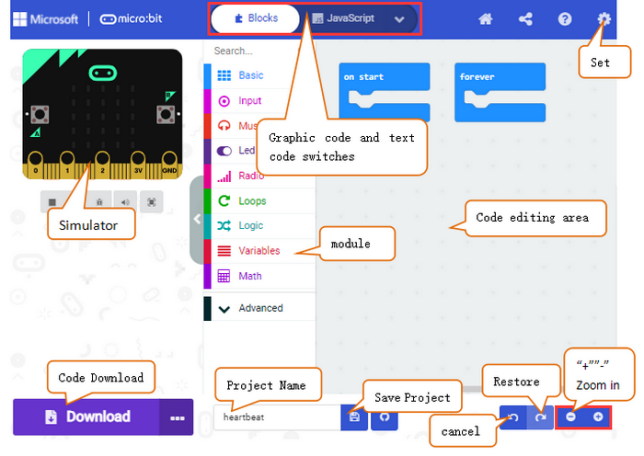

There are blocks “**on start**” and “**forever**” in the code editing area. When the power is plugged or reset, “on start” means that the code in the block only executes once, while “forever” implies that the code runs cyclically.

Click  “**JS JavaScript**” to see the JavaScript code:

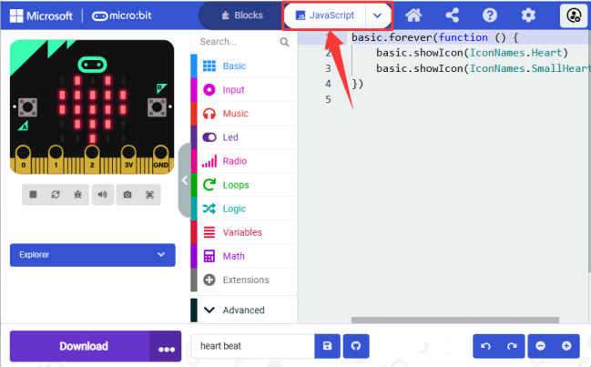

Or click “**Python**” to switch to Python code:

**Language settings:**

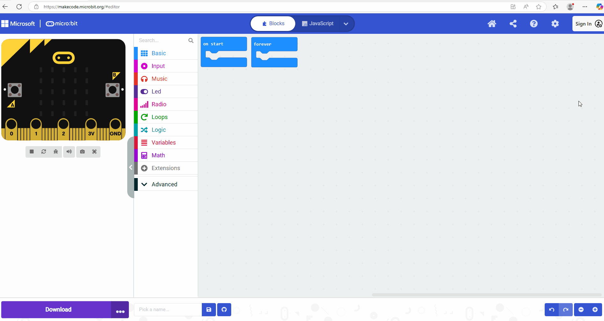

Steps:

Step 1: Click the settings button .

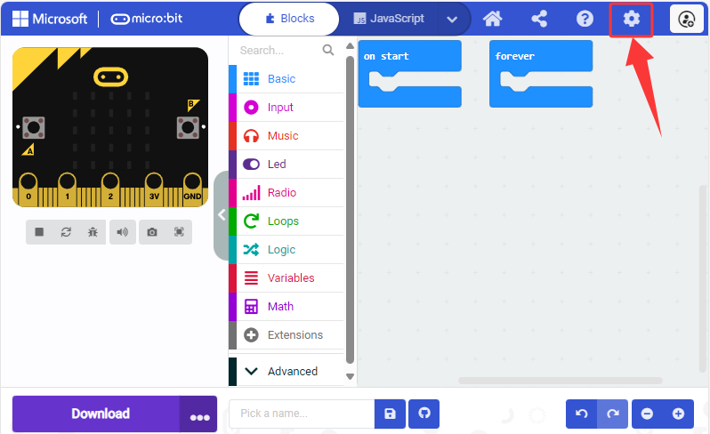

Step 2: Click “Language”.

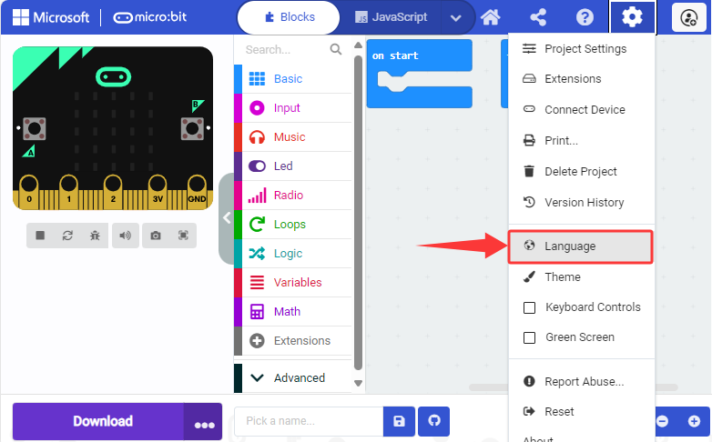

Step 3: Select the language you want. Here we set it to “English”.

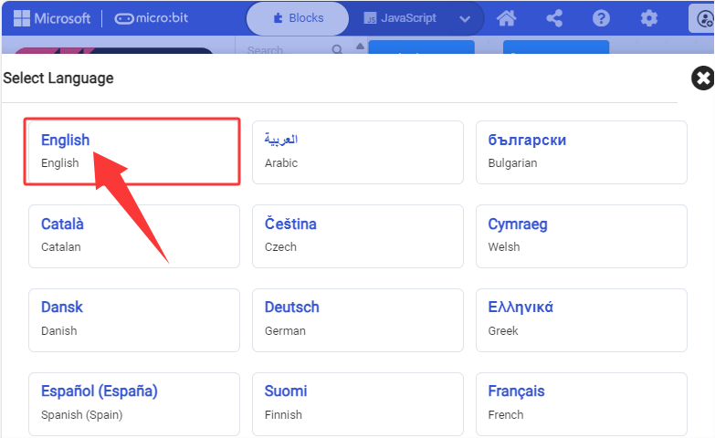

## 4.1.2 Makecode Extension Library

### 4.1.2.1 Add Library

⚠️ **We provide code files (.hex) for each projects, so you can directly load them to the MakeCode editor. Or if you want, you can also build code blocks by yourself. Note that libraries are required when build them manually.**

⚠️ **Note:** Copy and paste the link into the search box: `https://github.com/keyestudio2019/pxt-creative-inventors-kit-master.git`.

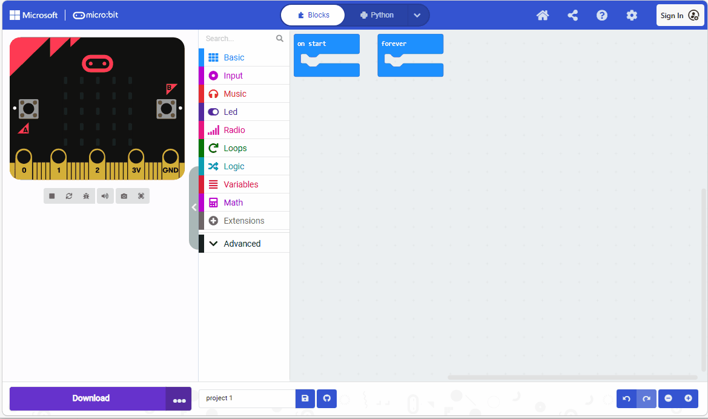

Steps:

1\. Click  to select “**Extensions**”.

Or click the “**Extensions**” above the **Advanced** blocks.

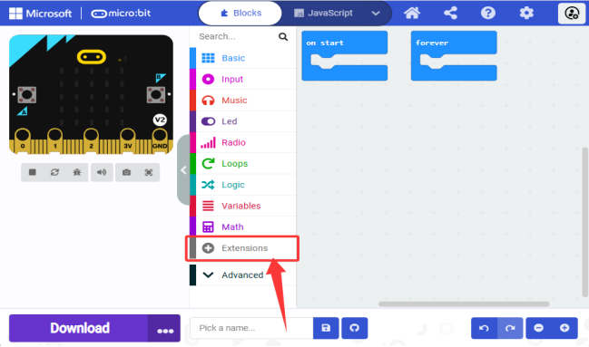

2\. Search key words or paste the GitHub link.

3\. Here we enter the URL: `https://github.com/keyestudio2019/KEYES-Smart-Gamepad-master.git` to the search box and click , and load the extension of “**Smart-Gamepad**”.

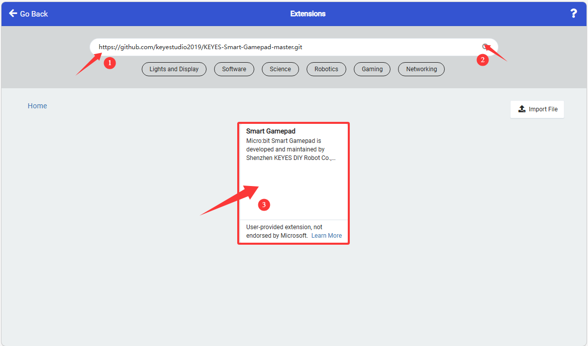

4\. Loading:

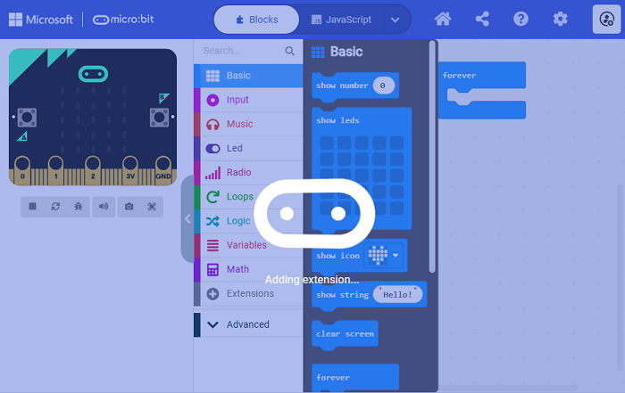

5\. Loaded:

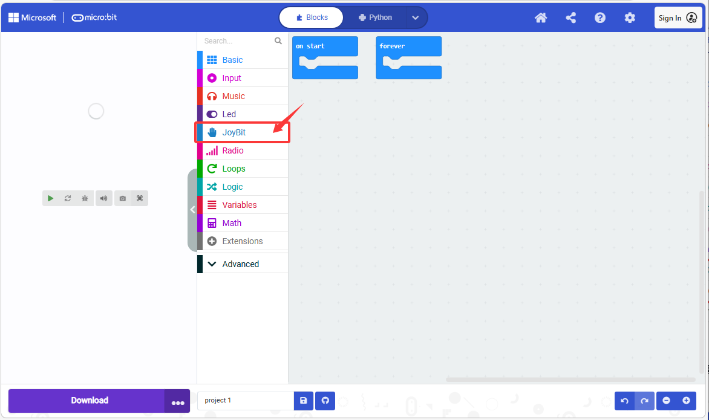

### 4.1.2.2 Update/Delete Library

⚠️ **Generally, there is no need to remove libraries, unless they are not required.**

Steps:

1\. Click “**JavaScript**” to switch to text codes.

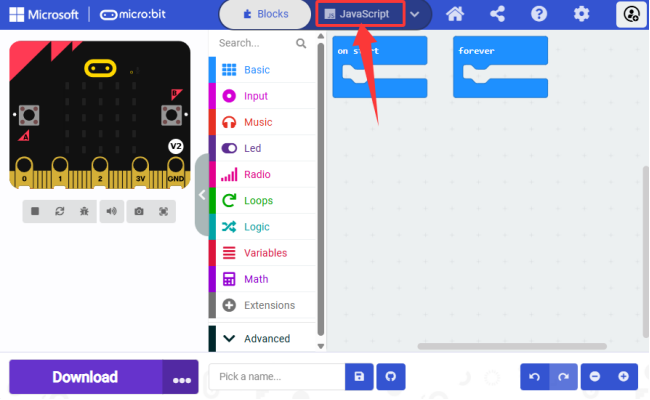

2\. Click “**Explorer**”.

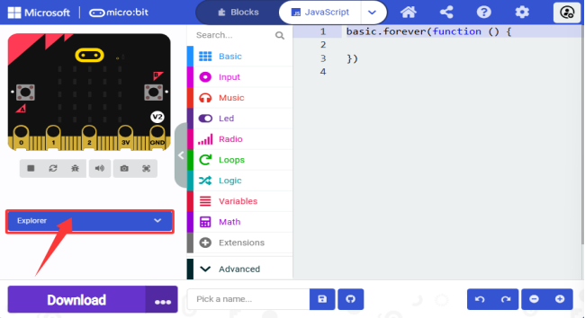

3\. Find the “**Smart-Gamepad**” and click the trash can  to remove it.

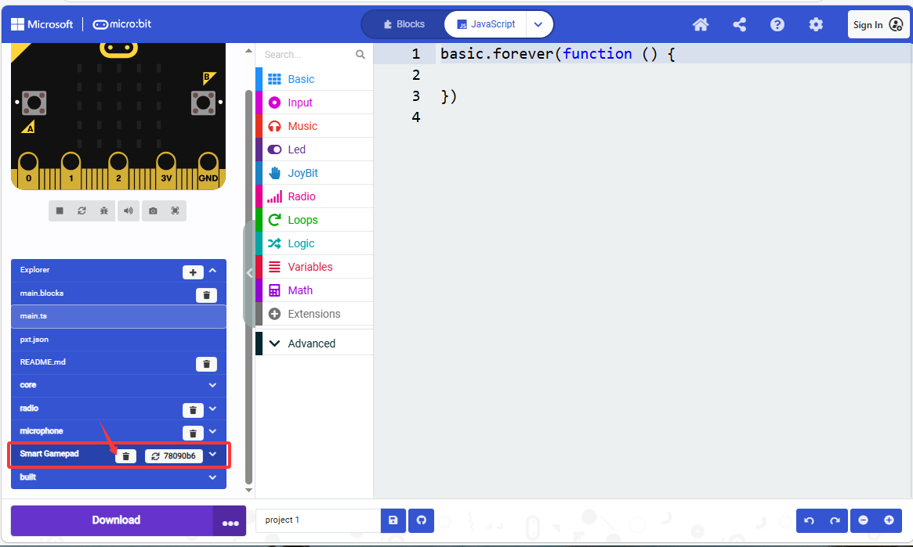

4\. “**Remove it**”.

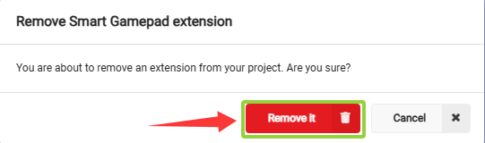

## 4.1.3 MakeCode Program

### 4.1.3.1 Import Program in MakeCode

We take the project “**heatbeat**” as an example.

Steps:

1\. Connect the micro:bit board to your computer via micro USB cable.

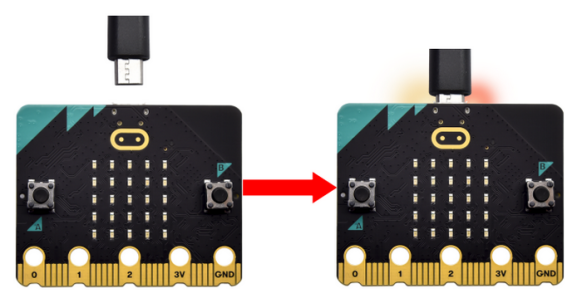

When the micro:bit is powered on, the red LED indicator on its back will light up.

On the micro:bit board, there is a yellow LED indicator that will flash when the board communicates with your computer through micro USB. 

Open Finder(Mac) / Devices and drives(Windows), and you can see a USB drive named "MICROBIT". Yet note that it is not a common disk!

2\. Click “**Import**”:

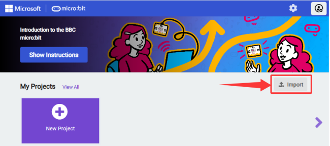

3\. And select “**Import File...**”.

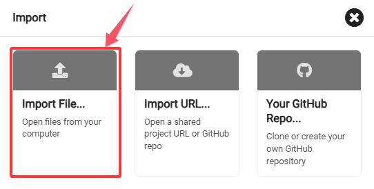

4\. “**Choose File**” to open the file you need.

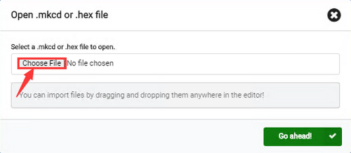

5\. Here we choose “**heartbeat.hex**”.

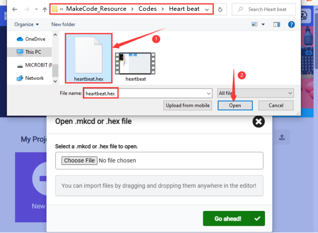

6\. “**Go ahead √**”.

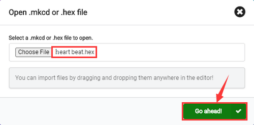

Or you can directly drag the hex file to the Makecode main interface:

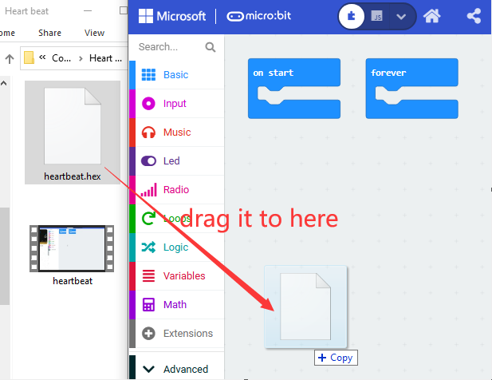

7\. Imported:

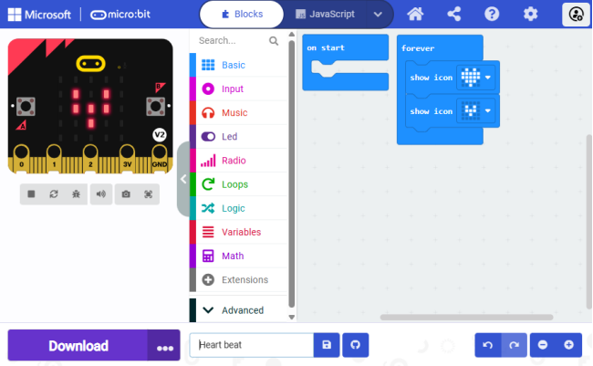

### 4.1.3.2 Download Code (WebUSB)

For browsers like **Google Chrome/Microsoft Edge**, their WebUSB allows direct access to the micro USB hardware device through online web page. Click “Connect Device” to pair the device. After that, click “**Download**” to load the code to the micro:bit board.

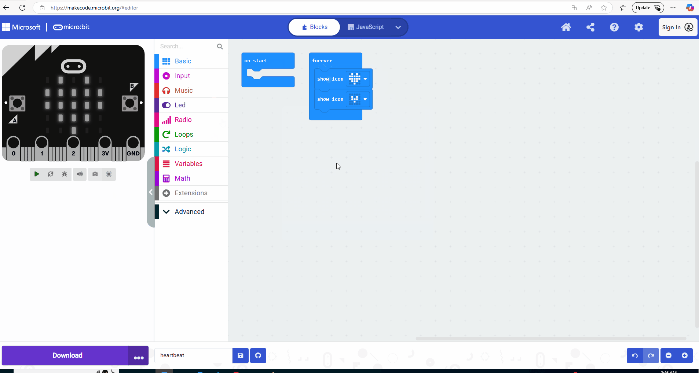

Steps:

#### 4.1.3.2.1 Pair device

1\. Connect the micro:bit board to your computer via micro USB cable.

2\. Click the three dots “**...**” behind the “**Download**” and select “**Connect device**”.

3\. “**Next**”.

4\. “**Pair**”.

5\. Connect to a “**Device**” and “**Connect**”. 

6\. “**Done**” and connected.

#### 4.1.3.2.2 Download code

After connecting, click “**Download**” and the code will be downloaded to the micro:bit board, and  becomes  .

⚠️ **Tips**

If there is no device for pairing in the interface, please see the [device-webusb-troubleshoot](https://makecode.microbit.org/device/usb/webusb/troubleshoot).

If the micro:bit firmware requires an update, please see [how-to-update-the-firmware](https://microbit.org/guide/firmware/).

### 4.1.3.3 Download Code (none WebUSB)

1\. Connect the micro:bit board to your computer via micro USB cable.

When the micro:bit is powered on, the red LED indicator on its back will light up.

On the micro:bit board, there is a yellow LED indicator that will flash when the board communicates with your computer through micro USB. 

Open Finder(Mac) / Devices and drives(Windows), and you can see a USB drive named "MICROBIT". Yet note that it is not a common disk!

2\. For browsers, please load the code to the micro:bit board as follows:

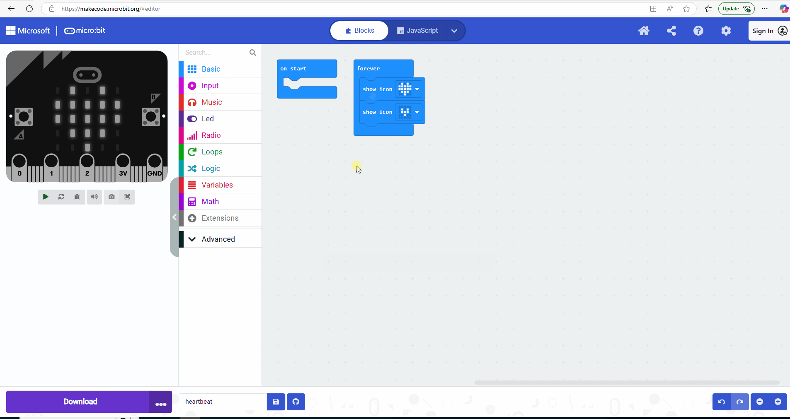

Steps:

① Click the “**Download**” button and a “**.hex**” file will be downloaded, which can be read by the micro:bit board. After that, copy and paste it to the board. 

For Windows, you can “**Send to→MICROBIT**” and load the “**.hex**” to the micro:bit board. During this process, the yellow indicator on the back of the board will flash. When done loaded, the indicator remains on.

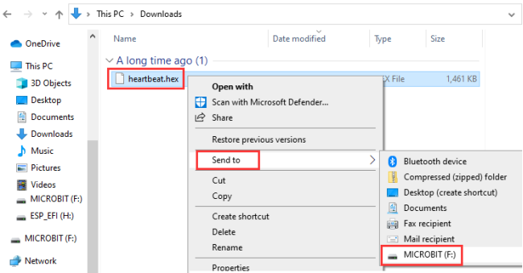

Or you can directly drag the “**.hex**” file to the MICROBIT:

② After that, connect the micro: bit board to the computer via micro USB cable and power on, and you can see the on-board 5 x 5 LED matrix repeatedly shows  and .

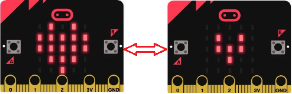

⚠️ During each programing, the MICROBIT disk will automatically eject and return, and the **.hex** files you have copied to it will not be displayed. That is because the micro:bit board only receives and runs the latest uploaded program rather than stores them.

