## 4.1.1 About MakeCode

⚠️ **Die folgenden Schritte werden unter dem Betriebssystem Windows ausgeführt. Wenn Sie ein anderes Betriebssystem verwenden, können Sie diese als Referenz nehmen. Hier wird Google Chrome / Microsoft Edge demonstriert.**

**MakeCode Programming Environment:**

Öffnen Sie die [online version of MakeCode editor](https://makecode.microbit.org/#editor).

MakeCode Hauptoberfläche:

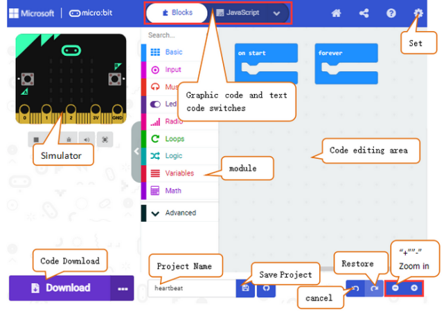

Im Code-Bearbeitungsbereich befinden sich die Blöcke “**on start**” und “**forever**”. Wenn die Stromversorgung eingesteckt oder das Gerät zurückgesetzt wird, bedeutet “on start”, dass der Code im Block nur einmal ausgeführt wird, während “forever” impliziert, dass der Code zyklisch ausgeführt wird.

Klicken Sie auf “**JS JavaScript**”, um den JavaScript-Code zu sehen:

Oder klicken Sie auf “**Python**”, um zu Python-Code zu wechseln:

**Language settings:**

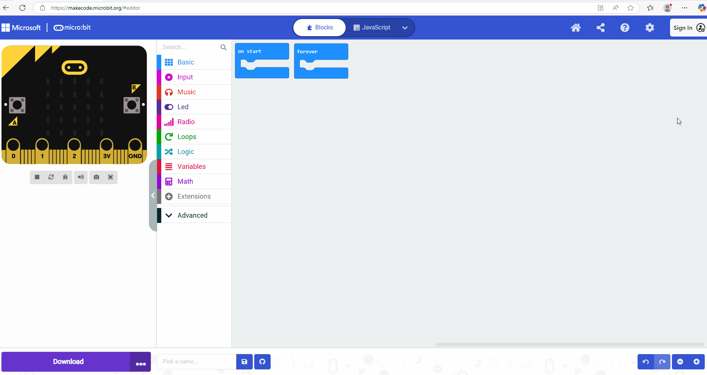

Schritte:

Step 1: Klicken Sie auf die Einstellungen .

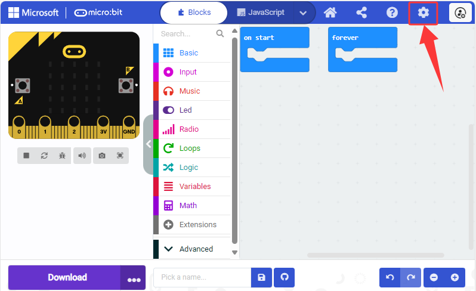

Step 2: Klicken Sie auf “Language”.

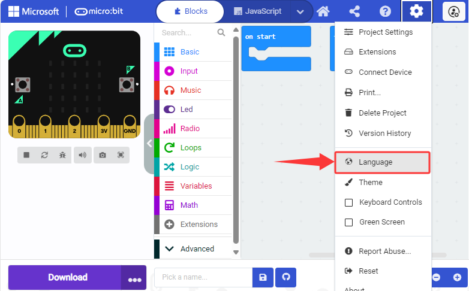

Step 3: Wählen Sie die gewünschte Sprache aus. Hier stellen wir sie auf “English”.

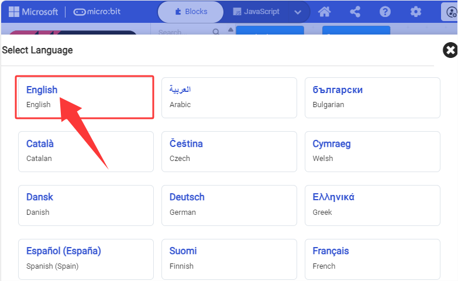

## 4.1.2 Makecode Extension Library

### 4.1.2.1 Add Library

⚠️ **Wir stellen Code-Dateien (.hex) für jedes Projekt zur Verfügung, sodass Sie diese direkt in den MakeCode-Editor laden können. Oder wenn Sie möchten, können Sie die Codeblöcke auch selbst bauen. Beachten Sie, dass Bibliotheken erforderlich sind, wenn Sie sie manuell erstellen.**

⚠️ **Hinweis:** Kopieren Sie den Link und fügen Sie ihn in das Suchfeld ein: `https://github.com/keyestudio2019/pxt-creative-inventors-kit-master.git`.

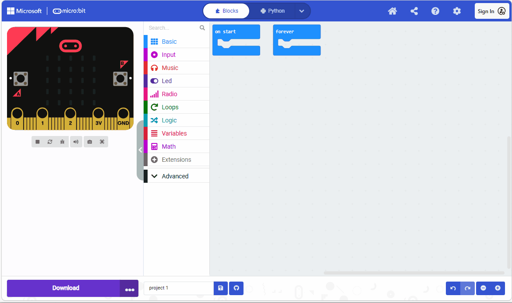

Schritte:

1\. Klicken Sie auf , um “**Extensions**” auszuwählen.

Oder klicken Sie auf “**Extensions**” oberhalb der **Advanced**-Blöcke.

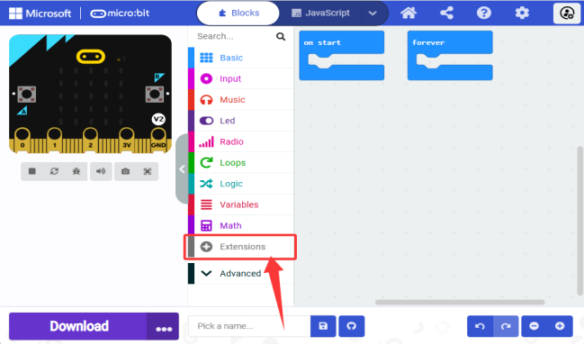

2\. Suchen Sie nach Schlüsselwörtern oder fügen Sie den GitHub-Link ein.

3\. Hier geben wir die URL: `https://github.com/keyestudio2019/KEYES-Smart-Gamepad-master.git` in das Suchfeld ein und klicken auf , um die Erweiterung “**Smart-Gamepad**” zu laden.

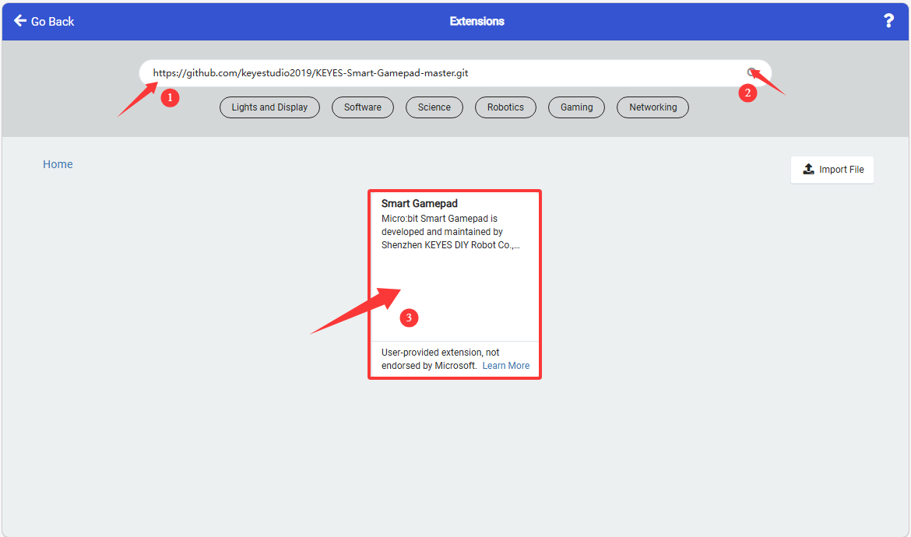

4\. Laden:

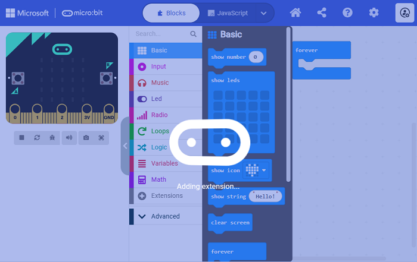

5\. Geladen:

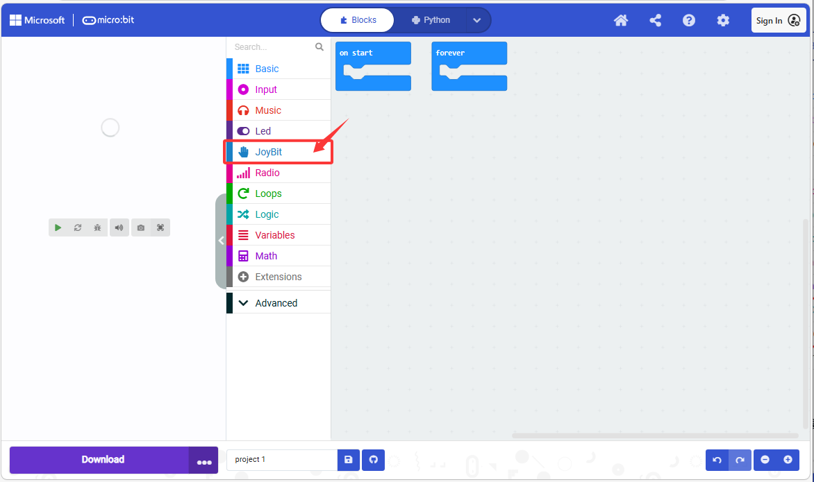

### 4.1.2.2 Update/Delete Library

⚠️ **Im Allgemeinen ist es nicht nötig, Bibliotheken zu entfernen, es sei denn, sie werden nicht mehr benötigt.**

Schritte:

1\. Klicken Sie auf “**JavaScript**”, um zu Textcodes zu wechseln.

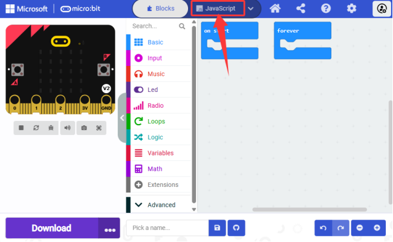

2\. Klicken Sie auf “**Explorer**”.

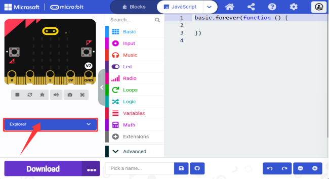

3\. Finden Sie das “**Smart-Gamepad**” und klicken Sie auf den Papierkorb , um es zu entfernen.

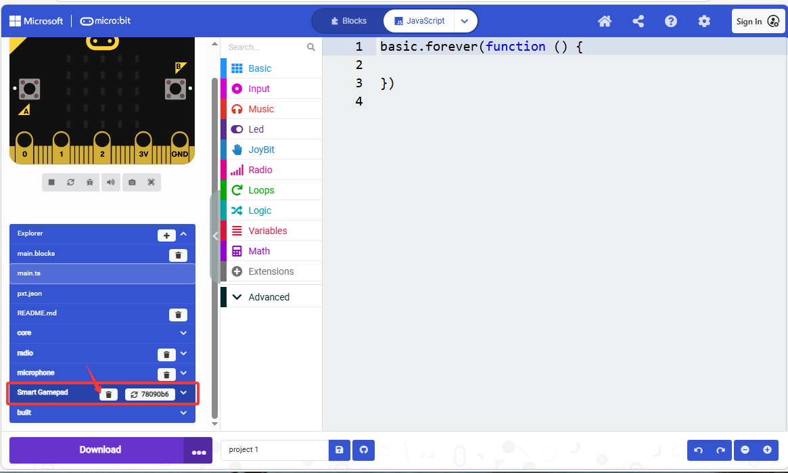

4\. “**Remove it**”.

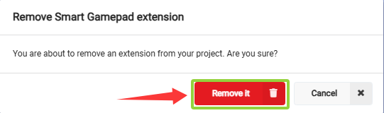

## 4.1.3 MakeCode Program

### 4.1.3.1 Import Program in MakeCode

Wir nehmen das Projekt “**heatbeat**” als Beispiel.

Schritte:

1\. Schließen Sie das micro:bit-Board mit dem micro USB-Kabel an Ihren Computer an.

Wenn das micro:bit eingeschaltet ist, leuchtet die rote LED-Anzeige auf seiner Rückseite.

Auf dem micro:bit-Board befindet sich eine gelbe LED-Anzeige, die blinkt, wenn das Board über micro USB mit Ihrem Computer kommuniziert.

Öffnen Sie Finder(Mac) / Devices and drives(Windows), und Sie sehen ein USB-Laufwerk mit dem Namen "MICROBIT". Beachten Sie jedoch, dass es sich nicht um eine normale Festplatte handelt!

2\. Klicken Sie auf “**Import**”:

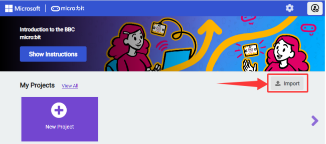

3\. Und wählen Sie “**Import File...**”.

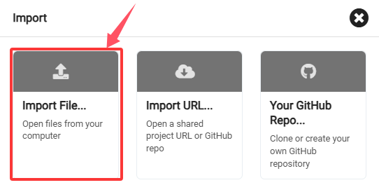

4\. “**Choose File**”, um die benötigte Datei zu öffnen.

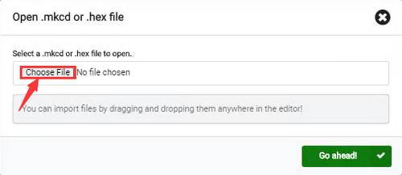

5\. Hier wählen wir “**heartbeat.hex**”.

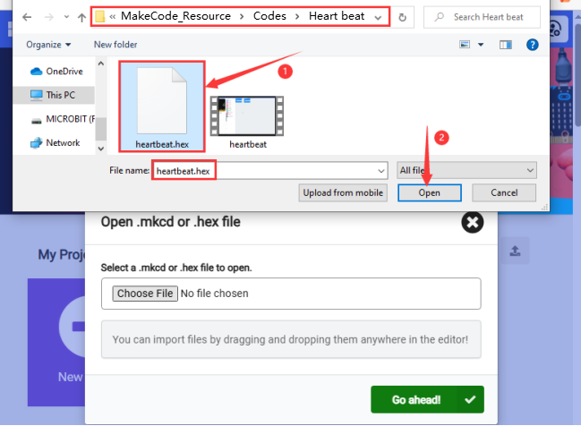

6\. “**Go ahead √**”.

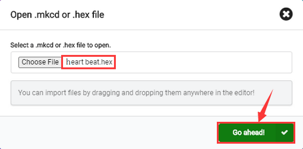

Oder Sie können die hex-Datei direkt in die Makecode-Hauptoberfläche ziehen:

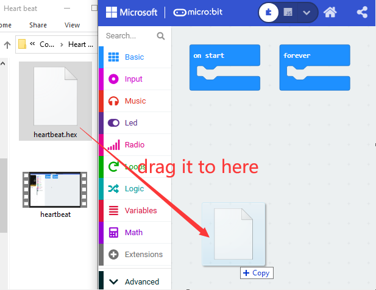

7\. Importiert:

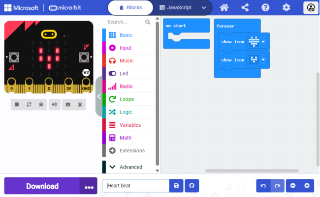

### 4.1.3.2 Download Code (WebUSB)

Für Browser wie **Google Chrome/Microsoft Edge** erlaubt deren WebUSB den direkten Zugriff auf das micro USB-Hardwaregerät über eine Online-Webseite. Klicken Sie auf “Connect Device”, um das Gerät zu koppeln. Danach klicken Sie auf “**Download**”, um den Code auf das micro:bit-Board zu laden.

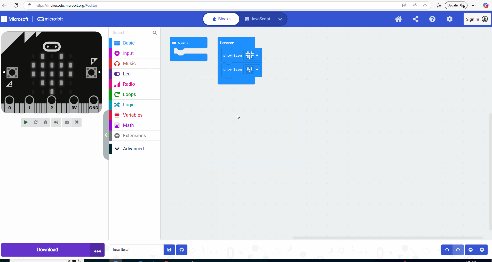

Schritte:

#### 4.1.3.2.1 Pair device

1\. Schließen Sie das micro:bit-Board mit dem micro USB-Kabel an Ihren Computer an.

2\. Klicken Sie auf die drei Punkte “**...**” hinter “**Download**” und wählen Sie “**Connect device**”.

3\. “**Next**”.

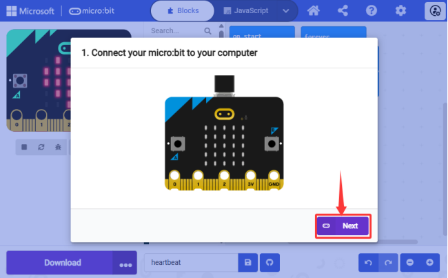

4\. “**Pair**”.

5\. Verbinden Sie mit einem “**Device**” und klicken Sie auf “**Connect**”.

6\. “**Done**” und verbunden.

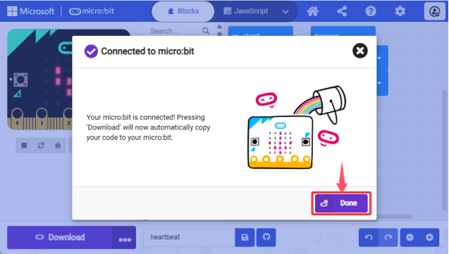

#### 4.1.3.2.2 Download code

Nach der Verbindung klicken Sie auf “**Download**” und der Code wird auf das micro:bit-Board heruntergeladen, und  wird zu .

⚠️ **Tipps**

Wenn kein Gerät zum Koppeln in der Oberfläche vorhanden ist, siehe [device-webusb-troubleshoot](https://makecode.microbit.org/device/usb/webusb/troubleshoot).

Wenn die micro:bit-Firmware ein Update benötigt, siehe [how-to-update-the-firmware](https://microbit.org/guide/firmware/).

### 4.1.3.3 Download Code (none WebUSB)

1\. Schließen Sie das micro:bit-Board mit dem micro USB-Kabel an Ihren Computer an.

Wenn das micro:bit eingeschaltet ist, leuchtet die rote LED-Anzeige auf seiner Rückseite.

Auf dem micro:bit-Board befindet sich eine gelbe LED-Anzeige, die blinkt, wenn das Board über micro USB mit Ihrem Computer kommuniziert.

Öffnen Sie Finder(Mac) / Devices and drives(Windows), und Sie sehen ein USB-Laufwerk mit dem Namen "MICROBIT". Beachten Sie jedoch, dass es sich nicht um eine normale Festplatte handelt!

2\. Für Browser laden Sie bitte den Code wie folgt auf das micro:bit-Board:

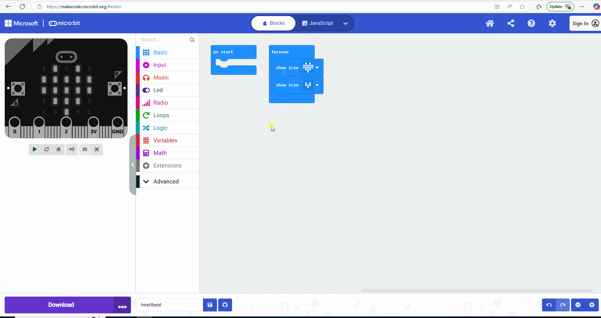

Schritte:

① Klicken Sie auf die “**Download**”-Schaltfläche und eine “**.hex**”-Datei wird heruntergeladen, die vom micro:bit-Board gelesen werden kann. Kopieren Sie diese anschließend auf das Board.

Für Windows können Sie “**Send to→MICROBIT**” verwenden und die “**.hex**” auf das micro:bit-Board laden. Während dieses Vorgangs blinkt die gelbe Anzeige auf der Rückseite des Boards. Nach Abschluss bleibt die Anzeige an.

Oder Sie können die “**.hex**”-Datei direkt in das MICROBIT ziehen:

② Danach verbinden Sie das micro: bit-Board per micro USB-Kabel mit dem Computer und schalten es ein; Sie sehen, dass die eingebaute 5 x 5 LED-Matrix wiederholt  und  anzeigt.

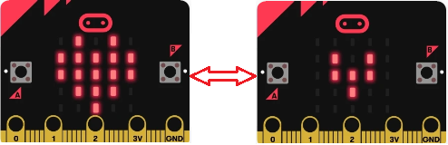

⚠️ Während jedes Programmierens wird die MICROBIT-Festplatte automatisch ausgeworfen und zurückgegeben, und die **.hex**-Dateien, die Sie darauf kopiert haben, werden nicht angezeigt. Das liegt daran, dass das micro:bit-Board nur das zuletzt hochgeladene Programm empfängt und ausführt, anstatt sie zu speichern.