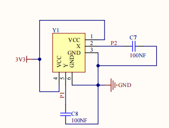
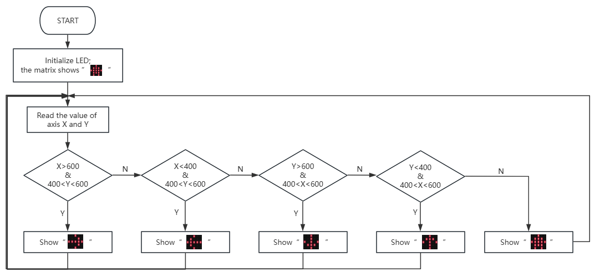

### 4.2.1 Direction Indicator

#### 4.2.1.1 Overview

When you toggle the joystick, the dot matrix displays arrows in the corresponding direction in real time: left, right, up, down, giving you a clear direction reference.

#### 4.2.1.2 Component Knowledge

**Micro:bit dot matrix:**

The LED dot matrix of the micro:bit board consists of a total of 25 light-emitting diodes, a group of 5, corresponding to axis X and Y, forming a 5×5 matrix. Each one is placed at the intersection of the row(X) and the column (Y). We can control one or some of them by setting the coordinate points.

**Joystick:**

| |   |
| :--: | :--: |
| Real product | Schematic diagram |

The internal core structure of this joystick is composed of two adjustable resistors (potentiometers) with a resistance value of 10KΩ each.

It detect directions (and amplitude) of the push through the ADC analog pin of the microcontroller to output the analog electrical signals of the corresponding dimension. During actual signal reading, when the analog values of the joystick X and Y axes are detected within the range of 450~600, it can be determined that the joystick is in a neutral(stationary) state without active toggling.

#### 4.2.1.3 Required Parts

| |   ||
| :--: | :--: | :--: |
| **micro:bit V2 board** (self-provided) ×1 | **micro:bit Smart Gamepad** (assembled) ×1 |**AAA battery** (self-provided) ×4 |

#### 4.2.1.4 Code Flow

#### 4.2.1.5 Test Code

⚠️ **Note that the following codes include the Makecode libraries of the Gamepad (the way how to add libraries is mentioned before). The sensitivity of the joystick can be adjusted according to your needs.**

**Complete code:**

**Brief explanation:**

① Initialize LED matrix to make it show .

② Read the values of the axis X and Y to determine the toggling direction. If it is detected, the matrix shows the corresponding arrow. If not, it displays .

#### 4.2.1.6 Test Result

After burning the code, insert the micro:bit board into the slot of the gamepad (**batteries installed**), and toggle the switch on it to “ON”. 

When you push the joystick of the gamepad, you can see the corresponding arrows on the matrix. If you raise your finger to bring it back to the center, there will be a house icon on the matrix.

**Tip:** If there is no response on the board, please press the reset button on the back of the micro:bit board.

