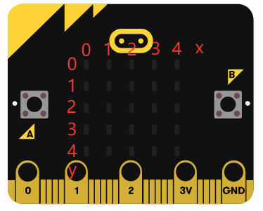
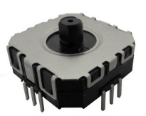
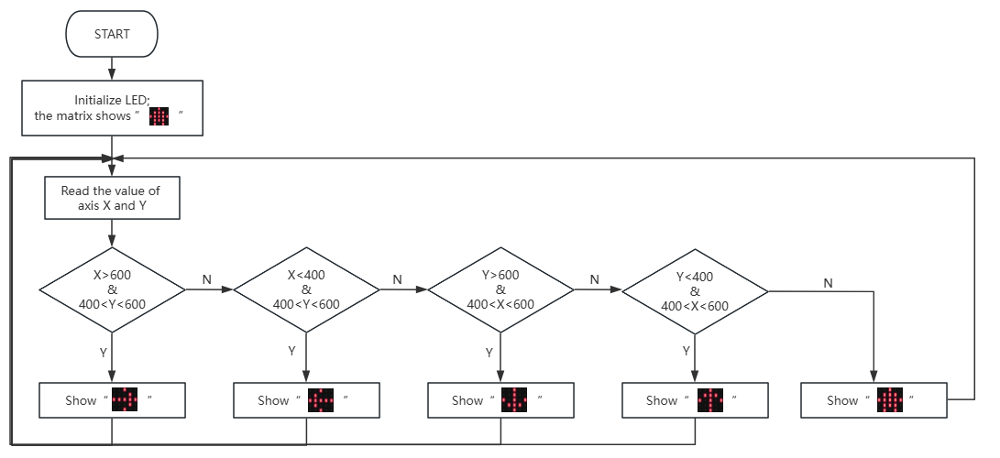
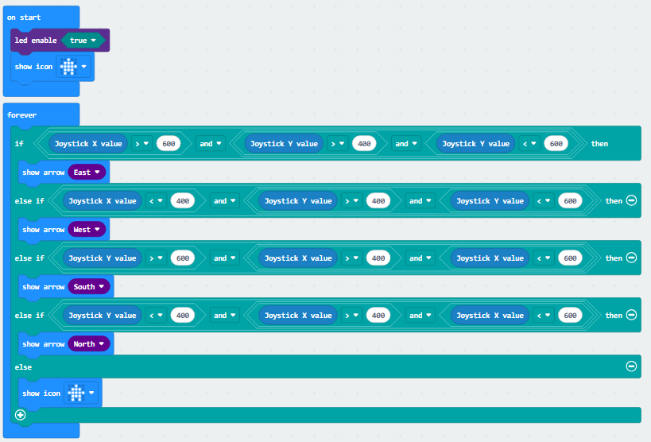
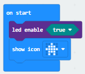
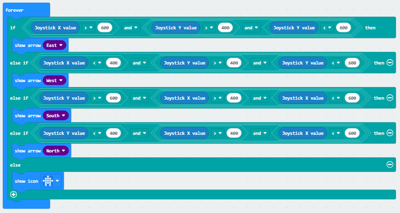

### 4.2.1 Indicateur de direction

#### 4.2.1.1 Aperçu

Lorsque vous basculez le joystick, la matrice de points affiche en temps réel des flèches dans la direction correspondante : gauche, droite, haut, bas, vous donnant une référence directionnelle claire.

#### 4.2.1.2 Connaissances des composants

**Micro:bit matrice de points :**

La matrice de diodes LED de la carte micro:bit est composée au total de 25 diodes électroluminescentes, regroupées par 5, correspondant aux axes X et Y, formant une matrice 5×5. Chacune est placée à l'intersection d'une ligne (X) et d'une colonne (Y). Nous pouvons contrôler une ou plusieurs d'entre elles en définissant des points de coordonnées.

**Joystick :**

| |   |
| :--: | :--: |
| Produit réel | Diagramme schématique |

La structure interne de base de ce joystick est composée de deux résistances ajustables (potentiomètres) d'une valeur de résistance de 10KΩ chacune.

Il détecte la direction (et l'amplitude) de la poussée via la broche analogique ADC du microcontrôleur afin de délivrer les signaux électriques analogiques correspondants. Lors de la lecture réelle du signal, lorsque les valeurs analogiques des axes X et Y du joystick sont détectées dans la plage 450~600, on peut déterminer que le joystick est dans un état neutre (stationnaire) sans basculement actif.

#### 4.2.1.3 Pièces requises

| |   ||
| :--: | :--: | :--: |
| **micro:bit V2 board** (à fournir) ×1 | **micro:bit Smart Gamepad** (assemblé) ×1 | **AAA battery** (à fournir) ×4 |

#### 4.2.1.4 Flux de code

#### 4.2.1.5 Code de test

⚠️ **Notez que les codes suivants incluent les bibliothèques Makecode du Gamepad (la manière d'ajouter les bibliothèques a été mentionnée précédemment). La sensibilité du joystick peut être ajustée selon vos besoins.**

**Code complet :**

**Brève explication :**

① Initialiser la matrice LED pour qu'elle affiche .

② Lire les valeurs des axes X et Y pour déterminer la direction du basculement. Si un mouvement est détecté, la matrice affiche la flèche correspondante. Sinon, elle affiche .

#### 4.2.1.6 Résultat du test

Après avoir transféré le code, insérez la carte micro:bit dans la fente du gamepad (**batteries installées**), et basculez l'interrupteur sur “ON”.

Lorsque vous poussez le joystick du gamepad, vous pouvez voir les flèches correspondantes sur la matrice. Si vous relevez votre doigt pour le ramener au centre, une icône en forme de maison apparaîtra sur la matrice.

**Astuce :** Si la carte ne répond pas, veuillez appuyer sur le bouton de réinitialisation à l'arrière de la carte micro:bit.

