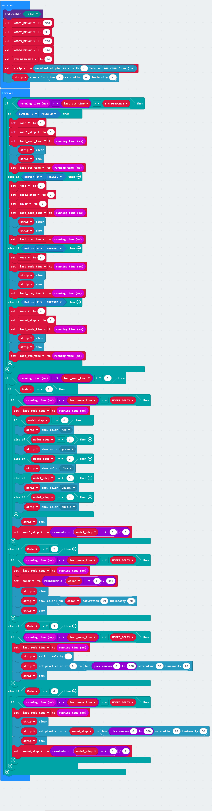
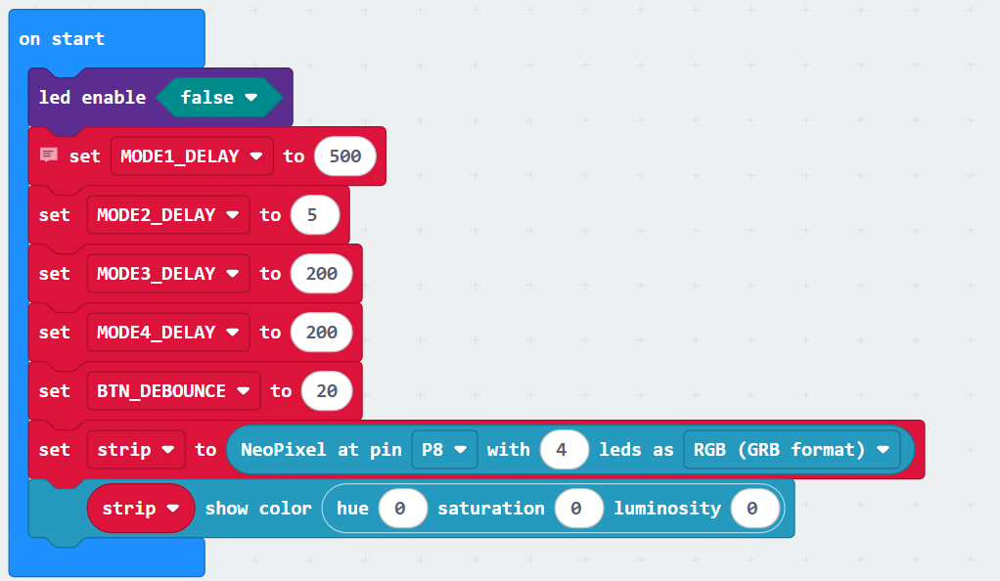
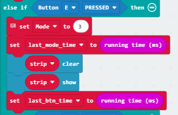
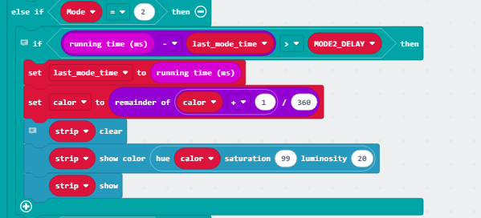

### 4.2.2 Colorful Lights

#### 4.2.2.1 Overview

RGB LEDs are a type of LED light source that creates images by mixing light from the three primary colors: red, green, and blue, whose intersection produces various hues. Common methods include direct mixing of the primary colors, using a blue LED combined with yellow phosphor, or employing an ultraviolet LED together with RGB phosphor. Compared to LEDs that emit white light directly, RGB LEDs offer a wider range of color mixing possibilities because the three primary colors can be controlled independently.

In this project, each button corresponds to a different mode of the RGB LEDs. When the button C is pressed, the lights flash alternately in the order of "red, green, blue, yellow, and purple"; Press D to switch to breathing lights; Press E for water flowing lights; Press F for marquee lights.

Colorful light strings for festival decorations, Christmas tree lights, RGB strips for daily ambiance, LED decorative lights in amusement parks and shopping malls... They are all common examples of multi-mode lights in our daily lives.

#### 4.2.2.2 Component Knowledge

**SK6812 RGB LED**

| | |
| :--: | :--: |
| Real product | Schematic diagram |

The SK6812 is an external-controlled LED light source that integrates control and lighting circuits. Its main part is 5x5mm surface-illuminated LED beads, each functioning as an independent pixel that incorporates multiple core circuits: a smart digital interface data latch circuit, signal shaping and amplification drive circuit, power regulation circuit, built-in constant-current circuit, and high-precision RC oscillator. 

Its communication employs a single-polarity zero-return code protocol. Upon power-on reset, each pixel receives data from the controller via the DIN port. The first 24 bits of data are extracted by the initial pixel and stored in the internal data latch, while the remaining ones are shaped and amplified internally before being transmitted through the DOUT port to subsequent pixels. With each pixel processed, the transmitted signal size decreases by 24 bits.

On the gamepad, there are four SK6812 RGB lights. These all support 256-level brightness adjustment across their red, green, and blue channels, enabling 256×256×256 color combinations. Due to this, it delivers diverse lighting effects such as alternating flashes, breathing gradients, and scrolling animations, providing more intuitive and vivid interactions.

**Button**

| | |
| :--: | :--: |
| Real product | Schematic diagram |

The button, first emerged in Japan, was referred to as a sensitive switch. During operation, press the switch to apply force to close the circuit. Upon release of the pressure, the switch opens. Its internal metal spring leaf changes its state of being connected/disconnected in response to applied force.

There are four buttons, each independently connected to a pin on the micro:bit board. When one button is pressed, the circuit generates a corresponding low-level signal, enabling the micro:bit to respond rapidly to commands and significantly enhancing interaction convenience and accuracy.

 

#### 4.2.2.3 Required Parts

| |   | |
| :--: | :--: | :--: |
| **micro:bit V2 board** (self-provided) ×1 | **micro:bit Smart Gamepad** (assembled) ×1 |**AAA battery** (self-provided) ×4 |

#### 4.2.2.4 Code Flow

#### 4.2.2.5 Test Code

⚠️ **Note that the delay time of the MODE\*_DELAY in the codes can be modified according to your needs.**

**Complete code:**

**Brief explanation:**

① At the beginning, disable the function of the LEDs (Set led enable to false). 

And define 4 LED delays (say, set 5 in mode 2, set 500 in mode 1...), set button debounce to 20. Initialize four RGB LED at pin P8 to no color (set all values to 0), i.e., set to off. 

② During the loop, anti-jitter operation is implemented by checking whether the difference between the current execution time and the previous press time exceeds the preset anti-jitter threshold (BTN_DEBOUNCE), thereby preventing repeated presses caused by physical jitter.

③ When the C(/D/E/F) is pressed, the mode is set to 1(2/3/4), while the animation steps and timing start points for the corresponding mode are reset, the lights are cleared and the button timestamp is updated. This enables precise switching and initial operation of different LED modes.

| ||
| :--: | :--: |
|Button C is pressed|Button D is pressed|
|     |        |
|Button E is pressed|Button F is pressed|

④ When the mode is set to 1 and the interval between the current time and the previous mode time exceeds MODE1Delay, update the mode timestamp first, and display the lights based on the different values of model_step (0–4) in sequence: red, green, blue, yellow, and purple. After refreshing the display, reset the model_step loop by a modulo operation regularly change these five colors.

⑤ When the mode is 2 and the interval between the current time and the previous mode time exceeds MODE2_DELAY, update the mode timestamp first, and increment the color value (hue) cyclically by modulo(range 0–359). Then, clear the light and display the corresponding hue with high saturation(99) and low brightness(20), and the gradient colors will smoothly change. (The brightness and saturation values in the codes can be adjusted as needed.)

⑥ When the mode is 3 and the interval between the current time and the previous mode time exceeds MODE3_DELAY, update the mode timestamp first and shift all pixels of the light strip by 1 bit, assign a random hue(0–359), high saturation(99), and low brightness(20) to the 0th pixel. Refresh the display and you can see a flowing light: Lights move sequentially and change color randomly. (The brightness and saturation values in the code can be adjusted as needed.)

⑦ When the mode is 4 and the interval between the current time and the previous mode time exceeds MODE4_DELAY, update the mode timestamp first and clear the light strip, assign a random hue(0–359), high saturation(99), and low brightness(20) to the pixels corresponding to model_step, and refresh the display. Finally, cycle model_step within 0-3 through modulo, and you will see single LED turns on sequentially in random colors. (The brightness and saturation values in the code can be adjusted as needed.)

#### 4.2.2.6 Test Result

After burning the code, insert the micro:bit board into the slot of the gamepad (**batteries installed**), and toggle the switch on it to “ON”. 

Press **C**: the lights alternates among **red-green-blue-yellow-purple** in sequence. 

Press **D**: the color hue of the lights will increase, and eventually the gradient colors will smoothly change. 

Press **E**: the lights generate a random color starting from the 0th pixel, and shift the color one pixel sequentially, so you can see a water flowing light.

Press **F**: each pixel lights up in random colors in sequence.

**Tip:** If there is no response on the board, please press the reset button on the back of the micro:bit board.

