### 4.2.2 Luces de Colores

#### 4.2.2.1 Resumen

Los LED RGB son un tipo de fuente de luz LED que crea imágenes mezclando la luz de los tres colores primarios: rojo, verde y azul, cuya intersección produce varios tonos. Los métodos comunes incluyen la mezcla directa de los colores primarios, el uso de un LED azul combinado con fósforo amarillo, o el empleo de un LED ultravioleta junto con fósforo RGB. En comparación con los LED que emiten luz blanca directamente, los LED RGB ofrecen una gama más amplia de posibilidades de mezcla de colores porque los tres colores primarios se pueden controlar de forma independiente.

En este proyecto, cada botón corresponde a un modo diferente de los LED RGB. Cuando se presiona el botón C, las luces parpadean alternativamente en el orden de "rojo, verde, azul, amarillo y púrpura"; presione D para cambiar a luces de respiración; presione E para luces de flujo de agua; presione F para luces de marquesina.

Cadenas de luces de colores para decoraciones festivas, luces de árboles de Navidad, tiras RGB para el ambiente diario, luces decorativas LED en parques de atracciones y centros comerciales... Todos son ejemplos comunes de luces multimodo en nuestra vida diaria.

#### 4.2.2.2 Conocimiento de Componentes

**LED RGB SK6812**

| 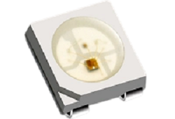| |
| :--: | :--: |
| Producto real | Diagrama esquemático |

El SK6812 es una fuente de luz LED controlada externamente que integra circuitos de control e iluminación. Su parte principal son perlas LED iluminadas en superficie de 5x5 mm, cada una funcionando como un píxel independiente que incorpora múltiples circuitos centrales: un circuito de enganche de datos de interfaz digital inteligente, un circuito de accionamiento de conformación y amplificación de señal, un circuito de regulación de potencia, un circuito de corriente constante incorporado y un oscilador RC de alta precisión.

Su comunicación emplea un protocolo de código de retorno a cero de polaridad única. Al reiniciar el encendido, cada píxel recibe datos del controlador a través del puerto DIN. Los primeros 24 bits de datos son extraídos por el píxel inicial y almacenados en el enganche de datos interno, mientras que los restantes son conformados y amplificados internamente antes de ser transmitidos a través del puerto DOUT a los píxeles subsiguientes. Con cada píxel procesado, el tamaño de la señal transmitida disminuye en 24 bits.

En el gamepad, hay cuatro luces RGB SK6812. Todas ellas admiten un ajuste de brillo de 256 niveles en sus canales rojo, verde y azul, lo que permite 256×256×256 combinaciones de colores. Debido a esto, ofrece diversos efectos de iluminación, como parpadeos alternos, gradientes de respiración y animaciones de desplazamiento, proporcionando interacciones más intuitivas y vívidas.

**Botón**

| 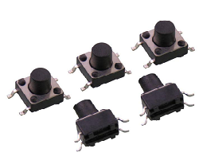| 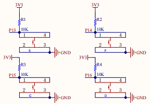|
| :--: | :--: |
| Producto real | Diagrama esquemático |

El botón, que apareció por primera vez en Japón, se conocía como un interruptor sensible. Durante el funcionamiento, presione el interruptor para aplicar fuerza y cerrar el circuito. Al liberar la presión, el interruptor se abre. Su lámina de resorte metálica interna cambia su estado de conectado/desconectado en respuesta a la fuerza aplicada.

Hay cuatro botones, cada uno conectado de forma independiente a un pin de la placa micro:bit. Cuando se presiona un botón, el circuito genera una señal de bajo nivel correspondiente, lo que permite a la micro:bit responder rápidamente a los comandos y mejora significativamente la comodidad y precisión de la interacción.

#### 4.2.2.3 Piezas Requeridas

| |  | |
| :--: | :--: | :--: |
| **Placa micro:bit V2** (suministrada por el usuario) ×1 | **Smart Gamepad micro:bit** (ensamblado) ×1 | **Pila AAA** (suministrada por el usuario) ×4 |

#### 4.2.2.4 Flujo del Código

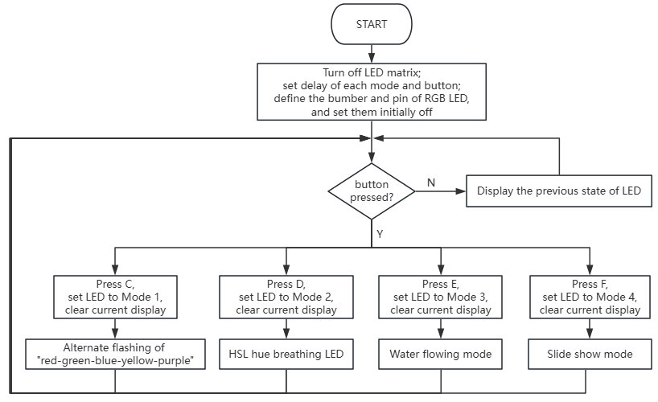

#### 4.2.2.5 Código de Prueba

⚠️ **Tenga en cuenta que el tiempo de retardo de MODE\*_DELAY en los códigos se puede modificar según sus necesidades.**

**Código completo:**

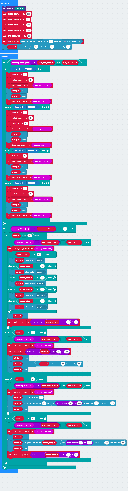

**Breve explicación:**

① Al principio, deshabilite la función de los LED (establezca led enable en false).

Y defina 4 retrasos de LED (por ejemplo, establezca 5 en el modo 2, establezca 500 en el modo 1...), establezca el antirebote del botón en 20. Inicialice cuatro LED RGB en el pin P8 sin color (establezca todos los valores en 0), es decir, apáguelos.

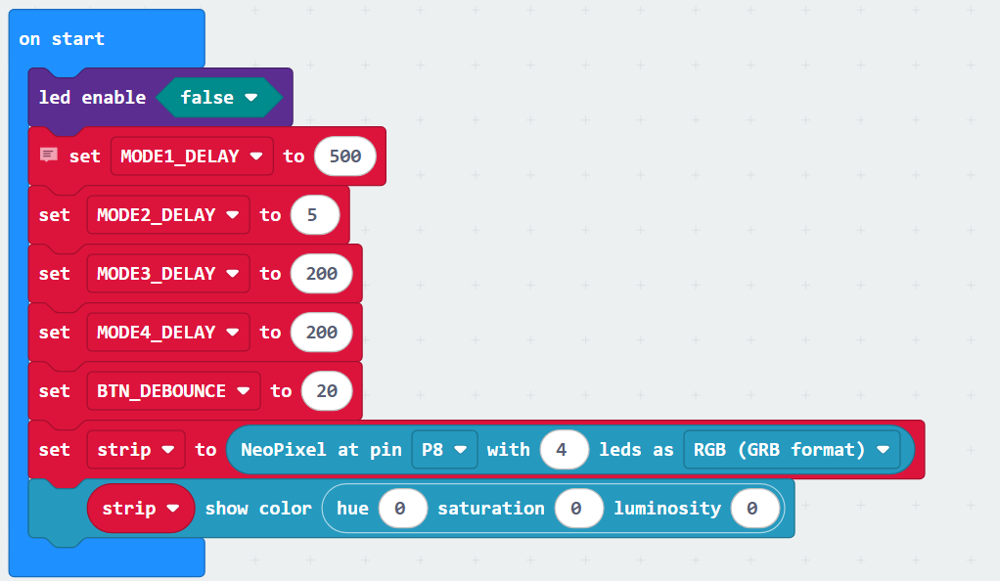

② Durante el bucle, la operación anti-jitter se implementa comprobando si la diferencia entre el tiempo de ejecución actual y el tiempo de pulsación anterior excede el umbral anti-jitter preestablecido (BTN_DEBOUNCE), evitando así las pulsaciones repetidas causadas por el jitter físico.

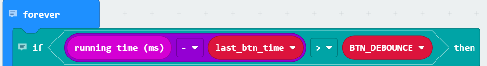

③ Cuando se presiona C(/D/E/F), el modo se establece en 1(2/3/4), mientras que los pasos de animación y los puntos de inicio de temporización para el modo correspondiente se restablecen, las luces se borran y la marca de tiempo del botón se actualiza. Esto permite un cambio preciso y el funcionamiento inicial de diferentes modos de LED.

| 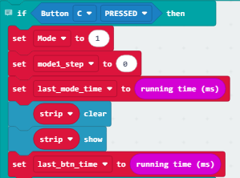|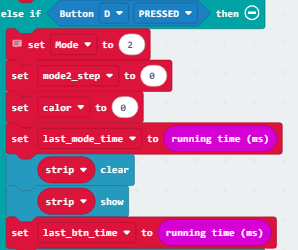|
| :--: | :--: |
|Botón C presionado|Botón D presionado|
| 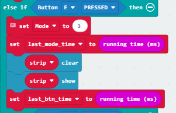 | 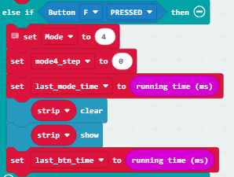 |
|Botón E presionado|Botón F presionado|

④ Cuando el modo se establece en 1 y el intervalo entre el tiempo actual y el tiempo del modo anterior excede MODE1Delay, actualice primero la marca de tiempo del modo y muestre las luces según los diferentes valores de model_step (0–4) en secuencia: rojo, verde, azul, amarillo y púrpura. Después de actualizar la pantalla, reinicie el bucle model_step mediante una operación de módulo para cambiar regularmente estos cinco colores.

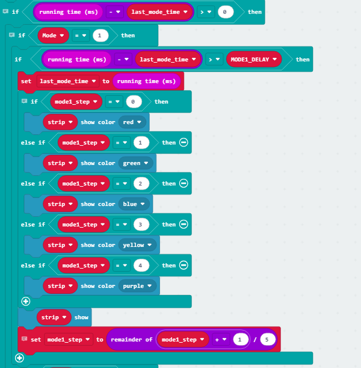

⑤ Cuando el modo es 2 y el intervalo entre el tiempo actual y el tiempo del modo anterior excede MODE2_DELAY, actualice primero la marca de tiempo del modo e incremente el valor del color (tono) cíclicamente por módulo (rango 0–359). Luego, borre la luz y muestre el tono correspondiente con alta saturación (99) y bajo brillo (20), y los colores degradados cambiarán suavemente. (Los valores de brillo y saturación en los códigos se pueden ajustar según sea necesario).

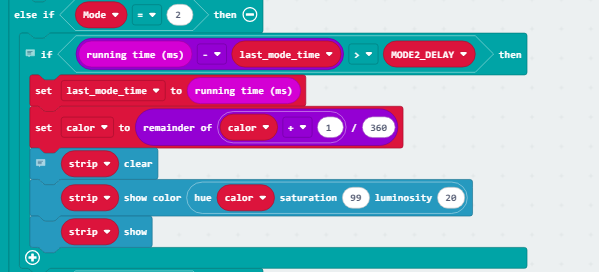

⑥ Cuando el modo es 3 y el intervalo entre el tiempo actual y el tiempo del modo anterior excede MODE3_DELAY, actualice primero la marca de tiempo del modo y desplace todos los píxeles de la tira de luz en 1 bit, asigne un tono aleatorio (0–359), alta saturación (99) y bajo brillo (20) al píxel 0. Actualice la pantalla y podrá ver una luz que fluye: las luces se mueven secuencialmente y cambian de color aleatoriamente. (Los valores de brillo y saturación en el código se pueden ajustar según sea necesario).

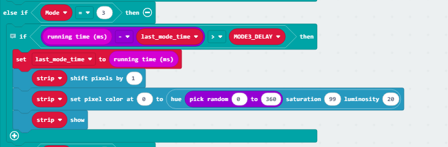

⑦ Cuando el modo es 4 y el intervalo entre el tiempo actual y el tiempo del modo anterior excede MODE4_DELAY, actualice primero la marca de tiempo del modo y borre la tira de luz, asigne un tono aleatorio (0–359), alta saturación (99) y bajo brillo (20) a los píxeles correspondientes a model_step, y actualice la pantalla. Finalmente, cíclico model_step dentro de 0-3 a través de módulo, y verá que un solo LED se enciende secuencialmente en colores aleatorios. (Los valores de brillo y saturación en el código se pueden ajustar según sea necesario).

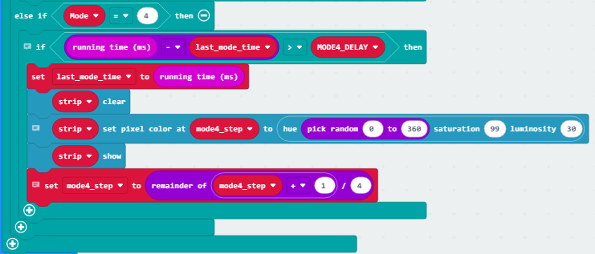

#### 4.2.2.6 Resultado de la Prueba

Después de grabar el código, inserte la placa micro:bit en la ranura del gamepad (**pilas instaladas**), y active el interruptor a “ON”.

Presione **C**: las luces alternan entre **rojo-verde-azul-amarillo-púrpura** en secuencia.

Presione **D**: el tono de color de las luces aumentará y, finalmente, los colores degradados cambiarán suavemente.

Presione **E**: las luces generan un color aleatorio a partir del píxel 0 y desplazan el color un píxel secuencialmente, por lo que puede ver una luz que fluye.

Presione **F**: cada píxel se ilumina en colores aleatorios en secuencia.

**Consejo:** Si no hay respuesta en la placa, presione el botón de reinicio en la parte posterior de la placa micro:bit.

