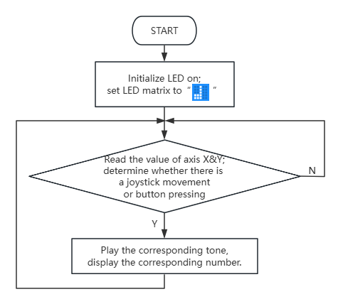
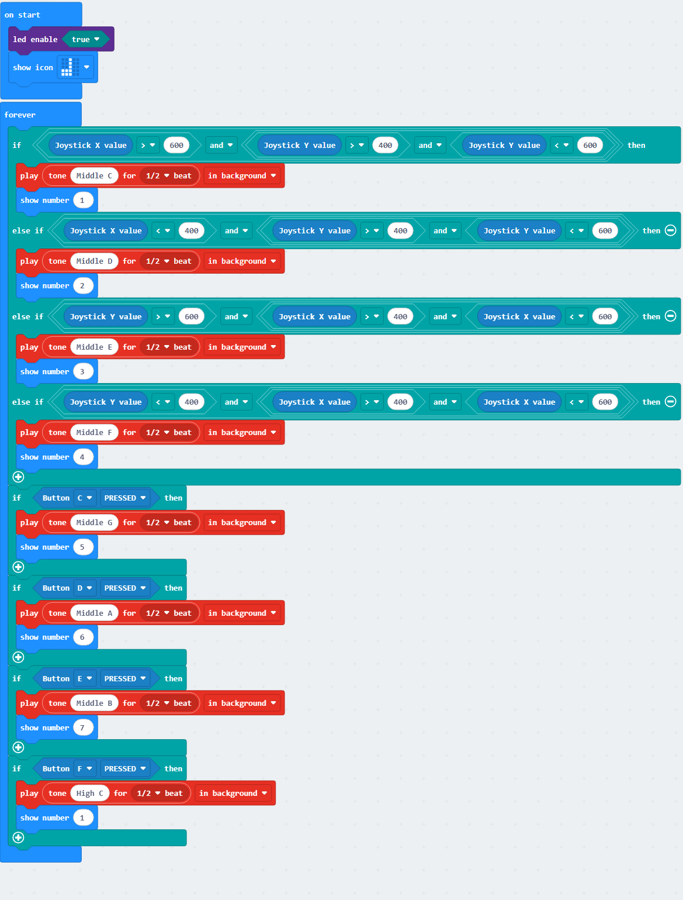
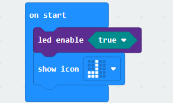
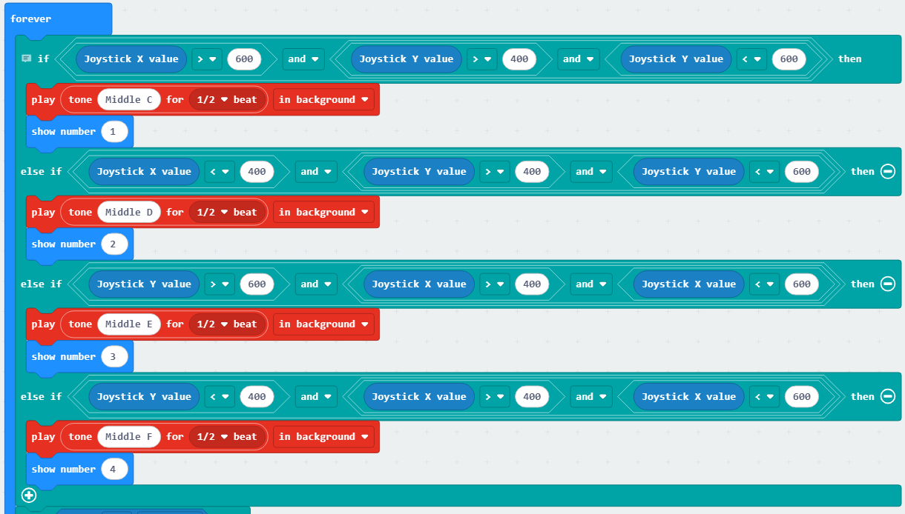

### 4.2.3 Simple Electronic Piano

#### 4.2.3.1 Overview

In this project, we control the micro:bit speaker to play different tones by toggling the joystick and pressing the buttons. Meanwhile, the on-board LED matrix will show corresponding numbers. 

Turning the joystick to the right produces "Do (Tone Central C)" with the display showing "1"; turning it to the left produces "Re (Tone D)" with "2"; turning it upward produces "Mi (Tone E)" with "3"; turning it downward produces "Fa (Tone F)" with "4". Pressing the button C produces "Sol (Tone G)" with "5", pressing D produces "La (Tone A)" with "6", E produces "Si (Tone B)" with "7", and pressing F produces higher "Do(Sharp)" while the display reverts to "1". There is a nice synchronization of the joystick, buttons, tones, and display.

#### 4.2.3.2 Component Knowledge

**Microbit speaker**

The micro:bit board features a built-in speaker for making sound, like giggles, greetings, yawns, or expressions of sadness, or even compose a song. By programming, it can even generate individual notes, melodies, and rhythms, or even musical compositions, such as the song *Twinkle Twinkle Little Star*.

#### 4.2.3.3 Required Parts

| |   | |
| :--: | :--: | :--: |
| **micro:bit V2 board** (self-provided) ×1 | **micro:bit Smart Gamepad** (assembled) ×1 |**AAA battery** (self-provided) ×4 |

#### 4.2.3.4 Code Flow

#### 4.2.3.5 Test Code

⚠️ **Note that the sensitivity of the joystick can be adjusted according to your needs.**

**Complete code:**

**Brief explanation:**

① Initialize micro:bit LED matrix to show .

② Determine the direction of the joystick movement; play the corresponding tones for half-beat in the background, and the LED matrix displays the corresponding number.

③ Check if a button is pressed, and play the corresponding tone for half-beat in the background, and the LED matrix displays the corresponding number.

#### 4.2.3.6 Test Result

After burning the code, insert the micro:bit board into the slot of the gamepad (**batteries installed**), and toggle the switch on it to “ON”. The LED matrix shows “” first.

Turning the joystick to the right produces "Do (Tone Central C)" with the display showing "1"; turning it to the left produces "Re (Tone D)" with "2"; turning it upward produces "Mi (Tone E)" with "3"; turning it downward produces "Fa (Tone F)" with "4". Pressing the button C produces "Sol (Tone G)" with "5", pressing D produces "La (Tone A)" with "6", E produces "Si (Tone B)" with "7", and pressing F produces higher "Do(Sharp)" while the display reverts to "1". 

You have built the simple electronic piano!

**Tip:** If there is no response on the board, please press the reset button on the back of the micro:bit board.

