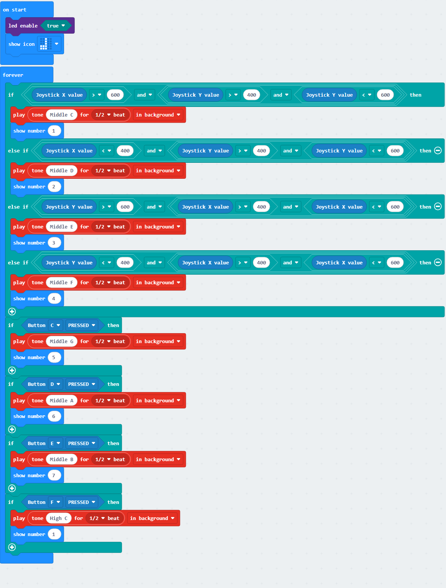
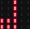
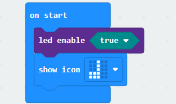
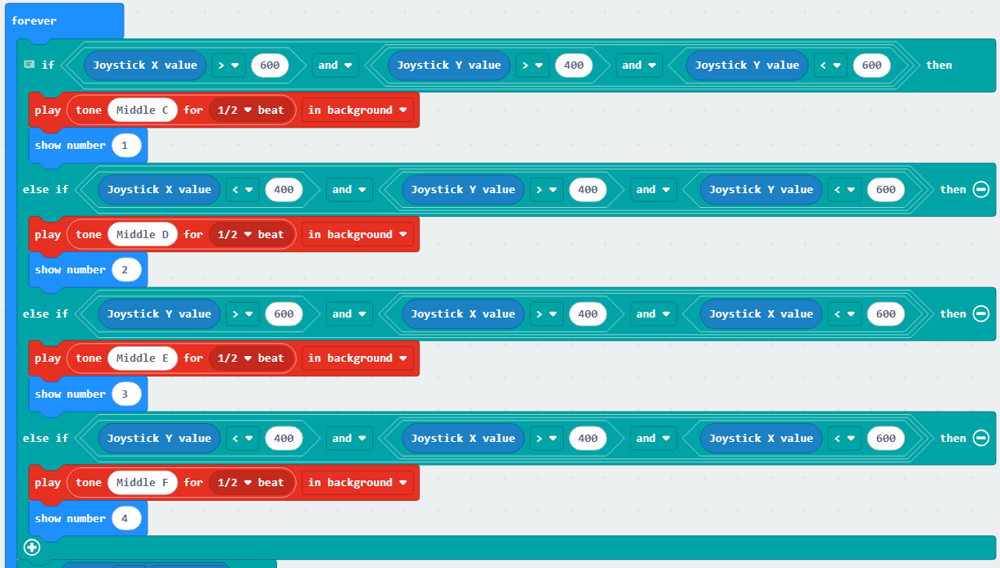
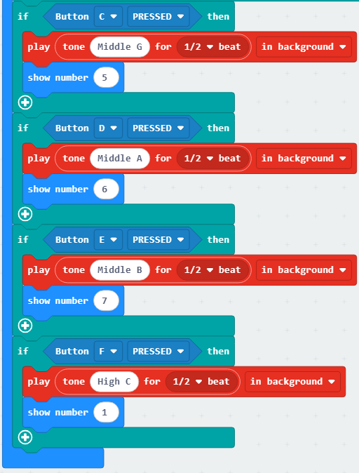

### 4.2.3 シンプルな電子ピアノ

#### 4.2.3.1 概要

このプロジェクトでは、ジョイスティックを操作したりボタンを押したりすることで、micro:bitスピーカーを制御して異なる音を再生します。同時に、オンボードのLEDマトリックスには対応する数字が表示されます。

ジョイスティックを右に倒すと「ド（中央C）」が鳴り、「1」が表示されます。左に倒すと「レ（D）」が鳴り、「2」が表示されます。上に倒すと「ミ（E）」が鳴り、「3」が表示されます。下に倒すと「ファ（F）」が鳴り、「4」が表示されます。ボタンCを押すと「ソ（G）」が鳴り、「5」が表示され、Dを押すと「ラ（A）」が鳴り、「6」が表示され、Eを押すと「シ（B）」が鳴り、「7」が表示され、Fを押すと高い「ド（シャープ）」が鳴り、表示は「1」に戻ります。ジョイスティック、ボタン、音、表示がうまく同期しています。

#### 4.2.3.2 コンポーネント知識

**Microbit スピーカー**

micro:bitボードには、くすくす笑い、挨拶、あくび、悲しみの表現などの音を出すための内蔵スピーカーが搭載されており、曲を作曲することもできます。プログラミングによって、個々の音符、メロディー、リズム、さらには「きらきら星」のような楽曲も生成できます。

#### 4.2.3.3 必要な部品

| **micro:bit V2 ボード** (自己調達) ×1 | **micro:bit スマートゲームパッド** (組み立て済み) ×1 |**単4電池** (自己調達) ×4 |
| :--: | :--: | :--: |
| |   | |

#### 4.2.3.4 コードフロー

#### 4.2.3.5 テストコード

⚠️ **ジョイスティックの感度は、必要に応じて調整できます。**

**完全なコード:**

**簡単な説明:**

① micro:bit LEDマトリックスを初期化して  を表示させます。

② ジョイスティックの動きの方向を決定します。対応する音をバックグラウンドで半拍再生し、LEDマトリックスに対応する数字を表示します。

③ ボタンが押されているかを確認し、対応する音をバックグラウンドで半拍再生し、LEDマトリックスに対応する数字を表示します。

#### 4.2.3.6 テスト結果

コードを書き込んだ後、micro:bitボードをゲームパッドのスロットに挿入し（**電池が取り付けられていることを確認**）、「ON」に切り替えます。LEDマトリックスには最初に「」が表示されます。

ジョイスティックを右に倒すと「ド（中央C）」が鳴り、「1」が表示されます。左に倒すと「レ（D）」が鳴り、「2」が表示されます。上に倒すと「ミ（E）」が鳴り、「3」が表示されます。下に倒すと「ファ（F）」が鳴り、「4」が表示されます。ボタンCを押すと「ソ（G）」が鳴り、「5」が表示され、Dを押すと「ラ（A）」が鳴り、「6」が表示され、Eを押すと「シ（B）」が鳴り、「7」が表示され、Fを押すと高い「ド（シャープ）」が鳴り、表示は「1」に戻ります。

シンプルな電子ピアノが完成しました！

**ヒント:** ボードが応答しない場合は、micro:bitボードの背面にあるリセットボタンを押してください。

