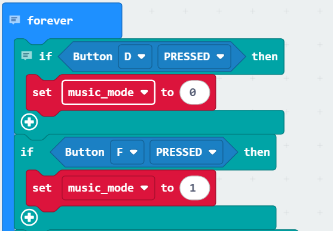
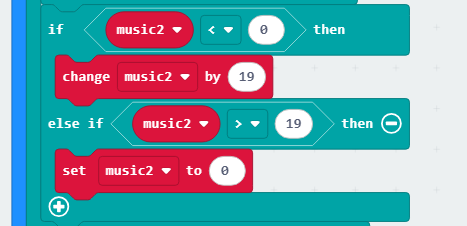
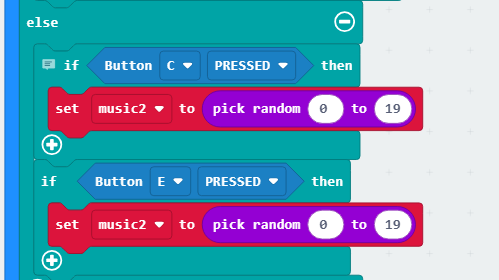
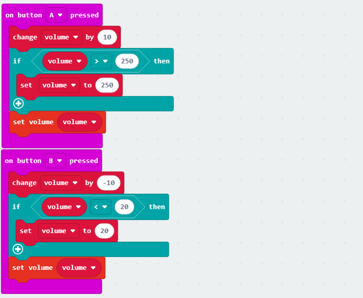

### 4.2.4 Music Player

#### 4.2.4.1 Overview

Herein we build a music player that generates sound via the built-in buzzer on the micro:bit board (does not play vocal music). It features a library of 20 short tracks and supports both sequential and random playback. 

In sequential mode, pressing C(Previous song) or E(Next song) button switches tracks according to a preset sequence until reaching the end of the list; while in random mode, each press selects a track randomly from the 20 sounds with the color lights flashing, and when one song is finishes it stops immediately. 

Meanwhile, the micro:bit LED matrix displays the current playback mode in real time.

#### 4.2.4.2 Required Parts

| |   | |
| :--: | :--: | :--: |
| **micro:bit V2 board** (self-provided) ×1 | **micro:bit Smart Gamepad** (assembled) ×1 |**AAA battery** (self-provided) ×4 |

#### 4.2.4.3 Code Flow

#### 4.2.4.4 Test Code

**Complete code:**

**Brief explanation:**

① Initialize the LED matrix and the sound volume, connect the RGB pin to P8 and set the number of RGB to 4.

② Initialize the array of melody to 20 and add their detailed tracks, and set its initial volume.

③ Determine whether button D or F is pressed. Press D for '0-sequential playback', F for '1-random playback'.

④ In sequential mode, press C to play the previous song, D to skip to the next song. 

Since there are only 20 tracks in the array, only music of N.O. 0-19 can be played. So we add an if condition to avoid overruns and underruns of the array.

However, in random mode, press C/E to shuffle all these 20 songs.

⑤ Determine whether the previous song is inconsistent with the current one. If yes, stop the current one first and then play that one.

⑥ Check the mode is '0-sequential playback', showing '', or '1-random playback', showing '', with a delay of 100ms.

⑦ Make the RGB lights breathing in background.

⑧ Press A to turn up the volume (+10); press B to turn it down (-10). The volume of the micro:bit buzzer is decided by the output voltage of the internal connected pin. We can control the volume by converting digital values 0~255 into analog ones through DAC.

#### 4.2.4.5 Test Result

After burning the code, insert the micro:bit board into the slot of the gamepad (**batteries installed**), and toggle the switch on it to “ON”. 

After powering on, it is in sequential mode by default, and will play the song at N.O. “0”. As it is finishes, you can press C for the last song or E for the next one. 

Press F to switch to random mode. And you can press D to back to sequential one. In F mode, a random track of these 20 will be played if you press C/E. After finishing, it stops. 

The RGB lights are always breathing from the moment of powering on. Meanwhile, the micro:bit LED matrix shows “” in sequential mode and “” in random mode. 

For volume, press A to turn up and B to turn down.

**Tip:** If there is no response on the board, please press the reset button on the back of the micro:bit board.

