### 4.2.4 Lettore Musicale

#### 4.2.4.1 Panoramica

Qui costruiamo un lettore musicale che genera suoni tramite il buzzer integrato sulla scheda micro:bit (non riproduce musica vocale). Dispone di una libreria di 20 brevi tracce e supporta sia la riproduzione sequenziale che casuale.

In modalità sequenziale, premendo il pulsante C (Canzone precedente) o E (Canzone successiva) si cambiano le tracce secondo una sequenza preimpostata fino a raggiungere la fine dell'elenco; mentre in modalità casuale, ogni pressione seleziona una traccia a caso tra i 20 suoni con le luci colorate che lampeggiano, e quando una canzone finisce si ferma immediatamente.

Nel frattempo, la matrice LED micro:bit visualizza la modalità di riproduzione corrente in tempo reale.

#### 4.2.4.2 Parti Richieste

| |  | |
| :--: | :--: | :--: |
| **Scheda micro:bit V2** (auto-fornita) ×1 | **Smart Gamepad micro:bit** (assemblato) ×1 | **Batteria AAA** (auto-fornita) ×4 |

#### 4.2.4.3 Flusso del Codice

#### 4.2.4.4 Codice di Test

**Codice completo:**

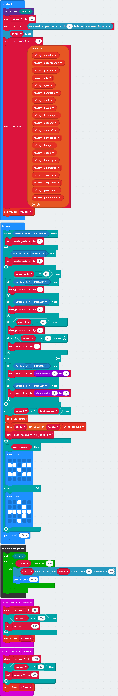

**Breve spiegazione:**

① Inizializza la matrice LED e il volume del suono, collega il pin RGB a P8 e imposta il numero di RGB a 4.

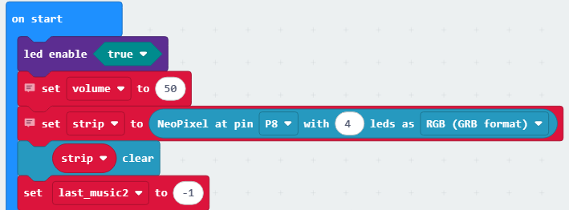

② Inizializza l'array della melodia a 20 e aggiungi le loro tracce dettagliate, e imposta il volume iniziale.

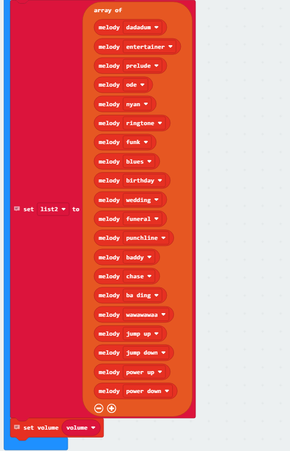

③ Determina se il pulsante D o F è premuto. Premi D per '0-riproduzione sequenziale', F per '1-riproduzione casuale'.

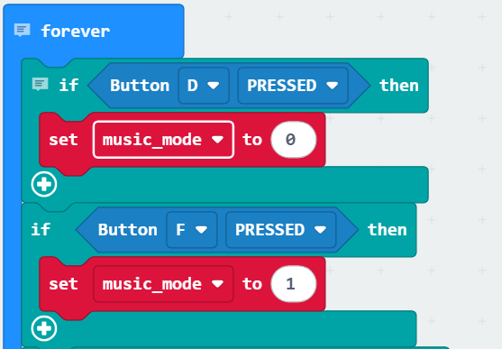

④ In modalità sequenziale, premi C per riprodurre la canzone precedente, E per passare alla canzone successiva.

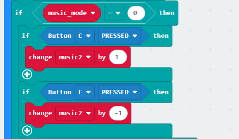

Poiché ci sono solo 20 tracce nell'array, può essere riprodotta solo musica dal N.O. 0-19. Quindi aggiungiamo una condizione if per evitare overflow e underflow dell'array.

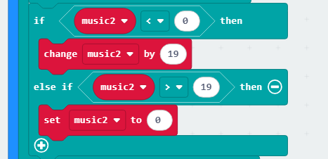

In modalità casuale, invece, premi C/E per mescolare tutte queste 20 canzoni.

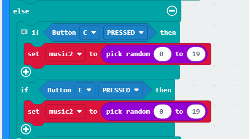

⑤ Determina se la canzone precedente è incoerente con quella attuale. In caso affermativo, ferma prima quella attuale e poi riproduci quella.

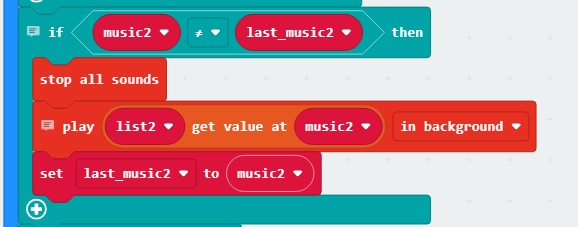

⑥ Controlla se la modalità è '0-riproduzione sequenziale', mostrando '', o '1-riproduzione casuale', mostrando '', con un ritardo di 100ms.

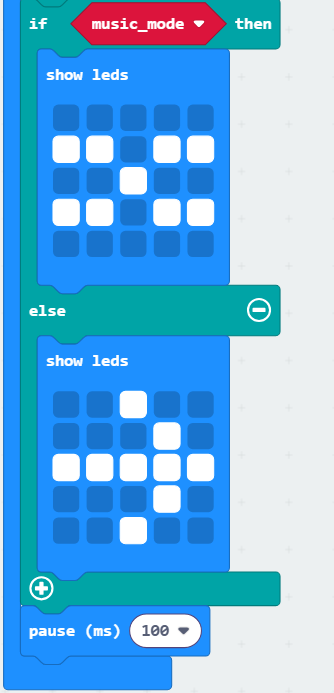

⑦ Fai respirare le luci RGB in sottofondo.

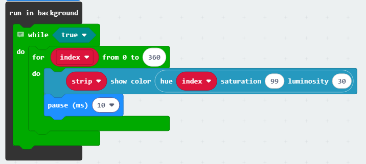

⑧ Premi A per aumentare il volume (+10); premi B per diminuirlo (-10). Il volume del buzzer micro:bit è deciso dalla tensione di uscita del pin interno collegato. Possiamo controllare il volume convertendo i valori digitali 0~255 in valori analogici tramite DAC.

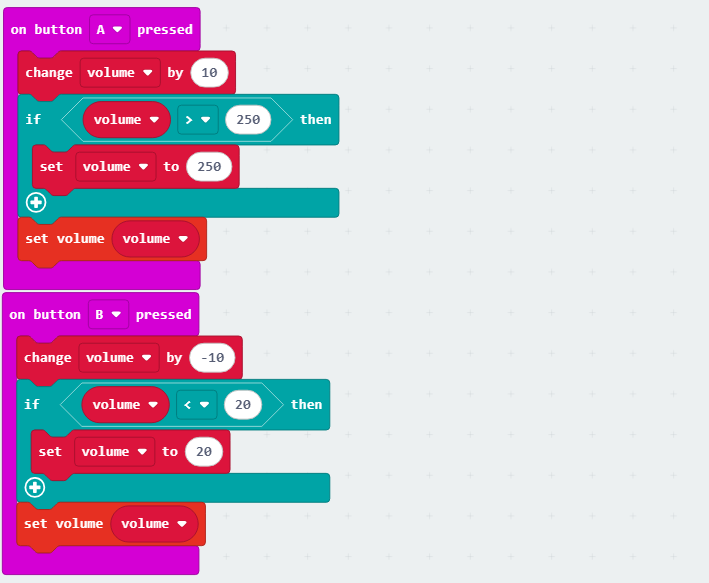

#### 4.2.4.5 Risultato del Test

Dopo aver caricato il codice, inserisci la scheda micro:bit nello slot del gamepad (**batterie installate**) e sposta l'interruttore su “ON”.

Dopo l'accensione, è in modalità sequenziale per impostazione predefinita e riprodurrà la canzone al N.O. “0”. Una volta terminata, puoi premere C per l'ultima canzone o E per la successiva.

Premi F per passare alla modalità casuale. E puoi premere D per tornare a quella sequenziale. In modalità F, una traccia casuale di queste 20 verrà riprodotta se premi C/E. Dopo aver terminato, si ferma.

Le luci RGB respirano sempre dal momento dell'accensione. Nel frattempo, la matrice LED micro:bit mostra “” in modalità sequenziale e “” in modalità casuale.

Per il volume, premi A per aumentare e B per diminuire.

**Suggerimento:** Se non c'è risposta sulla scheda, premi il pulsante di reset sul retro della scheda micro:bit.

