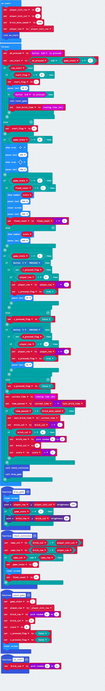
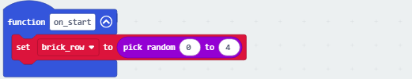
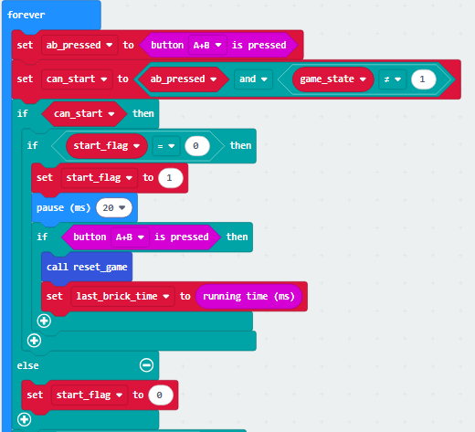
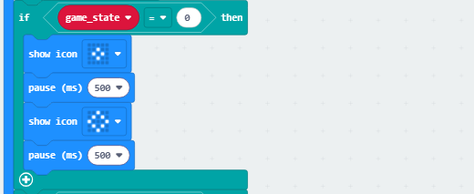
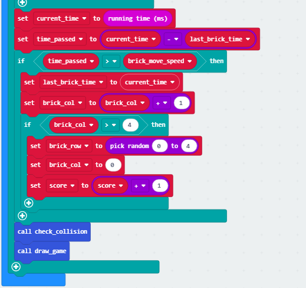

### 4.2.5 Avoid Bricks

#### 4.2.5.1 Overview

In this project, we play a brick-avoidance game where players use a Micro:bit gamepad to move their LED indicator left and right while evading bricks falling from above. There are three states: a) a dynamic icon at startup, b) real-time avoidance actions during gameplay, and c) a final score after collisions. 

Players earn 1 point after each avoidance (when the brick reaches the bottom), and the game is over when they collides with a brick; the final score is displayed with a scrolling effect. 

The game can be started or reset by pressing both A+B. This straightforward gameplay mechanism combines real-time responsiveness with strategic anticipation.

#### 4.2.5.2 Required Parts

| |   | |
| :--: | :--: | :--: |
| **micro:bit V2 board** (self-provided) ×1 | **micro:bit Smart Gamepad** (assembled) ×1 |**AAA battery** (self-provided) ×4 |

#### 4.2.5.3 Code Flow

#### 4.2.5.4 Test Code

⚠️ **Note that the initial threshold 300 in the code can be modified according to your needs. The higher the value is, the slower the brick will fall.**

**Complete code:**

**Brief explanation:**

① Initialize related variables, including player initial row, column, and speed of the brick, and set the position of the player to initial row. 

Call a on_start function.

② As for this function, it make the brick appears in a random column of 0~4 at the beginning of the game.

③ Determine whether “A+B is pressed and the game is not started”. If yes and startup is marked as an initial state, mark the startup state first and confirm again whether the buttons are still pressed after a short delay. If they are, reset the game (call the reset_game function) and record the time. Or else, cancel startup mark.

④ The following function resets the game to initial state. It sets the state to “gaming”(game_state=1) and puts player to initial position. And the brick will appear at a random column(0~4) and 0th row, and the scores will zero out. At last, the pressing of the A/B is marked as not triggered, and the matrix is then cleared.

⑤ When the game state is **0-initial state**(not gaming after powering on), the displayed icon will flash.

⑥ When it is **2-game over**, the score will be controlled according to the flash count (flash_count). If the count<3, repeats “show score → short  delay → clear display → short  delay → count+ 1”; when count reaches 3, it always shows the score and extend the delay.

⑦ In **1-gaming** state, when you press C without triggering the press mark and player row > 0, the player row -1 and mark button C as triggered (with delay to anti-jitter); press E without triggering and when player row < 4, and the row +1 with E being triggered (delay); if no action is performed, the trigger mark of the corresponding buttons is reset.

⑧ Calculate the difference between the current time and the last brick movement time. If this difference exceeds the brick speed threshold, update the brick movement time and the brick column +1. If column > 4 (reaching the boundary), reset the brick to a random row with its column=zero, and score+1. 

Call the collision detection and game graphics rendering functions to drop bricks, reset after reaching the boundary, accumulate score, and update game state in real time.

Invoke the collision detection and game graphics rendering functions to achieve automatic brick advancement, boundary reset, score accumulation, and real-time game state updates.

⑨ Determine whether the game is over: it first checks whether “the brick column matches the player's” and “whether the brick row matches the player's”. If both conditions are met (i.e., the bricks overlap with the player), set the game to 2 state (game over), clear the display and reset the flash count is reset. 

“Game over upon collision.”

⑩ Render game visuals: it first clears the display, and then plots points with a brightness of 255 (Player) at the player's initial column and current row positions; if the game is started (game_state=1), it plots points with a brightness of 85 (brick) at the brick's row and column. So we can distinguish bricks from the player according to their brightness.

#### 4.2.5.5 Test Result

After burning the code, insert the micro:bit board into the slot of the gamepad (**batteries installed**), and toggle the switch on it to “ON”. 

It is in **0-initial state** after powering on and the matrix flashes two square icons. 

Press A and B (for at least 1 second) to start the game (in **1-gaming** state), and a brick will fall in a random column. Now you can move left/right by pressing C/E. Each time you avoid a brick, score+1. 

Game over upon collision (**2-game over**), and the final score will be displayed on the matrix. If you want to play one more round, press A and B again. Power off to exit the game (toggle the DIP switch to “OFF”).

**Tip:** If there is no response on the board, please press the reset button on the back of the micro:bit board.

