### 4.2.5 Éviter les briques

#### 4.2.5.1 Aperçu

Dans ce projet, nous jouons à un jeu d'évitement de briques où les joueurs utilisent un Micro:bit gamepad pour déplacer leur indicateur LED vers la gauche et la droite tout en évitant des briques tombant d'en haut. Il y a trois états : a) une icône dynamique au démarrage, b) des actions d'évitement en temps réel pendant le jeu, et c) un score final après les collisions.

Les joueurs gagnent 1 point après chaque esquive (lorsque la brique atteint le bas), et la partie se termine lorsqu'ils entrent en collision avec une brique ; le score final est affiché avec un effet de défilement.

#### 4.2.5.2 Matériel requis

| |   | |
| :--: | :--: | :--: |
| **micro:bit V2 board** (fourni par l'utilisateur) ×1 | **micro:bit Smart Gamepad** (assemblé) ×1 |**AAA battery** (fourni par l'utilisateur) ×4 |

#### 4.2.5.3 Flux du code

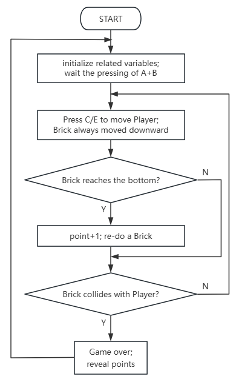

#### 4.2.5.4 Code de test

⚠️ **Remarque : le seuil initial 300 dans le code peut être modifié selon vos besoins. Plus la valeur est élevée, plus la brique tombera lentement.**

**Code complet :**

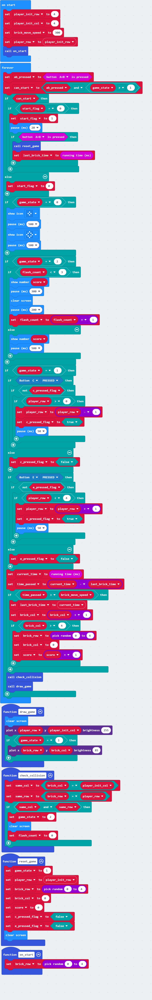

**Brève explication :**

① Initialiser les variables liées, y compris la colonne initiale du joueur, la ligne et la vitesse de la brique, et positionner le joueur sur la colonne initiale. Appeler la fonction on_start.

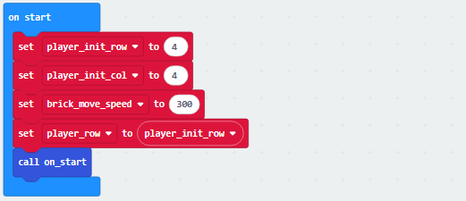

② Cette fonction fait apparaître la brique dans une colonne aléatoire de 0~4 au début du jeu.

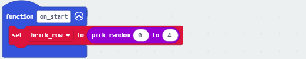

③ Déterminer si “A+B est pressé et que le jeu n'a pas démarré”. Si oui et que le démarrage est marqué comme état initial, marquer d'abord l'état de démarrage et confirmer à nouveau si les boutons sont toujours enfoncés après un court délai. S'ils le sont, réinitialiser le jeu (appeler la fonction reset_game) et enregistrer l'heure. Sinon, annuler la marque de démarrage.

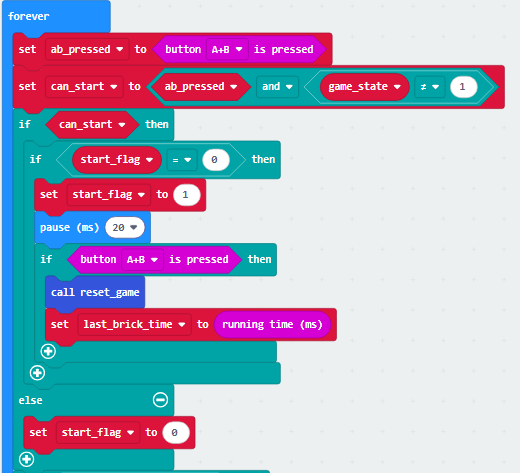

④ La fonction suivante réinitialise le jeu à l'état initial. Elle définit l'état sur “gaming” (game_state=1) et remet le joueur à la position initiale. La brique apparaîtra dans une colonne aléatoire (0~4) et à la ligne 0, et les scores sont remis à zéro. Enfin, l'appui des boutons A/B est marqué comme non déclenché, et la matrice est ensuite effacée.

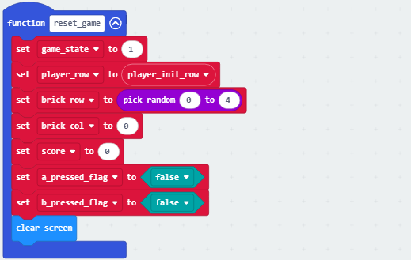

⑤ Lorsque l'état de jeu est **0-initial state** (pas en train de jouer après la mise sous tension), l'icône affichée clignote.

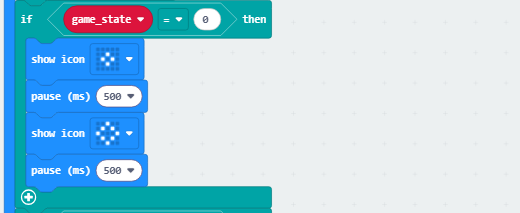

⑥ Quand il est en **2-game over**, l'affichage du score est contrôlé selon le nombre de clignotements (flash_count). Si le count<3, répéter “afficher le score → court délai → effacer l'affichage → court délai → count+1” ; lorsque count atteint 3, il affiche toujours le score et prolonge le délai.

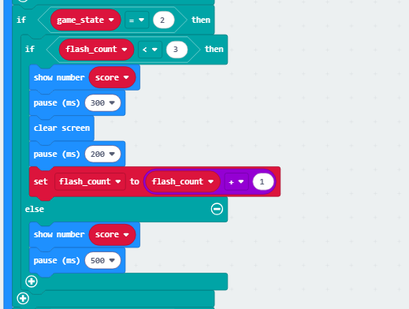

⑦ En état **1-gaming**, lorsque vous appuyez sur C sans que la marque d'appui soit déclenchée et que la colonne du joueur > 0, la colonne du joueur diminue de 1 et le bouton C est marqué comme déclenché (avec un délai anti-rebond) ; appuyez sur E sans déclenchement et lorsque la colonne du joueur < 4, la colonne augmente de 1 et E est marqué comme déclenché (délai) ; si aucune action n'est effectuée, la marque de déclenchement des boutons correspondants est réinitialisée.

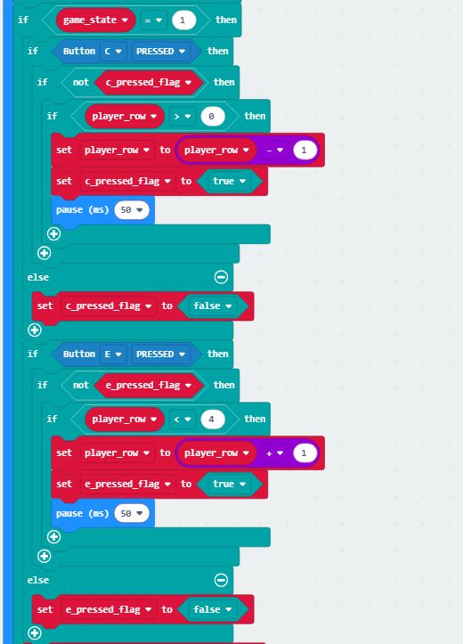

⑧ Calculer la différence entre le temps courant et le dernier temps de déplacement de la brique. Si cette différence dépasse le seuil de vitesse de la brique, mettre à jour le temps de déplacement de la brique et incrémenter la ligne de la brique de 1. Si row > 4 (atteint la limite), réinitialiser la brique à une colonne aléatoire avec row=0, et score+1.

Appeler les fonctions de détection de collision et de rendu graphique du jeu pour faire descendre les briques, réinitialiser après avoir atteint la limite, accumuler le score et mettre à jour l'état du jeu en temps réel.

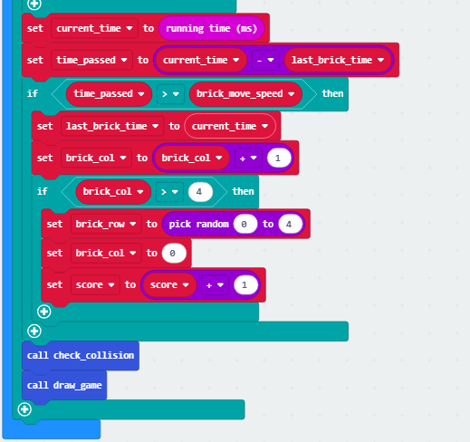

⑨ Déterminer si la partie est terminée : il vérifie d'abord si “la colonne de la brique correspond à celle du joueur” et “si la ligne de la brique correspond à celle du joueur”. Si les deux conditions sont remplies (c.-à-d. que la brique chevauche le joueur), définir le jeu en état 2 (game over), effacer l'affichage et réinitialiser flash_count.

“Game over lors d'une collision.”

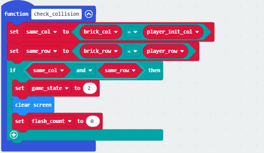

⑩ Rendre les visuels du jeu : on efface d'abord l'affichage, puis on trace des points avec une luminosité de 255 (Player) à la ligne fixe et à la colonne actuelle du joueur ; si le jeu est démarré (game_state=1), on trace des points avec une luminosité de 85 (brick) à la ligne et colonne de la brique. On peut ainsi distinguer les briques du joueur selon leur luminosité.

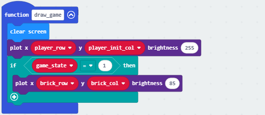

#### 4.2.5.5 Résultat du test

Après avoir flashé le code, insérez la carte micro:bit dans le slot du gamepad (**piles installées**), et basculez son interrupteur sur “ON”.

Il est en **0-initial state** après la mise sous tension et la matrice clignote avec deux icônes carrées.

Appuyez sur A et B (pendant au moins 1 seconde) pour démarrer la partie (en état **1-gaming**), et une brique tombera dans une colonne aléatoire. Vous pouvez maintenant vous déplacer à gauche/droite en appuyant sur C/E. À chaque fois que vous évitez une brique, score+1.

Game over lors d'une collision (**2-game over**), et le score final sera affiché sur la matrice. Si vous voulez rejouer une manche, appuyez de nouveau sur A et B. Éteignez pour quitter le jeu (mettre l'interrupteur DIP sur “OFF”).

**Astuce :** Si la carte ne répond pas, veuillez appuyer sur le bouton reset à l'arrière de la carte micro:bit.

