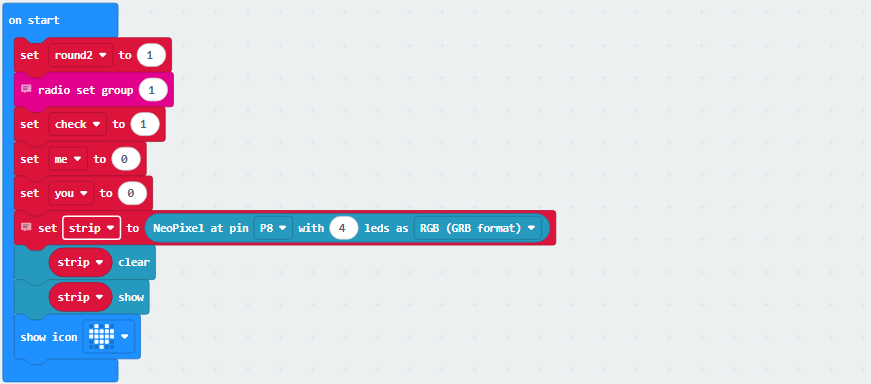
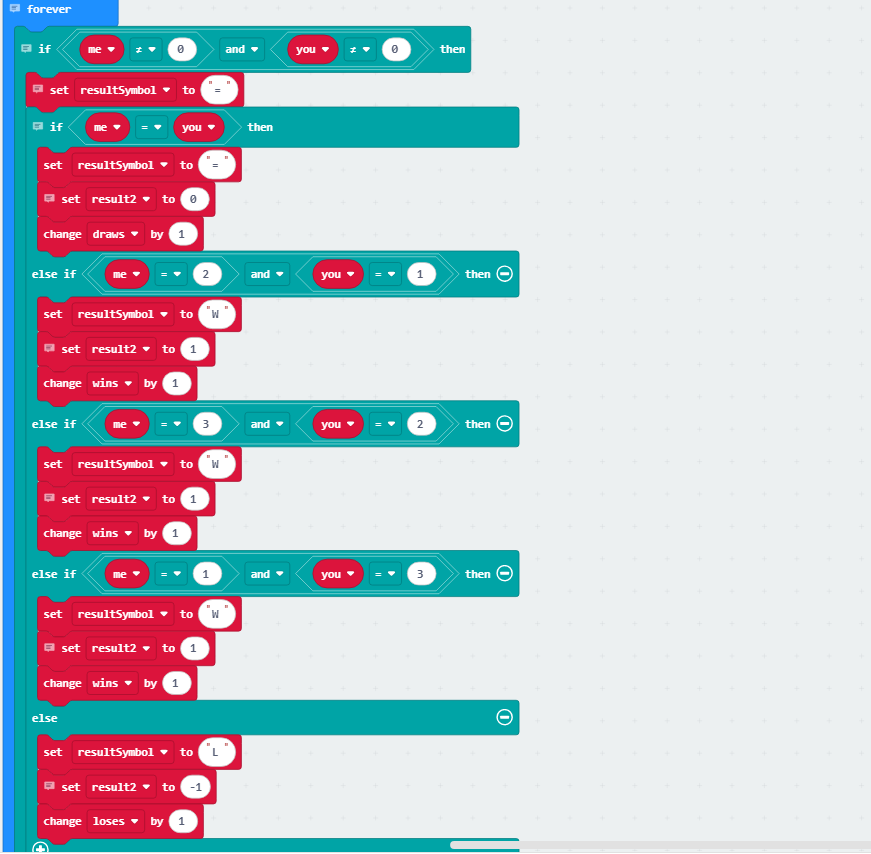
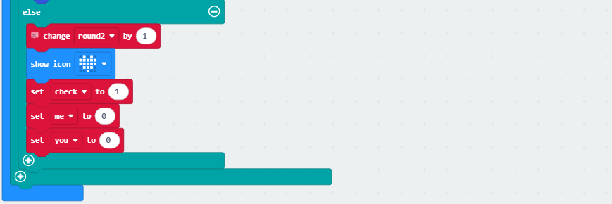
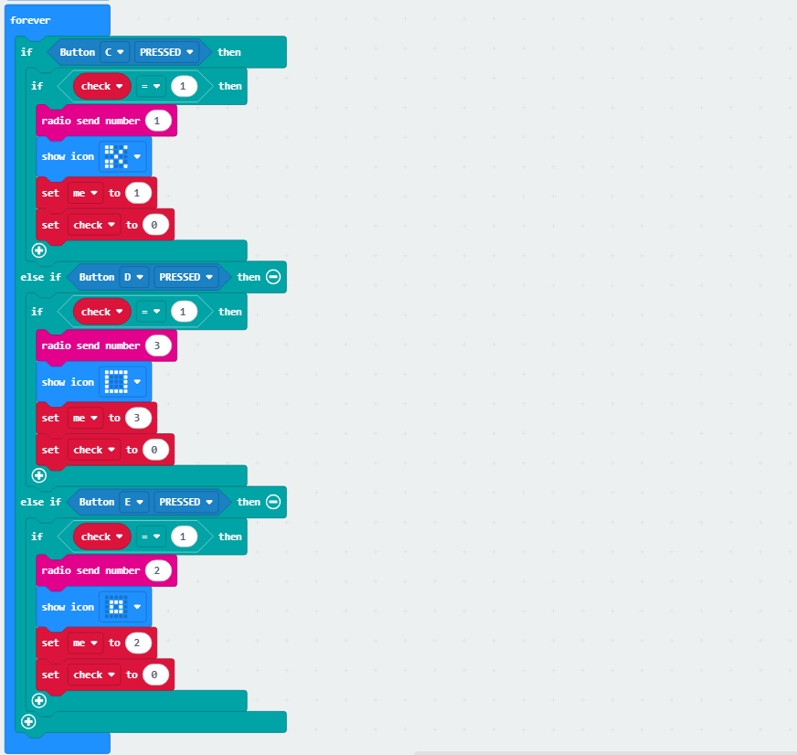
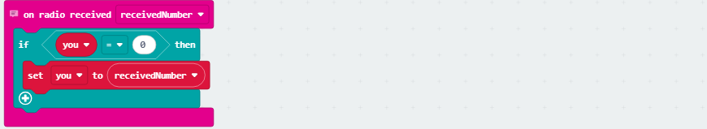
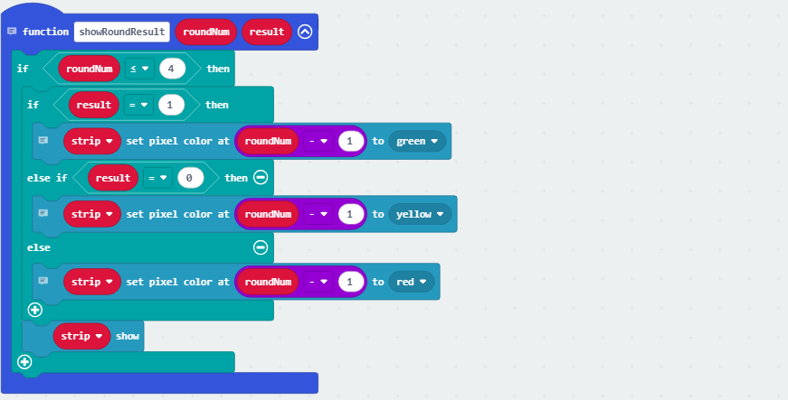
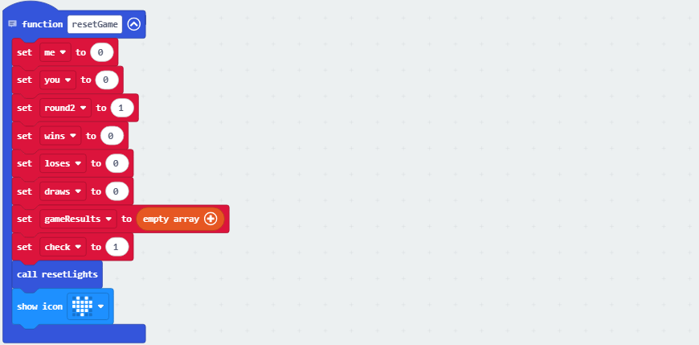

### 4.2.6 Rock-Paper-Scissors

#### 4.2.6.1 Overview

Herein, let's play rock-paper-scissors by wireless communication of micro:bit. Players select their move (rock, paper, or scissors) via the buttons, with data exchange between devices. The game follows best-of-three; if all three rounds end in all tie or win-loss-tie, a fourth match is triggered. 

Each outcome is displayed on the micro:bit matrix (W for win, L for Loss, = for tie) and revealed by the RGB lights (green for win, red for loss, yellow for tie) at pin P8. Upon completion of a round, the two device resets all data and lights, preparing for the next match. 

The gameplay seamlessly integrates wireless interaction with the multi-round combat.

#### 4.2.6.2 Component Knowledge

**Microbit wireless communication**

The micro:bit board integrates two convenient wireless communication capabilities: **2.4GHz radio** and **low-power Bluetooth (BLE)**. Yet they cannot be used simultaneously. 

The former requires no pairing and supports up to 255 independent packets to minimize interference, with a communication range of 10–30 meters, enabling rapid transmission of digital data and strings. While the latter is primarily used for pairing with smartphones, tablets, and other smart devices for IoT applications such as sensor data upload and mobile app remote control. 

They expands the creative development possibilities of the micro:bit.

#### 4.2.6.3 Required Parts

| |   | |
| :--: | :--: | :--: |
| **micro:bit V2 board** (self-provided) ×2 | **micro:bit Smart Gamepad** (assembled) ×2 |**AAA battery** (self-provided) ×8 |

#### 4.2.6.4 Code Flow

#### 4.2.6.5 Test Code

**Complete code:**

**Brief explanation:**

① Initiate the radio and set the group to '1'; set the number of rounds, status, opponent, and players' rock-paper-scissors result; connect the four RGB lights to pin P8 and refresh the display, set matrix to show .

② Determine the outcome of the current round: if your choice matches the opponent's (**1/2/3 for scissors/rock/paper**), it's a draw; otherwise, select a winner (scissors against paper against rock against scissors), round value +1 and store the result.

③ Store the results in an array and display the corresponding string. If this is the third game, determine whether a fourth game is needed (in all tie or win-loss-tie). If so, display "FINAL" and wait 1 second before clearing the rock-paper-scissors selection.

Otherwise, show "WINNER" for victory, "LOSER" for defeat, and "TIE" for a draw. After a 3-second delay, call the resetGame function to clear all game variables. 

If the match consists of four games, display "GAME OVER" and call the resetGame function again after a 3-second delay to reset all game variables.

If the game is not over, it shows and clears the choices of both.

④ Press C and the board sends "1" as scissors, and the matrix shows ; press D and the board sends "3" as paper, and the matrix shows ; Press E and it sends "2" as rock and shows .

⑤ Receive radio data (opponent's choice).

⑥ Determine whether a fourth round is required. If all three games end in all tie or win-loss-tie, a fourth game is necessary; otherwise, it is not needed.

⑦ The RGB lights display the corresponding colors based on the outcome: green for victory, red for defeat, and yellow for a draw.

⑧ When the game ends, clear the display of the four RGB lights.

⑨ Reset the game state, clear all game variable values, reset the RGB lights, and show .

#### 4.2.6.6 Test Result

After burning the code, insert the micro:bit board into the slot of the gamepad (**batteries installed**), and toggle the switch on it to “ON”. 

The matrix shows  initially. Players press buttons to select their move (E for rock, D for paper, or C for scissors), with match data exchange between the two devices. They determine the outcome of the current round: a win is indicated by the "W" with RGB light turning green, a draw by the "=" with yellow light, and a loss by the "L" with red (the first RGB light turns on after the first round, and so on). The next round will follow if the game is not over.

The game adopts best-of-three: if all three rounds end in all tie or win-loss-tie, a fourth match is triggered. 

If there is a winner after three rounds, it will display "WINNER" for victory and "LOSER" for defeat. Once the result is shown, "GAME OVER" will appear to reset the game. If the fourth round remains undecided, the game will also be over.

**Tip:** Wait for the heart icon to appear before continuing the next round. If there is no response on the board, please press the reset button on the back of the micro:bit board.

