### 4.2.6 Piedra-Papel-Tijera

#### 4.2.6.1 Resumen

Aquí, juguemos a piedra-papel-tijera mediante comunicación inalámbrica de micro:bit. Los jugadores seleccionan su movimiento (piedra, papel o tijera) a través de los botones, con intercambio de datos entre dispositivos. El juego sigue el formato al mejor de tres; si las tres rondas terminan en empate total o en victoria-derrota-empate, se activa un cuarto partido.

Cada resultado se muestra en la matriz de micro:bit (W para victoria, L para derrota, = para empate) y se revela mediante las luces RGB (verde para victoria, rojo para derrota, amarillo para empate) en el pin P8. Al finalizar una ronda, los dos dispositivos reinician todos los datos y luces, preparándose para el siguiente partido.

El juego integra a la perfección la interacción inalámbrica con el combate de varias rondas.

#### 4.2.6.2 Conocimiento de Componentes

**Comunicación inalámbrica de Micro:bit**

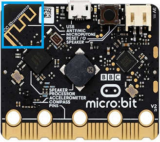

La placa micro:bit integra dos cómodas capacidades de comunicación inalámbrica: **radio de 2.4GHz** y **Bluetooth de baja energía (BLE)**. Sin embargo, no se pueden usar simultáneamente.

La primera no requiere emparejamiento y admite hasta 255 paquetes independientes para minimizar las interferencias, con un rango de comunicación de 10 a 30 metros, lo que permite la transmisión rápida de datos digitales y cadenas. Mientras que la segunda se utiliza principalmente para emparejar con teléfonos inteligentes, tabletas y otros dispositivos inteligentes para aplicaciones de IoT, como la carga de datos de sensores y el control remoto de aplicaciones móviles.

Amplían las posibilidades de desarrollo creativo de la micro:bit.

#### 4.2.6.3 Piezas Requeridas

| |  | |
| :--: | :--: | :--: |
| **Placa micro:bit V2** (suministrada por el usuario) ×2 | **Smart Gamepad micro:bit** (ensamblado) ×2 | **Pila AAA** (suministrada por el usuario) ×8 |

#### 4.2.6.4 Flujo del Código

#### 4.2.6.5 Código de Prueba

**Código completo:**

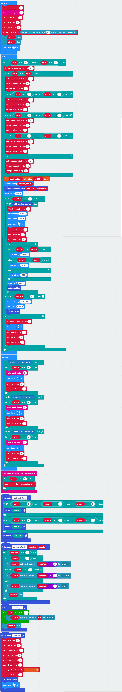

**Breve explicación:**

① Inicie la radio y establezca el grupo en '1'; establezca el número de rondas, el estado, el oponente y el resultado de piedra-papel-tijera de los jugadores; conecte las cuatro luces RGB al pin P8 y actualice la pantalla, establezca la matriz para que muestre .

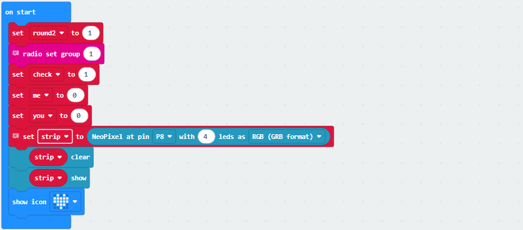

② Determine el resultado de la ronda actual: si su elección coincide con la del oponente (**1/2/3 para tijera/piedra/papel**), es un empate; de lo contrario, seleccione un ganador (tijera contra papel contra piedra contra tijera), el valor de la ronda +1 y almacene el resultado.

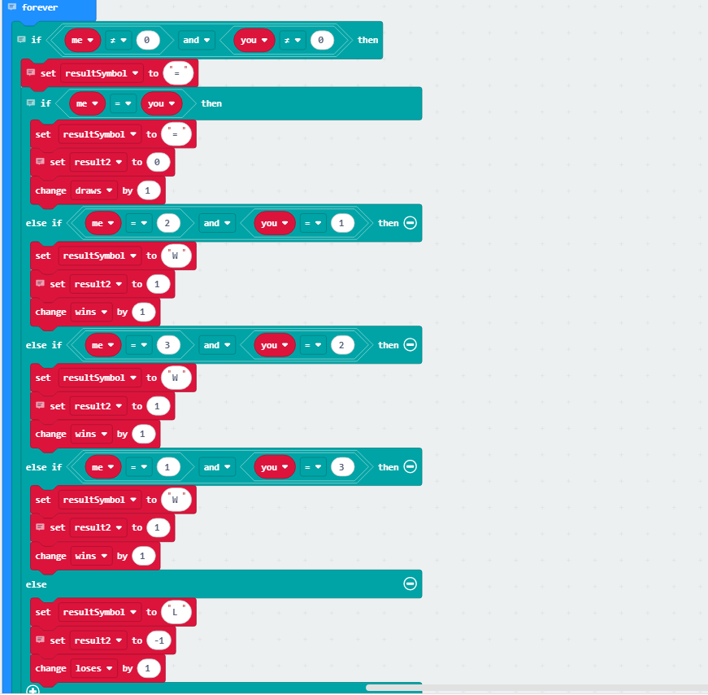

③ Almacene los resultados en un array y muestre la cadena correspondiente. Si este es el tercer juego, determine si se necesita un cuarto juego (en caso de empate total o victoria-derrota-empate). Si es así, muestre "FINAL" y espere 1 segundo antes de borrar la selección de piedra-papel-tijera.

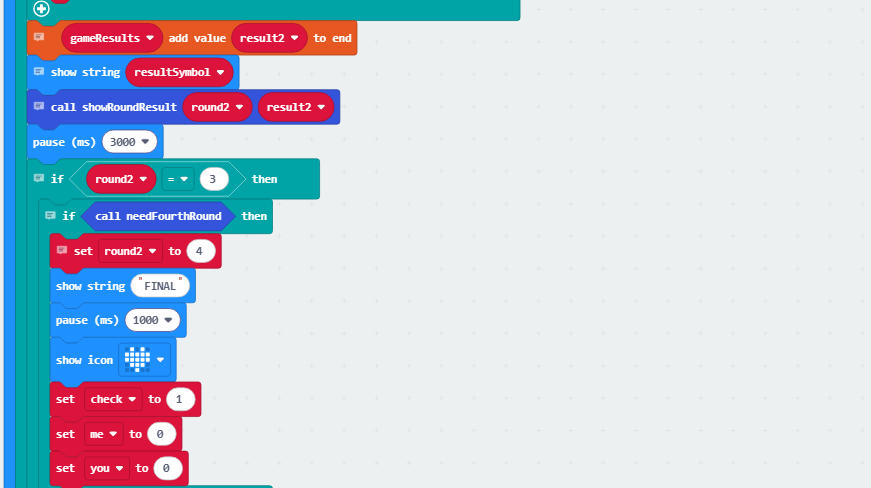

De lo contrario, muestre "WINNER" para la victoria, "LOSER" para la derrota y "TIE" para un empate. Después de un retraso de 3 segundos, llame a la función resetGame para borrar todas las variables del juego.

Si el partido consta de cuatro juegos, muestre "GAME OVER" y llame a la función resetGame nuevamente después de un retraso de 3 segundos para reiniciar todas las variables del juego.

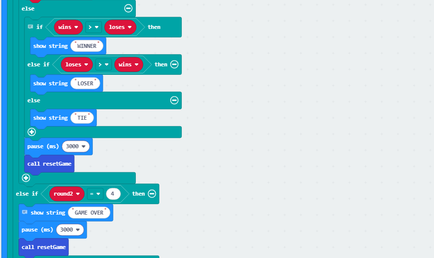

Si el juego no ha terminado, muestra  y borra las elecciones de ambos.

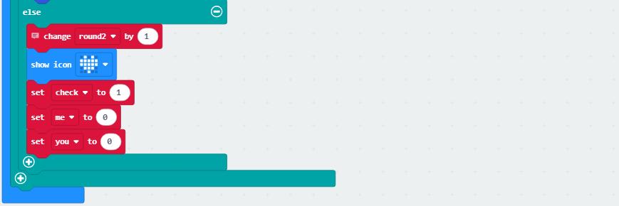

④ Presione C y la placa envía "1" como tijera, y la matriz muestra ; presione D y la placa envía "3" como papel, y la matriz muestra ; presione E y envía "2" como piedra y muestra .

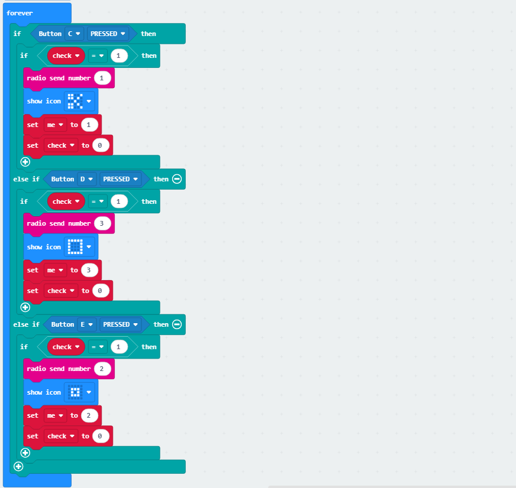

⑤ Reciba datos de radio (elección del oponente).

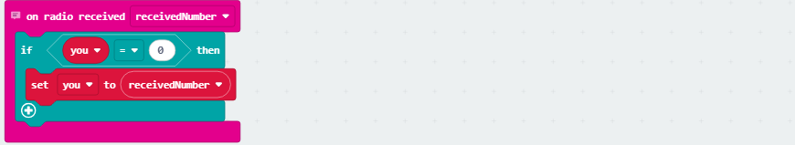

⑥ Determine si se requiere una cuarta ronda. Si los tres juegos terminan en empate total o victoria-derrota-empate, es necesario un cuarto juego; de lo contrario, no es necesario.

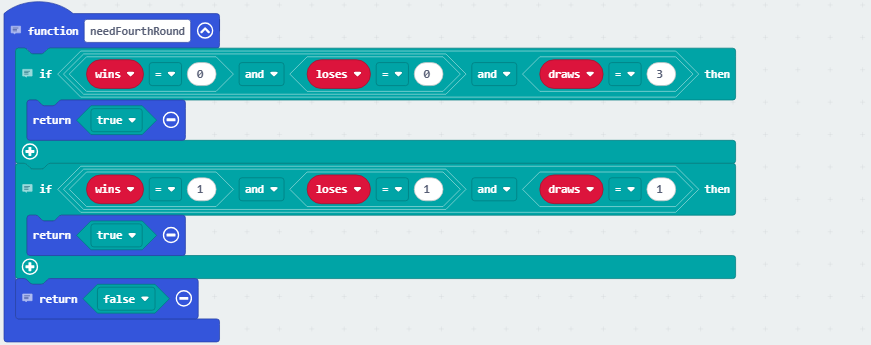

⑦ Las luces RGB muestran los colores correspondientes según el resultado: verde para la victoria, rojo para la derrota y amarillo para un empate.

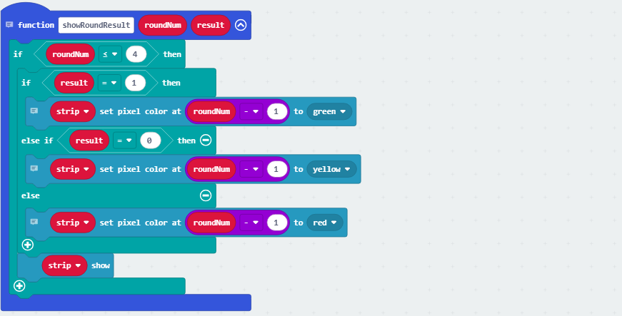

⑧ Cuando el juego termina, borre la visualización de las cuatro luces RGB.

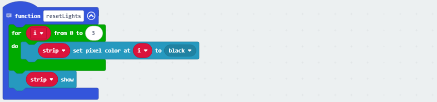

⑨ Reinicie el estado del juego, borre todos los valores de las variables del juego, reinicie las luces RGB y muestre .

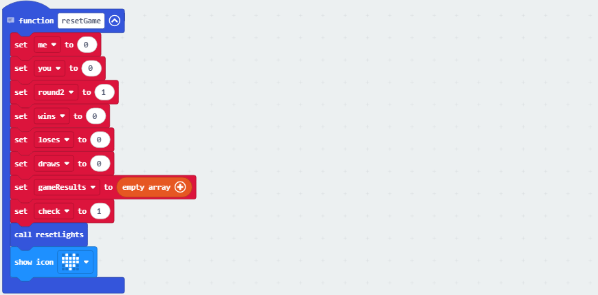

#### 4.2.6.6 Resultado de la Prueba

Después de grabar el código, inserte la placa micro:bit en la ranura del gamepad (**pilas instaladas**), y active el interruptor a “ON”.

La matriz muestra  inicialmente. Los jugadores presionan los botones para seleccionar su movimiento (E para piedra, D para papel o C para tijera), con intercambio de datos entre los dos dispositivos. Determinan el resultado de la ronda actual: una victoria se indica con la "W" con la luz RGB volviéndose verde, un empate con el "=" con la luz amarilla y una derrota con la "L" con la luz roja (la primera luz RGB se enciende después de la primera ronda, y así sucesivamente). La siguiente ronda seguirá si el juego no ha terminado.

El juego adopta el formato al mejor de tres: si las tres rondas terminan en empate total o victoria-derrota-empate, se activa un cuarto partido.

Si hay un ganador después de tres rondas, mostrará "WINNER" para la victoria y "LOSER" para la derrota. Una vez que se muestre el resultado, aparecerá "GAME OVER" para reiniciar el juego. Si la cuarta ronda sigue sin decidirse, el juego también terminará.

**Consejo:** Espere a que aparezca el icono del corazón antes de continuar con la siguiente ronda. Si no hay respuesta en la placa, presione el botón de reinicio en la parte posterior de la placa micro:bit.

