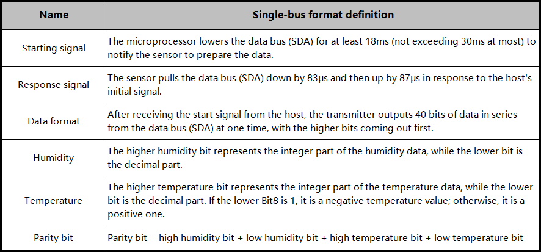
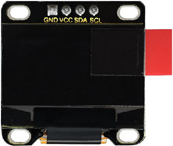
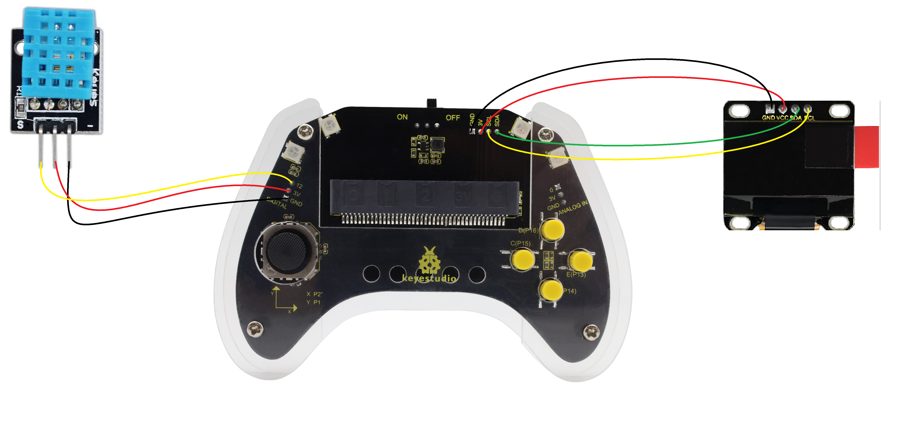
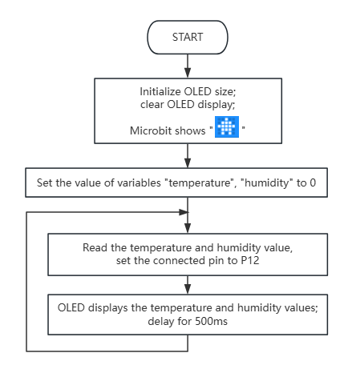
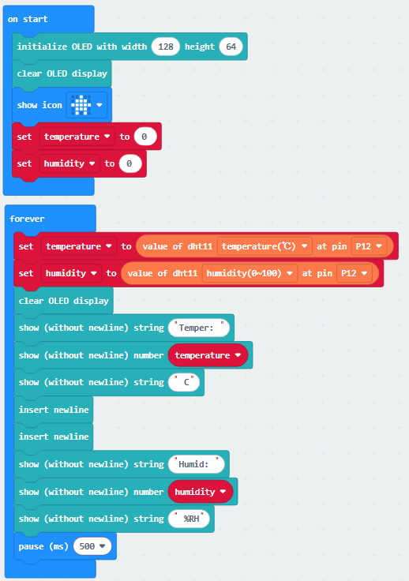

### 4.2.7 Temperature and Humidity Meter

#### 4.2.7.1 Overview

In this project, we build a temperature and humidity monitoring system by a Micro:bit board, a gamepad, an XHT11 temperature and humidity sensor, and an OLED display. The XHT11 sensor measures ambient temperature and humidity, while the OLED display updates the readings in real time. The controller board of the game pad facilitates circuit expansion and stable connections, enabling the system to function as a simple thermometer.

#### 4.2.7.2 Component Knowledge

**XHT11 temperature and humidity sensor**

The XHT11 temperature and humidity sensor outputs digital signals and employs specialized analog signal acquisition and conversion, advanced temperature and humidity sensing techniques to ensure excellent long-term stability and high reliability. 

It incorporates high-precision resistive humidity and thermistor temperature sensors, integrated with an 8-bit high-performance microcontroller.

**XHT11 communication mode:**

It employs a simplified single-bus communication. The single bus consists of a single data line, through which all data exchange and control operations within the system are performed.

- Single-bus transmission data bit:

  - Single-bus data format: Transmit 40 bits of data at a time, high bit first.

  - 8-bit integer humidity data + 8-bit decimal humidity data + 8-bit integer temperature data + 8-bit decimal temperature data + 8-bit parity bit. 

    **Note: The decimal part of the humidity is 0**.

- Parity bit:
  
  - 8-bit integer humidity data + 8-bit decimal humidity data + 8-bit integer temperature data + 8-bit decimal temperature data
  
    The 8-bit parity bit is the last 8 bits of the result.

Data sequence diagram of XH11 temperature and humidity sensor:

After the user host (MCU) sends a start signal, the XHT11 switches from low-power mode to high-speed mode, and after this signal ends, the XHT11 sends a response signal and 40-bit data, and triggers a signal acquisition. 

The signal is sent as shown in the figure:

⚠️ **Tip:** The temperature and humidity data read by the host from the XHT11 sensor are always the values from the previous measurement. If there is a long interval between two measurements, please take two consecutive readings; the value in the second time will be the actual one.

**Schematic diagram:**

**Parameters:**

- Operating voltage: DC 4.2V~5V 
- Operating current: (Max)2.5mA@5V
- Maximum power: 0.0125W
- Temperature range: -25 ~ +60°C (±2℃)
- Humidity range: 5 ~ 95%RH(Accuracy around 25C° is ±5%RH)
- Output signal: digital bidirectional single bus

**OLED display**

OLED delivers exceptional advantages such as rich color reproduction, high contrast, and wide viewing angles. Images on it are clear and vivid, with particularly outstanding black. Each pixel is self-emissive without needs for a backlight, resulting in relatively low power consumption. The 0.9-inch OLED screen, featuring its compact size, high resolution (128×96 pixels), and low power consumption, is ideal for applications in embedded systems and wearable devices.

⚠️ **Note**: For this OLED display, the SDA interface is connected to pin P20 on the Micro:bit board, while the SCL is connected to pin P19.

**Parameters:**

- Operating voltage: DC 4.2V - 5V
- Operating current: 30mA
- Interface: Pin with a spacing of 2.54mm
- Communication mode: I2C communication
- Internal driving chip: SSD1306
- Resolution: 128×64
- Viewing angle: Greater than 150°

#### 4.2.7.3 Required Parts

| |   | |
| :--: | :--: | :--: |
| **micro:bit V2 board** (self-provided) ×1 | **micro:bit Smart Gamepad** (assembled) ×1 |**AAA battery** (self-provided) ×4 |
||||
|**XHT11 temperature and humidity sensor** (self-provided)×1|**OLED display** (self-provided)×1 |**F-F DuPont wire**(self-provided) x7|

#### 4.2.7.4 Wiring Diagram

**After wiring up as shown above, insert the micro:bit into the slot on the gamepad control board.**

| OLED display | micro:bit gamepad control board |micro:bit board pin |
| :--: | :--: | :--: |
| GND |  GND | GND |
| VCC |  3V | 3V |
| SDA |  SDA | P20 |
| SCL |  SCL | P19 |

| XHT11 temperature and humidity sensor | micro:bit gamepad control board | micro:bit board pin |
| :--: | :--: | :--: |
| G | GND | GND |
| V |  3V | 3V |
| S |  12 | P12 |

#### 4.2.7.5 Code Flow

#### 4.2.7.6 Test Code
⚠️ **Note that here OLED and DHT11 libraries are included, so we need to import: https://github.com/keyestudio/pxt-environment-kit-master**.

**Complete code:**

**Brief explanation:**

① Initialize the pixels of the OLED and clear it, set the 5×5LED matrix shows , and define the values of temperature and humidity to 0.

② Assign the corresponding readings of the XHT11 sensor to variable temperature and humidity.

③ The OLED shows the readings of XHT11 sensor.

④ Delay 500ms(0.5s).

#### 4.2.7.7 Test Result

After burning the code, insert the micro:bit board into the slot of the gamepad (**batteries installed**), and toggle the switch on it to “ON”. 

After uploading the code to micro:bit board, the OLED shows the temperature and humidity read by the XHT11 sensor in real time.

**Tip:** If there is no response on the board, please press the reset button on the back of the micro:bit board.

