### 4.2.7 Temperatuur- en Vochtigheidsmeter

#### 4.2.7.1 Overzicht

In dit project bouwen we een temperatuur- en vochtigheidsbewakingssysteem met een Micro:bit board, een gamepad, een XHT11 temperatuur- en vochtigheidssensor en een OLED-display. De XHT11-sensor meet de omgevingstemperatuur en -vochtigheid, terwijl het OLED-display de metingen in real-time bijwerkt. Het controllerboard van de gamepad vergemakkelijkt circuituitbreiding en stabiele verbindingen, waardoor het systeem kan functioneren als een eenvoudige thermometer.

#### 4.2.7.2 Component Kennis

**XHT11 temperatuur- en vochtigheidssensor**

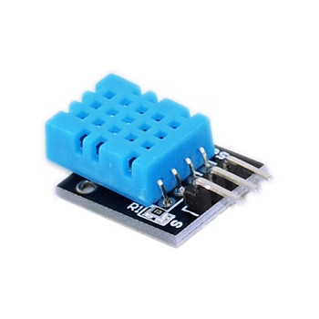

De XHT11 temperatuur- en vochtigheidssensor geeft digitale signalen af en maakt gebruik van gespecialiseerde analoge signaalverwerving en -conversie, geavanceerde temperatuur- en vochtigheidsdetectietechnieken om uitstekende langetermijnstabiliteit en hoge betrouwbaarheid te garanderen.

Het bevat zeer nauwkeurige resistieve vochtigheids- en thermistor temperatuursensoren, geïntegreerd met een 8-bit high-performance microcontroller.

**XHT11 communicatiemodus:**

Het maakt gebruik van een vereenvoudigde single-bus communicatie. De single bus bestaat uit een enkele datalijn, waardoor alle gegevensuitwisseling en besturingsbewerkingen binnen het systeem worden uitgevoerd.

- Single-bus transmissie databit:

  - Single-bus dataformaat: Zend 40 bits aan gegevens tegelijkertijd, hoge bit eerst.

  - 8-bit integer vochtigheidsgegevens + 8-bit decimale vochtigheidsgegevens + 8-bit integer temperatuurgegevens + 8-bit decimale temperatuurgegevens + 8-bit pariteitsbit.

    **Opmerking: Het decimale deel van de vochtigheid is 0**.

- Pariteitsbit:

  - 8-bit integer vochtigheidsgegevens + 8-bit decimale vochtigheidsgegevens + 8-bit integer temperatuurgegevens + 8-bit decimale temperatuurgegevens

    De 8-bit pariteitsbit is de laatste 8 bits van het resultaat.

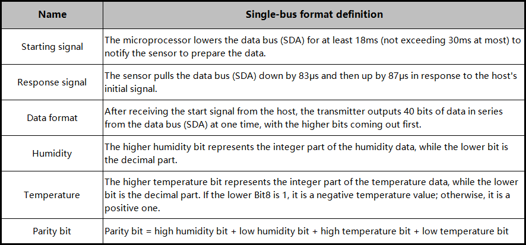

Gegevensvolgordediagram van XH11 temperatuur- en vochtigheidssensor:

Nadat de gebruikershost (MCU) een startsignaal heeft verzonden, schakelt de XHT11 van de energiezuinige modus naar de hoge-snelheidsmodus, en nadat dit signaal is beëindigd, verzendt de XHT11 een antwoordsignaal en 40-bit gegevens, en activeert het een signaalverwerving.

Het signaal wordt verzonden zoals weergegeven in de afbeelding:

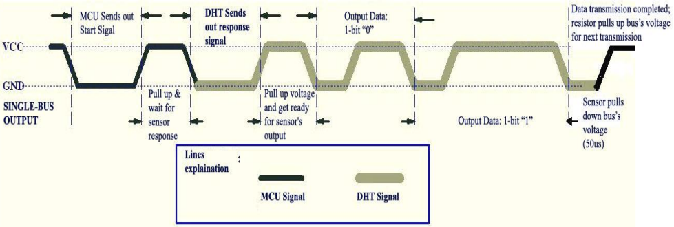

⚠️ **Tip:** De temperatuur- en vochtigheidsgegevens die door de host van de XHT11-sensor worden gelezen, zijn altijd de waarden van de vorige meting. Als er een lang interval is tussen twee metingen, voer dan twee opeenvolgende metingen uit; de waarde van de tweede keer zal de werkelijke zijn.

**Schematisch diagram:**

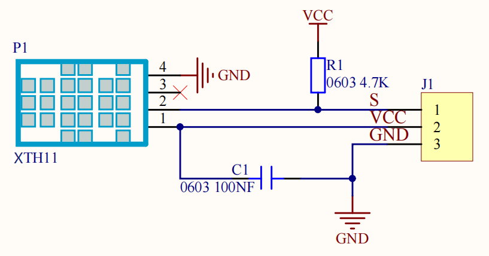

**Parameters:**

- Bedrijfsspanning: DC 3V~5V
- Bedrijfsstroom: (Max)2.5mA
- Maximaal vermogen: 0.0125W
- Temperatuurbereik: -25 ~ +60°C (±2℃)
- Vochtigheidsbereik: 5 ~ 95%RH (Nauwkeurigheid rond 25C° is ±5%RH)
- Uitgangssignaal: digitaal bidirectioneel single bus

**OLED-display**

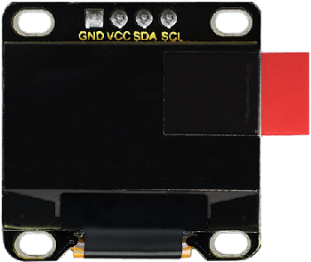

OLED biedt uitzonderlijke voordelen zoals rijke kleurweergave, hoog contrast en brede kijkhoeken. Afbeeldingen erop zijn helder en levendig, met bijzonder uitstekend zwart. Elke pixel is zelflichtgevend zonder dat er achtergrondverlichting nodig is, wat resulteert in een relatief laag stroomverbruik. Het 0.9-inch OLED-scherm, met zijn compacte formaat, hoge resolutie (128×64 pixels) en lage stroomverbruik, is ideaal voor toepassingen in embedded systemen en draagbare apparaten.

⚠️ **Opmerking**: Voor dit OLED-display is de SDA-interface verbonden met pin P20 op het Micro:bit board, terwijl de SCL is verbonden met pin P19.

**Parameters:**

- Bedrijfsspanning: DC 3V - 5V
- Bedrijfsstroom: 30mA
- Interface: Pin met een afstand van 2.54mm
- Communicatiemodus: I2C communicatie
- Interne driverchip: SSD1306
- Resolutie: 128×64
- Kijkhoek: Groter dan 150°

#### 4.2.7.3 Benodigde Onderdelen

| |  | |
| :--: | :--: | :--: |
| **micro:bit V2 board** (zelf meegeleverd) ×1 | **micro:bit Smart Gamepad** (gemonteerd) ×1 |**AAA batterij** (zelf meegeleverd) ×4 |
||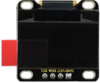||
|**XHT11 temperatuur- en vochtigheidssensor** (zelf meegeleverd)×1|**OLED display** (zelf meegeleverd)×1 |**F-F DuPont draad**(zelf meegeleverd) x7|

#### 4.2.7.4 Bedradingsschema

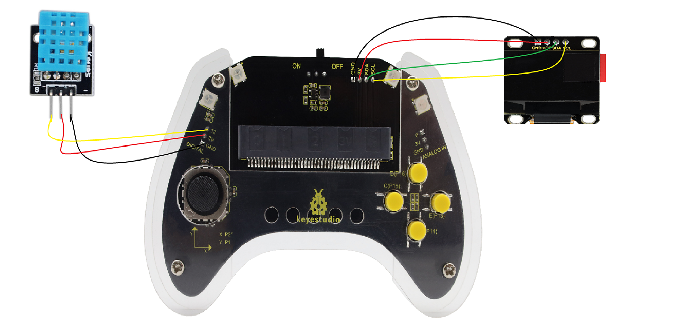

**Na de bedrading zoals hierboven weergegeven, plaatst u de micro:bit in de sleuf op het gamepad-besturingsbord.**

| OLED-display | micro:bit gamepad-besturingsbord | micro:bit board pin |
| :--: | :--: | :--: |
| GND | GND | GND |
| VCC | 3V | 3V |
| SDA | SDA | P20 |
| SCL | SCL | P19 |

| XHT11 temperatuur- en vochtigheidssensor | micro:bit gamepad-besturingsbord | micro:bit board pin |
| :--: | :--: | :--: |
| G | GND | GND |
| V | 3V | 3V |
| S | 12 | P12 |

#### 4.2.7.5 Code Stroom

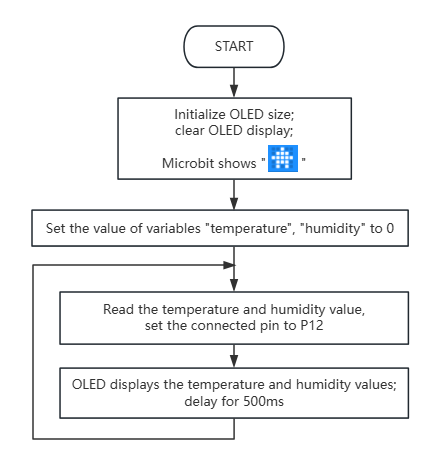

#### 4.2.7.6 Test Code
⚠️ **Let op dat hier OLED- en DHT11-bibliotheken zijn opgenomen, dus we moeten importeren: https://github.com/keyestudio/pxt-environment-kit-master**.

**Volledige code:**

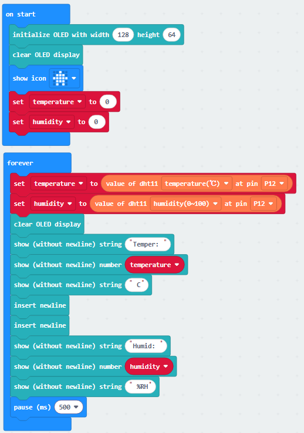

**Korte uitleg:**

① Initialiseer de pixels van de OLED en wis deze, stel de 5×5LED matrix in om  te tonen, en definieer de waarden van temperatuur en vochtigheid op 0.

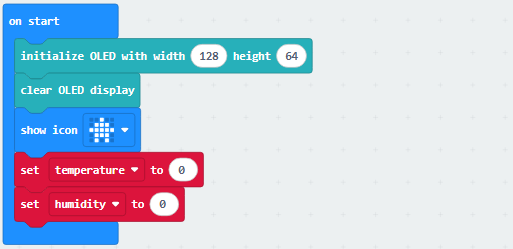

② Wijs de corresponderende metingen van de XHT11-sensor toe aan de variabelen temperatuur en vochtigheid.

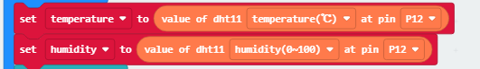

③ De OLED toont de metingen van de XHT11-sensor.

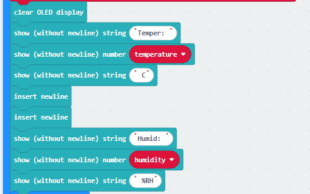

④ Vertraging 500ms (0.5s).

#### 4.2.7.7 Test Resultaat

Na het branden van de code, plaatst u het micro:bit board in de sleuf van de gamepad (**batterijen geïnstalleerd**), en zet u de schakelaar op "ON".

Na het uploaden van de code naar het micro:bit board, toont de OLED de temperatuur en vochtigheid die door de XHT11-sensor in real-time worden gelezen.

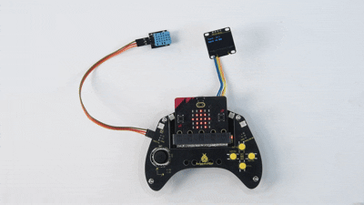

**Tip:** Als er geen reactie is op het board, druk dan op de resetknop aan de achterkant van het micro:bit board.

