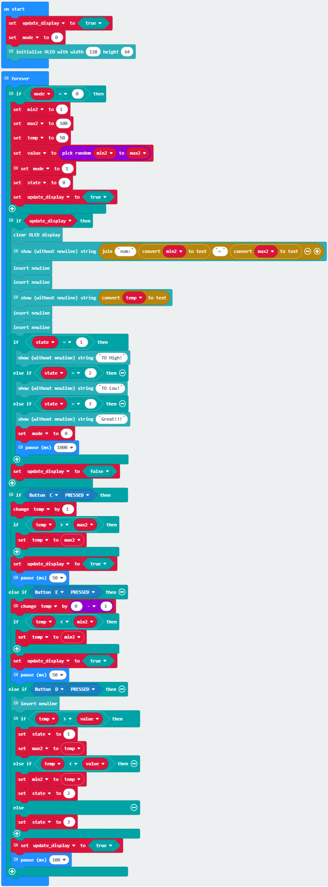
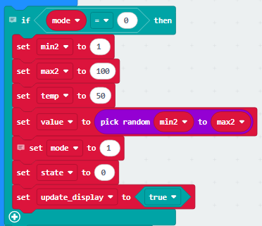
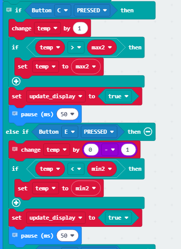

### 4.2.8 Guess Number

#### 4.2.8.1 Overview

In this project, we play a game of guessing number by a Micro:bit board, a gamepad control board, and an OLED display. When the correct number is guessed, the OLED displays "Great!!!"; if the guess is too high or too low, it shows "To High!"/"To Low!" respectively, along with the corresponding range of possible numbers.

#### 4.2.8.3 Required Parts

| |   | |
| :--: | :--: | :--: |
| **micro:bit V2 board** (self-provided) ×1 | **micro:bit Smart Gamepad** (assembled) ×1 |**AAA battery** (self-provided) ×4 |
||||
|**OLED display** (self-provided)×1 |**F-F DuPont wire**(self-provided) x4||

#### 4.2.8.4 Wiring Diagram

**After wiring up as shown above, insert the micro:bit into the slot on the gamepad control board.**

| OLED display | micro:bit gamepad control board | micro:bit board pin |
| :--: | :--: | :--: |
| GND |  GND | GND |
| VCC |  3V | 3V |
| SDA |  SDA | P20 |
| SCL |  SCL | P19 |

#### 4.2.8.5 Code Flow

#### 4.2.8.6 Test Code

⚠️ **Note that here OLED library is included, so we need to import: https://github.com/keyestudio/pxt-environment-kit-master**.

**Complete code:**

**Brief explanation:**

① Initialize the screen update flag bit, set mode variable to 0 (0-game readiness, 1-game running), and initialize the OLED screen display.

② During game preparation, set the guess range, initial guess value, target value, and guess.

③ Update the value range and guess value on the OLED. Display corresponding prompts when the result status flag bit changes: "TO High!" when state=1; "TO LOW!" when state=2; and "Great!!!" when state=3. 

And set the mode to game readiness and wait for 1000 milliseconds(1s).

④ Press C and the guess value temp+1; if the guess value exceeds the maximum, set it as the new maximum. 

Press E and the guess value temp-1; if the guess value is smaller than the minimum, set it as the new minimum.

⑤ Press D to compare the guess value with the target value. If temp is greater, record the new maximum max2 and enter State 1; if temp is smaller, record the new minimum min2 and enter State 2; if both values are equal, go to State 3. 

Finally, update the display with 1000-millisecond delay.

#### 4.2.8.7 Test Result

After burning the code, insert the micro:bit board into the slot of the gamepad (**batteries installed**), and toggle the switch on it to “ON”. 

After uploading the code, the OLED initialize and shows the value range of “num: 1 ~ 100” and initial guess of 50. You can press C to temp+1(max of 100) or  E to temp-1(min of 1) to change your guess value on the OLED. 

Press D to submit your value, and temp will be compared with the random target value. If temp>value, show “To High!” and assign temp to max2; if temp<value, show “To Low!” and assign it to min2. If you are too lucky that temp=value, you will see “Great!!!” for 1s. 

After that, the game will be reset and a new target value will be set. Let's play another round!

⚠️ **The building block in Test Result are not included in this product kit.**

**Tip:** If there is no response on the board, please press the reset button on the back of the micro:bit board.

