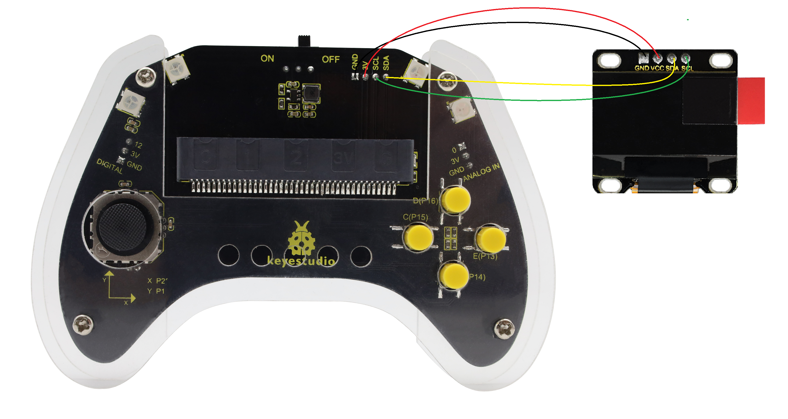
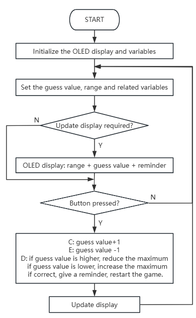
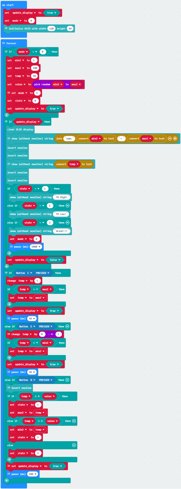
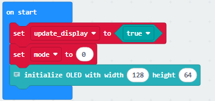
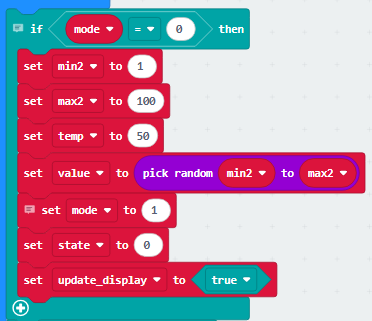
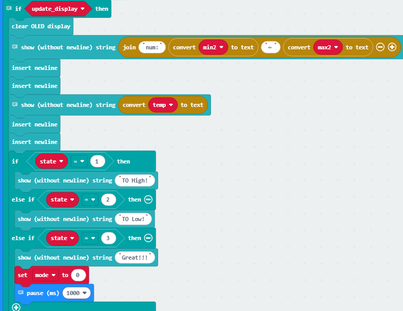
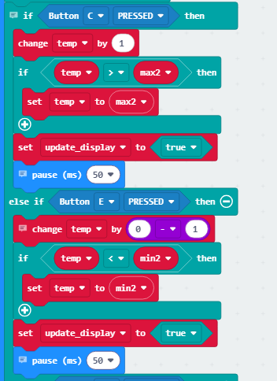
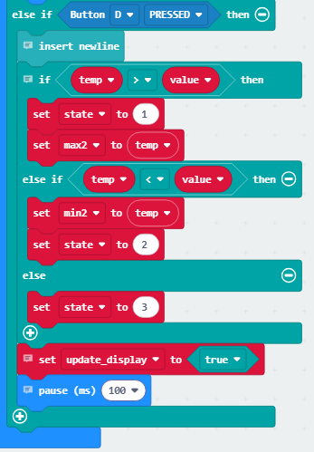

### 4.2.8 Zahlenraten

#### 4.2.8.1 Übersicht

In diesem Projekt spielen wir ein Zahlenratespiel mit einem Micro:bit board, einer Gamepad-Steuerplatine und einem OLED display. Wenn die richtige Zahl erraten wird, zeigt das OLED „Great!!!“ an; wenn die Schätzung zu hoch oder zu niedrig ist, zeigt es „To High!“/„To Low!“ an, zusammen mit dem entsprechenden Bereich der möglichen Zahlen.

#### 4.2.8.2 Komponentenwissen

Dieses Projekt verwendet dasselbe OLED display wie Projekt 07. Bitte beachten Sie Abschnitt 4.2.7.2 für dessen Komponentenwissen.

#### 4.2.8.3 Benötigte Teile

| |  | |
| :--: | :--: | :--: |
| **micro:bit V2 board** (selbst mitzubringen) ×1 | **micro:bit Smart Gamepad** (montiert) ×1 |**AAA battery** (selbst mitzubringen) ×4 |
||||
|**OLED display** (selbst mitzubringen)×1 |**F-F DuPont wire**(selbst mitzubringen) x4||

#### 4.2.8.4 Schaltplan

**Nachdem die Verkabelung wie oben gezeigt abgeschlossen ist, stecken Sie das micro:bit in den Steckplatz auf der Gamepad-Steuerplatine.**

| OLED display | micro:bit gamepad control board | micro:bit board pin |
| :--: | :--: | :--: |
| GND | GND | GND |
| VCC | 3V | 3V |
| SDA | SDA | P20 |
| SCL | SCL | P19 |

#### 4.2.8.5 Code-Ablauf

#### 4.2.8.6 Testcode

⚠️ **Beachten Sie, dass hier die OLED library enthalten ist, daher müssen wir importieren: https://github.com/keyestudio/pxt-environment-kit-master**.

**Vollständiger Code:**

**Kurze Erklärung:**

① Initialisieren Sie das Bildschirmaktualisierungs-Flag-Bit, setzen Sie die Modusvariable auf 0 (0-Spielbereitschaft, 1-Spiel läuft) und initialisieren Sie die OLED-Bildschirmanzeige.

② Während der Spielvorbereitung legen Sie den Ratebereich, den anfänglichen Schätzwert, den Zielwert und die Schätzung fest.

③ Aktualisieren Sie den Wertebereich und den Schätzwert auf dem OLED. Zeigen Sie entsprechende Hinweise an, wenn sich das Ergebnisstatus-Flag-Bit ändert: „To High!“ wenn state=1; „To Low!“ wenn state=2; und „Great!!!“ wenn state=3.

Und setzen Sie den Modus auf Spielbereitschaft und warten Sie 1000 Millisekunden (1s).

④ Drücken Sie C und der Schätzwert temp+1; wenn der Schätzwert das Maximum überschreitet, setzen Sie ihn als neues Maximum.

Drücken Sie E und der Schätzwert temp-1; wenn der Schätzwert kleiner als das Minimum ist, setzen Sie ihn als neues Minimum.

⑤ Drücken Sie D, um den Schätzwert mit dem Zielwert zu vergleichen. Wenn temp größer ist, notieren Sie das neue Maximum max2 und wechseln Sie in Zustand 1; wenn temp kleiner ist, notieren Sie das neue Minimum min2 und wechseln Sie in Zustand 2; wenn beide Werte gleich sind, wechseln Sie in Zustand 3.

Aktualisieren Sie abschließend die Anzeige mit einer Verzögerung von 1000 Millisekunden.

#### 4.2.8.7 Testergebnis

Nach dem Brennen des Codes stecken Sie das micro:bit board in den Steckplatz des Gamepads (**Batterien eingelegt**) und schalten Sie es auf „ON“.

Nach dem Hochladen des Codes initialisiert das OLED und zeigt den Wertebereich von „num: 1 ~ 100“ und die anfängliche Schätzung von 50 an. Sie können C drücken, um temp+1 (max 100) oder E, um temp-1 (min 1) zu ändern, um Ihren Schätzwert auf dem OLED zu ändern.

Drücken Sie D, um Ihren Wert zu übermitteln, und temp wird mit dem zufälligen Zielwert verglichen. Wenn temp>value, wird „To High!“ angezeigt und temp wird max2 zugewiesen; wenn temp<value, wird „To Low!“ angezeigt und min2 zugewiesen. Wenn Sie zu viel Glück haben und temp=value ist, sehen Sie „Great!!!“ für 1s.

Danach wird das Spiel zurückgesetzt und ein neuer Zielwert festgelegt. Lassen Sie uns eine weitere Runde spielen!

⚠️ **Die Bausteine im Testergebnis sind nicht in diesem Produktkit enthalten.**

**Tipp:** Wenn das Board nicht reagiert, drücken Sie bitte die Reset-Taste auf der Rückseite des micro:bit board.

