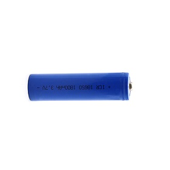
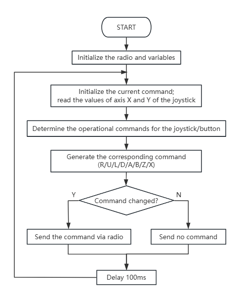
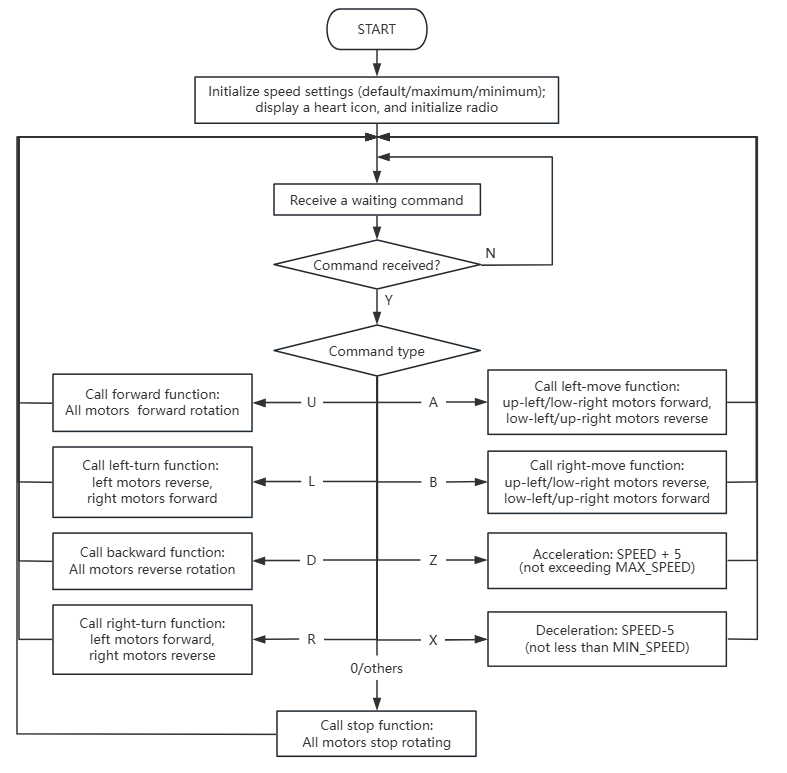
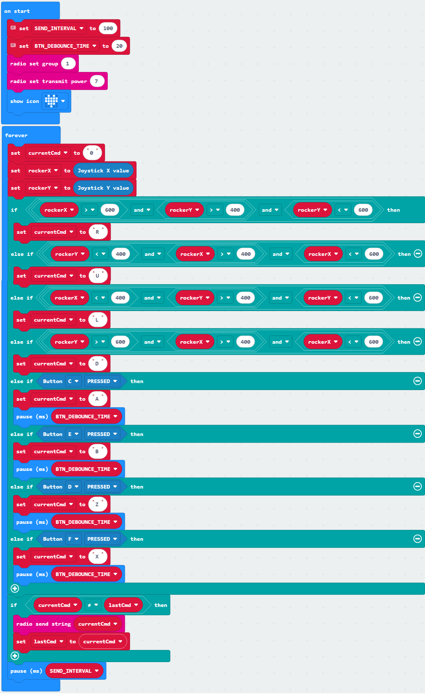
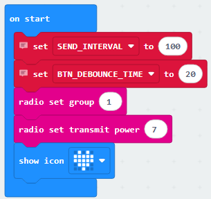
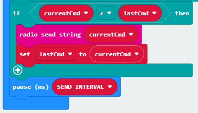
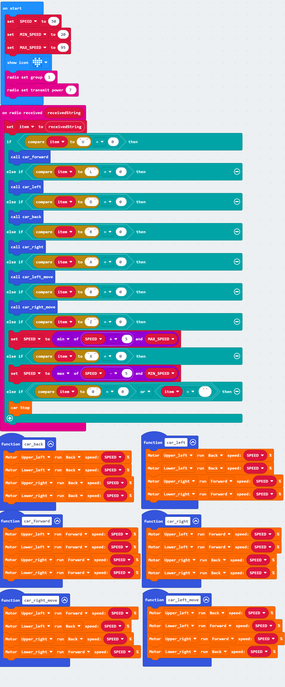
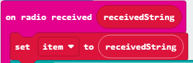
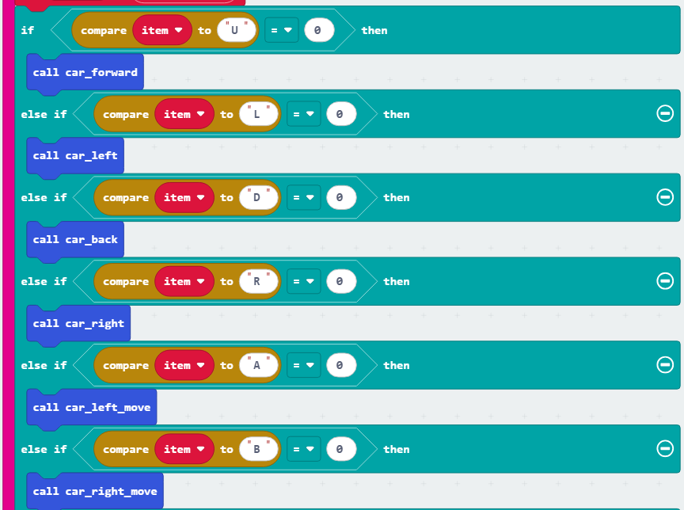
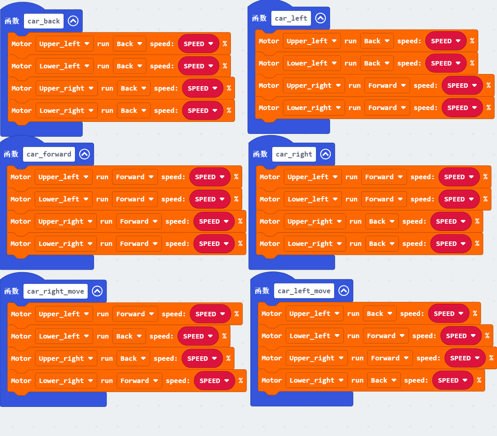

### 4.2.9 Micro:bit Gamepad Controlled 4WD Mecanum Robot Car

#### 4.2.9.1 Overview

In this project, we control a 4WD Mecanum Robot Car by a gamepad control board and a Micro:bit board. The joystick enables the car to go forward, backward, turn left and right; the C button moves the car leftward laterally, the D to rightward laterally, and the E accelerates while the D key decelerates (with a speed range of 20–95). When no operation is performed, the car remains stationary.

#### 4.2.9.2 Required Parts

| |   | |
| :--: | :--: | :--: |
| **micro:bit V2 board** (self-provided) ×1 | **micro:bit Smart Gamepad** (assembled) ×1 |**AAA battery** (self-provided) ×4 |
|  |  ||
| **KS4034 kit**(self-provided) ×1 | **18650 battery**(self-provided) ×2 ||

For the detailed information of the 4WD Mecanum Robot Car**(KS4034)**, please visit [here](https://docs.keyestudio.com/projects/KS4034/en/latest/).
#### 4.2.9.4 Code Flow
⚠️ **Note that the following library needs to be imported when programming codes of the car: https://github.com/keyestudio2019/mecanum_robot_v2**.

**Code flow of the gamepad:**

**Code flow of the car:**

#### 4.2.9.5 Test Code

**Complete code of the gamepad:**

**Brief explanation:**

① Initialize the radio group to 1 with a signal transmission strength of 7; display a heart icon, and set the variables SEND_INTERCAL to 100 and BTN_DEBOUNCE_TIME to 20.

② Set the variable currentCmd (instruction content variable) to character '0', and assign axis X and Y values of the joystick to the variables rockerX and rockerY, respectively.

③ Check whether the joystick or button has a corresponding operation. If an operation occurs, set the variable currentCmd (instruction content variable) to the corresponding character (R/U/L/D/A/B/Z/X); otherwise, leave it unchanged.

④ Check whether currentCmd (instruction content variable) differs from the lastCmd (stores the previous instruction content). If yes, send currentCmd, set lastCmd to currentCmd, and wait for a specified delay.

**Complete code of the car:**

**Brief explanation:**

① Initialize the radio group to 1 with a signal transmission strength of 7; display a heart icon, and set the variables SPEED to 50, MIN_SPEED to 20, and MAX_speed to 95.

② Receive the command value sent by the radio and store the command in the variable item.

③ Based on the character commands (U/L/D/R/A/B) received by item, call the corresponding functions to control the car to go forward, backward, turn left, right, and left shift and right shift.

④ Based on the character command (Z/X) received by item, the car is accelerated or decelerated accordingly. 

During acceleration, the speed is set to the minimum of SPEED+5 and MAX_speed (to prevent exceeding MAX_speed); during deceleration, the speed is set to the maximum of SPEED-5 and MIN_speed (to prevent falling below MIN_speed).

⑤ Six vehicle motion control functions are defined here:

- car_back controls all four motors to reverse-rotate for going backward; 
- car_forward controls all four motors to rotate forward for advancing; 
- car_left achieves car left turn by setting the left-side motors backward and the right-side motors forward; 
- car_right achieves right turn by setting the right-side motors backward and the left-side motors forward; 
- car_left_move and car_right_move enable left and right shift through coordinated rotation of the diagonal motors. 

All functions take the variable SPEED as the motor speed parameter.

#### 4.2.9.6 Test Result

After burning the code, insert the micro:bit board into the slot of the gamepad (**batteries installed**), and toggle the switch on it to “ON”. 

Uploading these codes to two Micro:bit board of the gamepad and of the car respectively, and ensure the batteries with sufficient charge. Insert corresponding Micro:bit in the gamepad and the car and toggle the switches on both to "ON". 

Now you can control the car by the gamepad: push the joystick upward and the car move forward, push it downward to move backward, left turns it left, and right turns it right. We can also control the car acceleration(press buton E)/deceleration(press button D), left shift(C) and right shift(D). Note that the speed range is 20–95.

**Tip:** If there is no response on the board, please press the reset button on the back of the micro:bit board.

