### 4.2.9 Micro:bit Gamepad Controlled 4WD Mecanum Robot Car

#### 4.2.9.1 Aperçu

Dans ce projet, nous contrôlons un 4WD Mecanum Robot Car à l'aide d'une carte de commande de type gamepad et d'une carte Micro:bit. Le joystick permet au véhicule d'aller en avant, en arrière, de tourner à gauche et à droite ; la touche C déplace le véhicule latéralement vers la gauche, la touche D latéralement vers la droite, la touche E accélère, et la touche F décélère (avec une plage de vitesse de 20–95). Lorsqu'aucune opération n'est effectuée, le véhicule reste immobile.

#### 4.2.9.2 Pièces requises

| |   | |
| :--: | :--: | :--: |
| **micro:bit V2 board** (fournie par l'utilisateur) ×1 | **micro:bit Smart Gamepad** (assemblé) ×1 |**AAA battery** (fournie par l'utilisateur) ×4 |
| 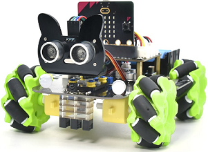 | 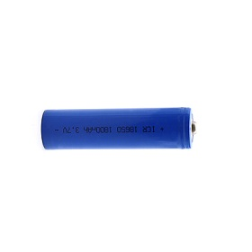 ||
| **KS4034 kit** (fournie par l'utilisateur) ×1 | **18650 battery** (fournie par l'utilisateur) ×2 ||

Pour des informations détaillées sur le 4WD Mecanum Robot Car **(KS4034)**, veuillez visiter [ici](https://docs.keyestudio.com/projects/KS4034/en/latest/).
#### 4.2.9.3 Schéma de câblage

Veuillez vous référer aux instructions de câblage dans la documentation KS4034 pour connecter le 4WD Mecanum Robot Car et le gamepad via la communication radio. Aucun câblage physique entre les deux n'est requis ; les deux appareils communiquent sans fil.

#### 4.2.9.4 Flux du code
⚠️ **Notez que la bibliothèque suivante doit être importée lors de la programmation du code du véhicule : https://github.com/keyestudio2019/mecanum_robot_v2**.

**Flux du code du gamepad :**

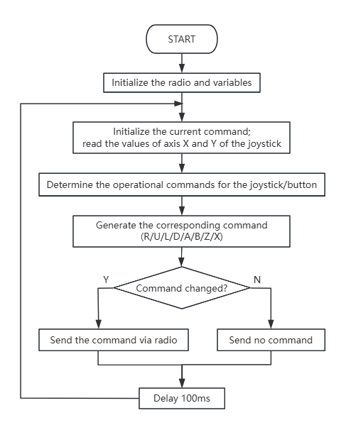

**Flux du code du véhicule :**

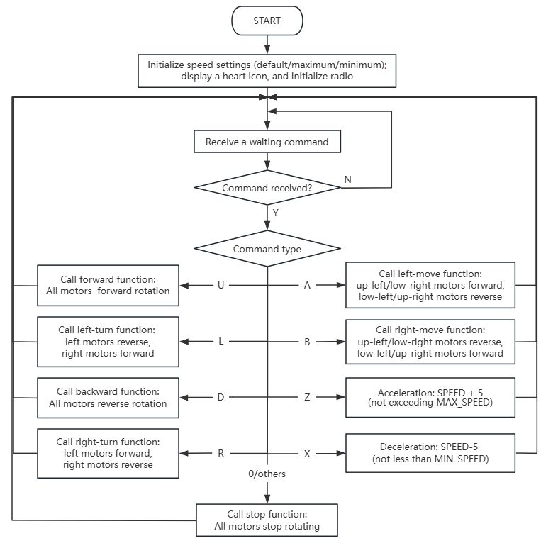

#### 4.2.9.5 Code de test

**Code complet du gamepad :**

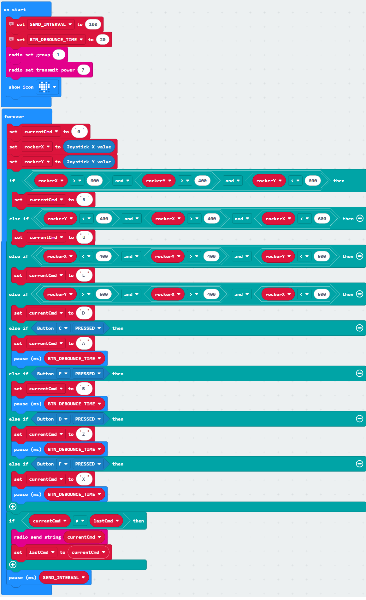

**Brève explication :**

① Initialiser le groupe radio à 1 avec une puissance de transmission du signal de 7 ; afficher une icône de cœur, et définir les variables SEND_INTERCAL à 100 et BTN_DEBOUNCE_TIME à 20.

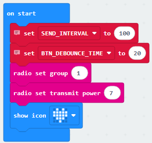

② Affecter la variable currentCmd (variable de contenu d'instruction) au caractère '0', et assigner les valeurs des axes X et Y du joystick aux variables rockerX et rockerY, respectivement.

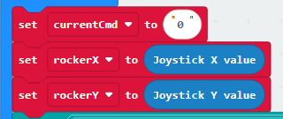

③ Vérifier si le joystick ou un bouton a une opération correspondante. Si une opération se produit, définir la variable currentCmd (variable de contenu d'instruction) sur le caractère correspondant (R/U/L/D/A/B/Z/X) ; sinon, la laisser inchangée.

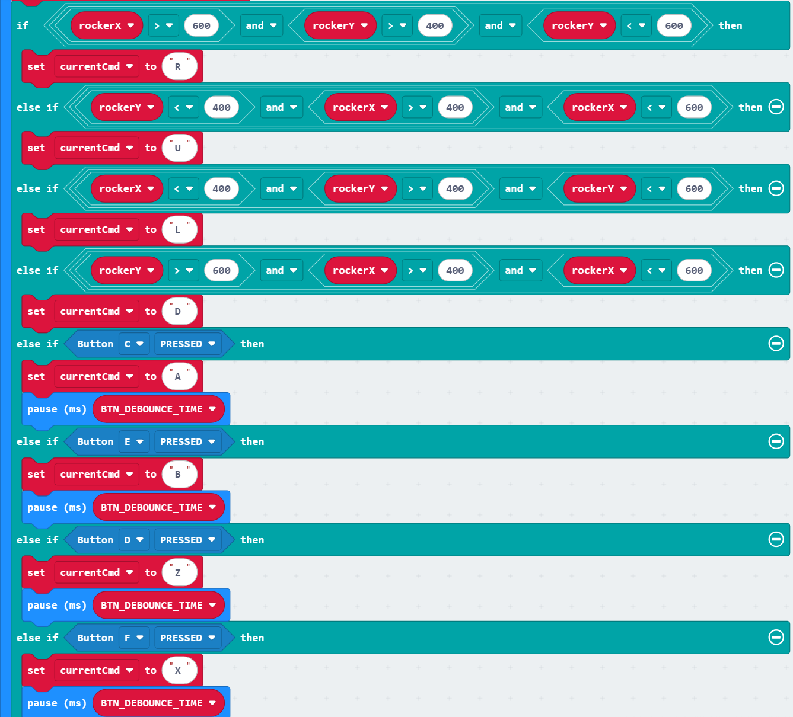

④ Vérifier si currentCmd (variable de contenu d'instruction) diffère de lastCmd (stocke le contenu d'instruction précédent). Si oui, envoyer currentCmd, définir lastCmd à currentCmd, et attendre un délai spécifié.

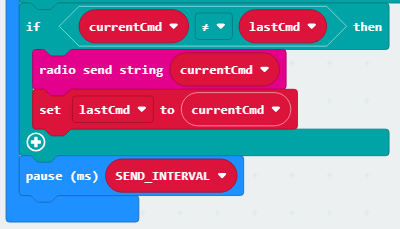

**Code complet du véhicule :**

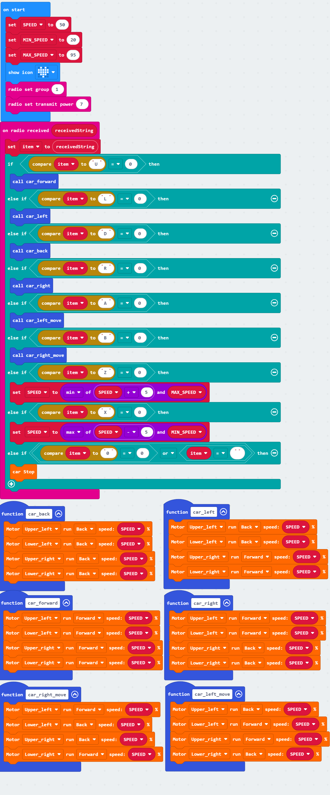

**Brève explication :**

① Initialiser le groupe radio à 1 avec une puissance de transmission du signal de 7 ; afficher une icône de cœur, et définir les variables SPEED à 50, MIN_SPEED à 20, et MAX_speed à 95.

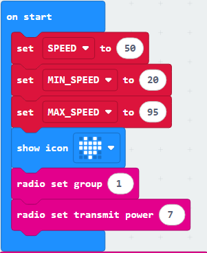

② Recevoir la valeur de commande envoyée par la radio et stocker la commande dans la variable item.

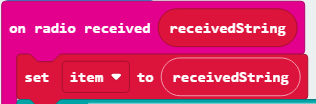

③ En fonction des commandes de caractères (U/L/D/R/A/B) reçues dans item, appeler les fonctions correspondantes pour contrôler le véhicule afin d'aller vers l'avant, vers l'arrière, tourner à gauche, tourner à droite, et effectuer un déplacement latéral gauche et droit.

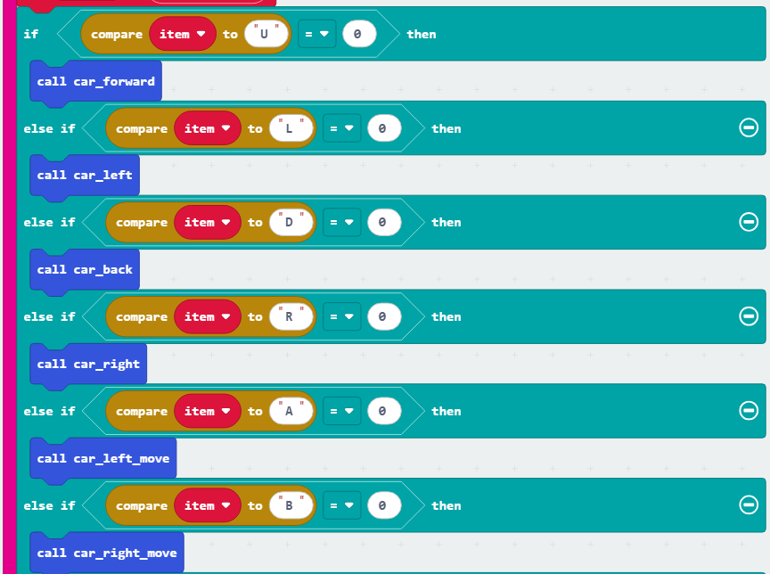

④ En fonction de la commande de caractère (Z/X) reçue dans item, le véhicule est accéléré ou décéléré en conséquence.

Pendant l'accélération, la vitesse est réglée sur le minimum entre SPEED+5 et MAX_speed (pour éviter de dépasser MAX_speed) ; pendant la décélération, la vitesse est réglée sur le maximum entre SPEED-5 et MIN_speed (pour éviter de descendre en dessous de MIN_speed).

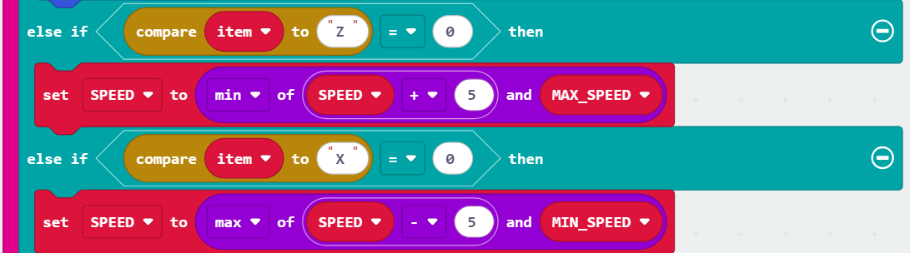

⑤ Six fonctions de contrôle du mouvement du véhicule sont définies ici :

- car_back contrôle les quatre moteurs pour une rotation inverse afin d'aller en arrière ; 
- car_forward contrôle les quatre moteurs pour une rotation avant afin d'avancer ; 
- car_left réalise une rotation à gauche en mettant les moteurs côté gauche en marche arrière et les moteurs côté droit en marche avant ; 
- car_right réalise une rotation à droite en mettant les moteurs côté droit en marche arrière et les moteurs côté gauche en marche avant ; 
- car_left_move et car_right_move permettent un déplacement latéral gauche et droit via la rotation coordonnée des moteurs en diagonale. 

Toutes les fonctions prennent la variable SPEED comme paramètre de vitesse des moteurs.

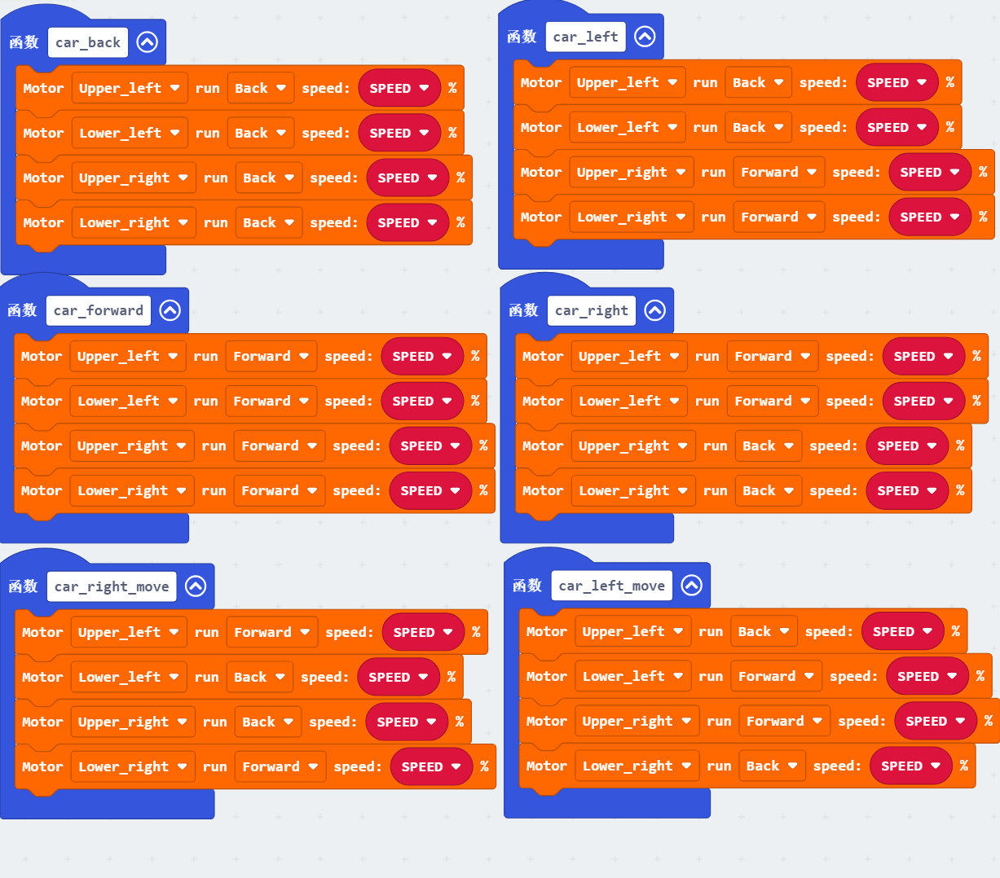

#### 4.2.9.6 Résultat du test

Après avoir téléversé le code, insérez la carte micro:bit dans le logement du gamepad (**batteries installées**), et basculez son interrupteur sur « ON ».

Téléversez ces codes sur les deux Micro:bit du gamepad et du véhicule respectivement, et assurez-vous que les batteries sont suffisamment chargées. Insérez les Micro:bit correspondants dans le gamepad et le véhicule et mettez les deux interrupteurs sur « ON ».

Vous pouvez maintenant contrôler le véhicule avec le gamepad : poussez le joystick vers le haut et le véhicule avance, poussez-le vers le bas pour reculer, vers la gauche pour tourner à gauche, et vers la droite pour tourner à droite. Vous pouvez également contrôler l'accélération (appuyez sur la touche E) / la décélération (appuyez sur la touche F), le déplacement latéral gauche (C) et droit (D). Notez que la plage de vitesse est de 20–95.

**Astuce :** Si la carte ne répond pas, veuillez appuyer sur le bouton de réinitialisation à l'arrière de la carte micro:bit.

