## Troubleshooting
### 4.3.1 USB Driver Installation (Optional)

**Micro:bit is free of driver installation. However, in case your computer fail to recognize the main board, you can install the diver too.**

#### 4.3.1.1 USB Driver Download

Click to download the [USB driver](./USB_driver.7z).

#### 4.3.1.2 USB Driver Installation

⚠️ Note that here we demonstrate how to install the driver on Windows, which can be take as a reference for MacOS users.

1\. Connect micro:bit main board to computer via USB cable.

2\. Find the driver file and click it and to **Install**.

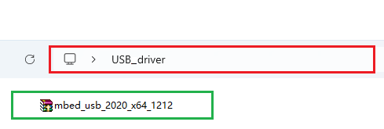

3\. Click “**Install**” and “**Next**”.

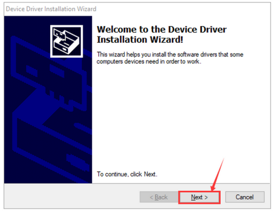

4\. Click “**Install**” and “**Finish**”.

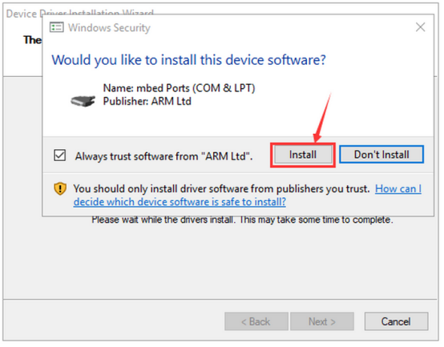

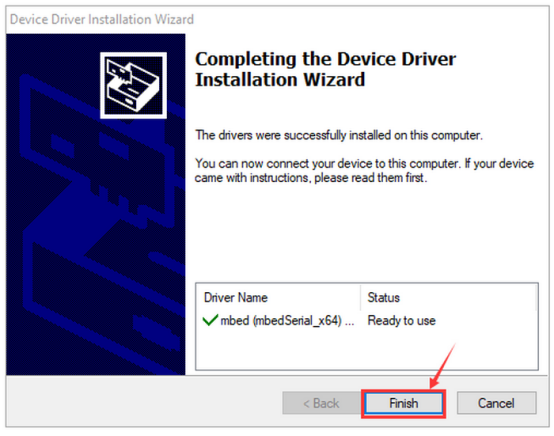

5\. Click “**Computer**” → “**Properties**” → “**Device manager**” and you will see:

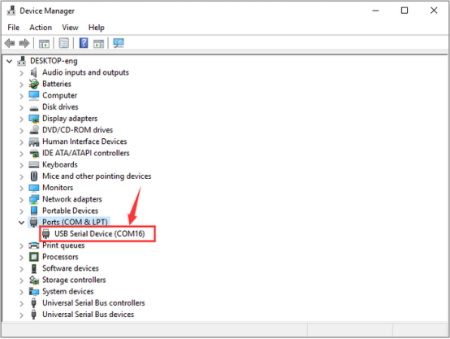

### 4.3.2 FAQ
Solutions for the issue where Microbit fails to download programs and displays MAINTENANCE.

#### 4.3.2.1 Problems

Many new users have recently encountered this issue: When they plug the Micro:bit board into the computer via a Micro USB cable and click on “**Download**”, the code fails to download and the board shows no response.

If you were accidentally holding the reset button at the back of the Micro:bit board at the time you copied the program onto it, this would have put the the board into maintenance mode. Or perhaps due to some of your own mistakes, the firmware on the board is lost.

As a result, a new “**MAINTENANCE**” drive will appear in your file manager, so the micro:bit will not accept your user code. 

The MAINTENANCE drive will look like this, depending on your computer:

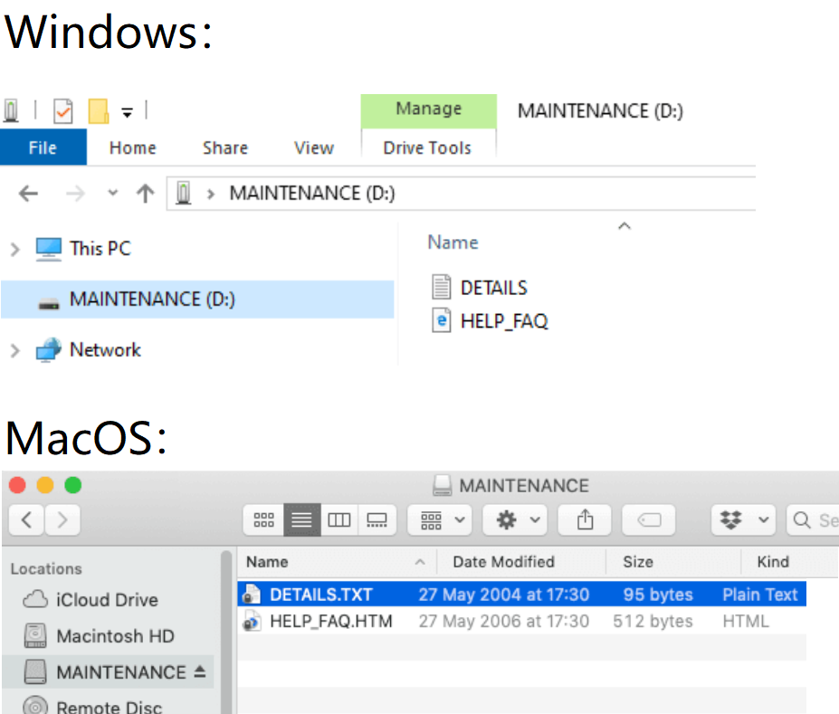

 #### 4.3.2.2 Solutions

(1) Download the .hex file appropriate for your version of the micro:bit from this page to your computer.

Download [the latest Micro:bit firmware -0255 .hex file](https://www.microbit.org/get-started/user-guide/firmware/), which we also provided in the folder.

(2) Drag and drop the .hex file you downloaded from this page onto the **MAINTENANCE** drive. Note that the firmware varies from the model of Micro:bit V2 board. Here is Firmware for V2.20_V2.21. When the upgrade is completed, the micro:bit will reset, ejecting itself from the computer and re-appear in normal **MICROBIT** drive mode.

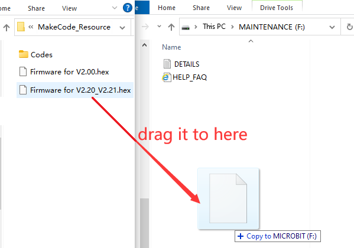

#### 4.3.2.3 Avoid “MAINTENANCE” Mode

(1) Do not press the reset button at the back of the Micro:bit board when it is connected to a Micro USB cable.

If the reset button is pressed while powering up, the micro:bit will go into maintenance mode. (**Common mistakes made by beginners**)

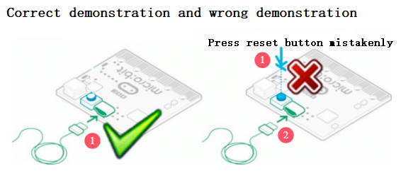

(2) Do not unplug it suddenly during downloading program. Or the the firmware may be lost, and the micro:bit will then enter the MAINTENANCE mode.

(3) During the experiment, wrong wiring will also result in a short circuit so the micro:bit firmware may be lost. Beginners must pay attention when operating.

#### 4.3.2.4 Download with WebUSB

Your micro:bit appears to have developed a fault with WebUSB (/ device/ usb/ webusb)? Let's try to figure out the reason.

**Step 1: Test on micro USB cable**

Plug the micro:bit into your computer with a micro USB cable. It should appear as a MICROBIT drive.

If MICROBIT appears as a drive under Devices and drives, go to Step 2. 

If not, please try: (a) another cable; (b) another USB port on your computer; (c) connecting the micro:bit to another computer. 

Some micro USB cables may only offer a power connection and do not actually transmit data, and some computers may power down their USB ports for some reason. 

You still cannot see the MICROBIT drive? Hum, there might be a problem with your micro:bit board. See the article on [troubleshooting](https://support.microbit.org/solution/articles/19000024000-fault-finding-with-a-micro-bit) with the microbit.org or open a [support ticket](https://support.microbit.org/support/tickets/new) to notify the Micro:bit Foundation of the issue. And, skip all the following steps.

**Step 2: Checking your firmware version**

To find out what version of the firmware you have on your micro:bit:

① Plug it in to a computer using the USB cable and open **MICROBIT** drive.

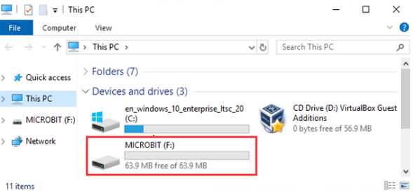

② Open the **DETAILS.TXT** file.

③ Look for the number on the line that begins “Interface/Bootloader Version”.

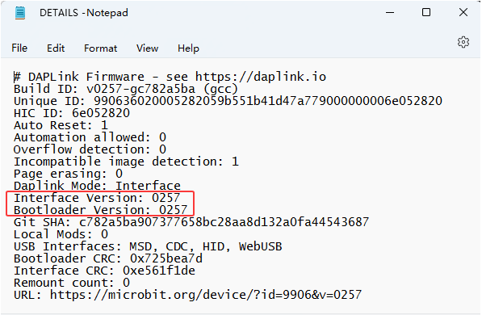

If it is 0234/0241/0243, you need to update the firmware on your micro:bit V2 board. Go to Step 3 for the update.

If it is 0249/0257 or higher,  go to Step 4.

**Step 3: How to update the firmware**

If you need to update the firmware to access a new feature or troubleshoot a problem, here is how to do it:

① Disconnect the USB cable and battery pack from the micro:bit。

② Hold the reset button at the back of the micro:bit and plug the USB cable into the micro:bit and your computer. You should see a drive appear in your file manager called **MAINTENANCE** (instead of MICROBIT) and the yellow LED indicator on the back should light up.

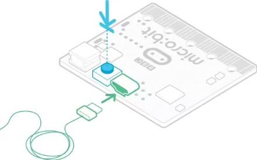

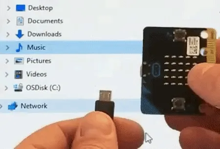

③ Download [firmware .hex file](https://microbit.org/guide/firmware/) appropriate for your version of the micro:bit. Here is Firmware for V2.20_V2.21.

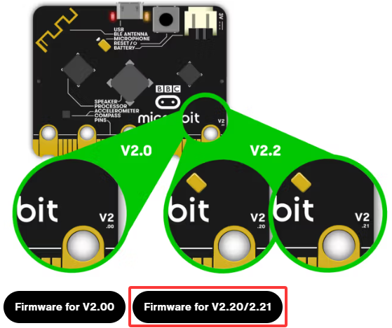

④ Drag and drop the .hex firmware onto the **MAINTENANCE** drive.

⑤ Wait for the yellow LED on the back of the device to stop flashing. After copying, the LED will turn off and the micro:bit will reset. MAINTENANCE will be back to MICROBIT.

⑥ Finally, check the DETAILS.TXT file that is on the **MICROBIT** drive and make sure that it has the same version number as the .hex firmware.

For any issues oof the board, maintenance mode and firmware updates, please refer to the [Firmware Guide](https://microbit.org/guide/firmware/).

**Step 4: Checking your browser version**

WebUSB is a relatively new function that you may update your browser. Check if your browser is: (a) compatible with Android, Chrome OS; (b) Microsoft Edge; (c) the Chrome 65+ of Linux, macOS and Windows 10.

**Step 5: Connecting a device**

Open Google Chrome / Microsoft Edge to go to the MakeCode editor, and click on the “**Connect Device**”. For how to pair a device, please refer to [WebUSB (/ device/ usb/ webusb)](https://microbit.org/get-started/user-guide/web-usb/).

Enjoy quick download!

