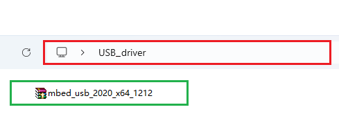
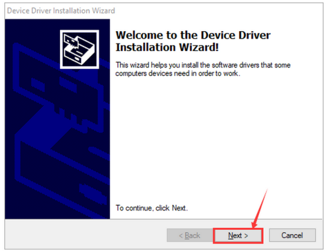
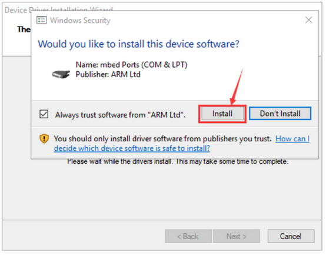
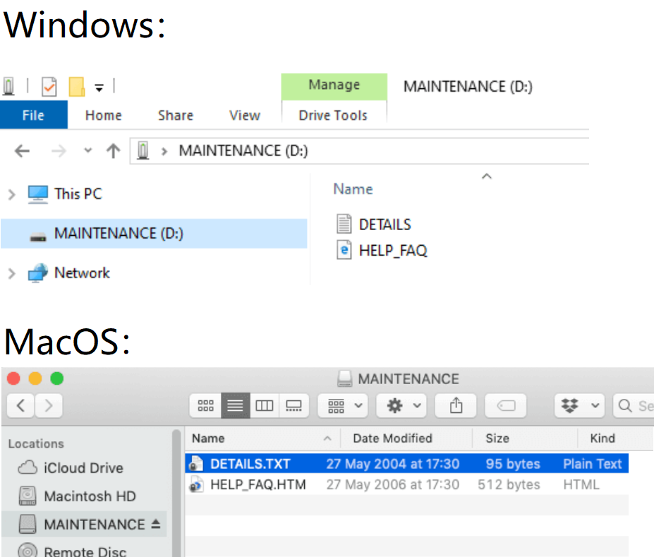
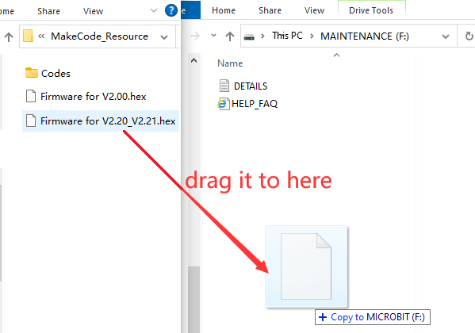
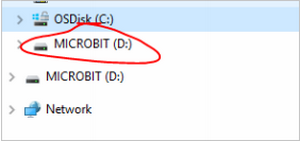
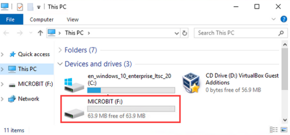
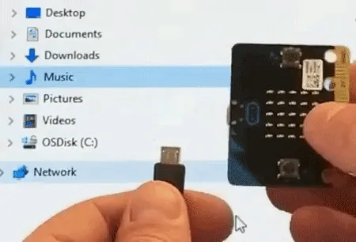

## Dépannage
### 4.3.1 Installation du pilote USB (optionnel)

**Micro:bit ne nécessite pas d'installation de pilote. Cependant, si votre ordinateur ne parvient pas à reconnaître la carte principale, vous pouvez également installer le pilote.**

#### 4.3.1.1 Téléchargement du pilote USB

Cliquez pour télécharger le [pilote USB](./USB_driver.7z).

#### 4.3.1.2 Installation du pilote USB

⚠️ Notez que nous montrons ici comment installer le pilote sous Windows, ce qui peut servir de référence pour les utilisateurs MacOS.

1\. Connectez la carte principale micro:bit à l'ordinateur avec un câble USB.

2\. Trouvez le fichier du pilote, cliquez dessus et sélectionnez **Installer**.

3\. Cliquez sur « **Installer** » puis sur « **Suivant** ».

4\. Cliquez sur « **Installer** » puis sur « **Terminer** ».

5\. Cliquez sur « **Ordinateur** » → « **Propriétés** » → « **Gestionnaire de périphériques** » et vous verrez :

### 4.3.2 FAQ
Solutions pour le problème où Microbit n'arrive pas à télécharger des programmes et affiche MAINTENANCE.

#### 4.3.2.1 Problèmes

Beaucoup de nouveaux utilisateurs ont récemment rencontré ce problème : lorsqu'ils branchent la carte Micro:bit à l'ordinateur via un câble Micro USB et cliquent sur « **Télécharger** », le code ne se télécharge pas et la carte ne réagit pas.

Si vous avez appuyé accidentellement sur le bouton de réinitialisation à l'arrière de la carte Micro:bit au moment où vous avez copié le programme dessus, cela aurait placé la carte en mode maintenance. Ou peut-être, suite à certaines de vos erreurs, le firmware de la carte a été perdu.

En conséquence, un nouveau lecteur « **MAINTENANCE** » apparaîtra dans votre gestionnaire de fichiers, et la micro:bit n'acceptera pas votre code utilisateur. 

Le lecteur MAINTENANCE ressemblera à ceci, selon votre ordinateur :

 #### 4.3.2.2 Solutions

(1) Téléchargez sur votre ordinateur le fichier .hex correspondant à votre version de micro:bit depuis cette page.

Téléchargez [le dernier firmware Micro:bit -0255 .hex file](https://www.microbit.org/get-started/user-guide/firmware/), que nous avons également fourni dans le dossier.

(2) Glissez-déposez le fichier .hex que vous avez téléchargé depuis cette page sur le lecteur **MAINTENANCE**. Notez que le firmware varie selon le modèle de carte Micro:bit V2. Voici le firmware pour V2.20_V2.21. Une fois la mise à jour terminée, la micro:bit se réinitialisera, s'éjectera de l'ordinateur et réapparaîtra en mode lecteur **MICROBIT** normal.

#### 4.3.2.3 Éviter le mode « MAINTENANCE »

(1) Ne pas appuyer sur le bouton de réinitialisation à l'arrière de la carte Micro:bit lorsqu'elle est connectée à un câble Micro USB.

Si le bouton de réinitialisation est pressé lors de la mise sous tension, la micro:bit passera en mode maintenance. (**Erreurs courantes commises par les débutants**)

(2) Ne le débranchez pas soudainement pendant le téléchargement d'un programme. Sinon le firmware pourrait être perdu, et la micro:bit entrera alors en mode MAINTENANCE.

(3) Lors de l'expérience, un mauvais câblage peut aussi provoquer un court-circuit et faire perdre le firmware de la micro:bit. Les débutants doivent être prudents lors des manipulations.

#### 4.3.2.4 Télécharger avec WebUSB

Votre micro:bit semble présenter un dysfonctionnement avec WebUSB (/ device/ usb/ webusb) ? Essayons d'en identifier la cause.

**Étape 1 : Tester le câble micro USB**

Branchez la micro:bit à votre ordinateur avec un câble micro USB. Elle devrait apparaître comme un lecteur MICROBIT.

Si MICROBIT apparaît comme un lecteur sous Périphériques et lecteurs, passez à l'étape 2. 

Si ce n'est pas le cas, essayez : (a) un autre câble ; (b) un autre port USB de votre ordinateur ; (c) connecter la micro:bit à un autre ordinateur. 

Certains câbles micro USB n'offrent qu'une connexion d'alimentation et ne transmettent pas réellement de données, et certains ordinateurs peuvent couper l'alimentation de leurs ports USB pour une raison quelconque. 

Vous ne voyez toujours pas le lecteur MICROBIT ? Hum, il pourrait y avoir un problème avec votre carte micro:bit. Consultez l'article sur le [dépannage](https://support.microbit.org/solution/articles/19000024000-fault-finding-with-a-micro-bit) sur microbit.org ou ouvrez un [ticket de support](https://support.microbit.org/support/tickets/new) pour informer la Micro:bit Foundation du problème. Et passez toutes les étapes suivantes.

**Étape 2 : Vérifier la version du firmware**

Pour savoir quelle version du firmware est installée sur votre micro:bit :

① Branchez-la sur un ordinateur à l'aide du câble USB et ouvrez le lecteur **MICROBIT**.

② Ouvrez le fichier **DETAILS.TXT**.

③ Recherchez le numéro sur la ligne commençant par « Interface/Bootloader Version ».

S'il s'agit de 0234/0241/0243, vous devez mettre à jour le firmware de votre carte micro:bit V2. Passez à l'étape 3 pour la mise à jour.

S'il s'agit de 0249/0257 ou d'une version supérieure, passez à l'étape 4.

**Étape 3 : Comment mettre à jour le firmware**

Si vous devez mettre à jour le firmware pour accéder à une nouvelle fonctionnalité ou résoudre un problème, voici comment faire :

① Déconnectez le câble USB et le pack de batteries de la micro:bit。

② Maintenez le bouton de réinitialisation à l'arrière de la micro:bit et branchez le câble USB à la micro:bit et à votre ordinateur. Vous devriez voir apparaître dans votre gestionnaire de fichiers un lecteur appelé **MAINTENANCE** (au lieu de MICROBIT) et le témoin LED jaune à l'arrière devrait s'allumer.

③ Téléchargez [firmware .hex file](https://microbit.org/guide/firmware/) adapté à votre version de micro:bit. Voici le firmware pour V2.20_V2.21.

④ Glissez-déposez le firmware .hex sur le lecteur **MAINTENANCE**.

⑤ Attendez que la LED jaune à l'arrière de l'appareil cesse de clignoter. Une fois la copie terminée, la LED s'éteindra et la micro:bit se réinitialisera. MAINTENANCE redeviendra MICROBIT.

⑥ Enfin, vérifiez le fichier DETAILS.TXT qui se trouve sur le lecteur **MICROBIT** et assurez-vous qu'il affiche le même numéro de version que le firmware .hex.

Pour tout problème lié à la carte, au mode maintenance ou aux mises à jour du firmware, veuillez consulter le [Firmware Guide](https://microbit.org/guide/firmware/).

**Étape 4 : Vérifier la version de votre navigateur**

WebUSB est une fonctionnalité relativement récente ; vous devrez peut-être mettre à jour votre navigateur. Vérifiez si votre navigateur est : (a) compatible avec Android, Chrome OS ; (b) Microsoft Edge ; (c) Chrome 65+ sous Linux, macOS et Windows 10.

**Étape 5 : Connexion d'un appareil**

Ouvrez Google Chrome / Microsoft Edge et allez dans l'éditeur MakeCode, puis cliquez sur « **Connecter un appareil** ». Pour savoir comment appairer un appareil, veuillez consulter [WebUSB (/ device/ usb/ webusb)](https://microbit.org/get-started/user-guide/web-usb/).

Profitez d'un téléchargement rapide!