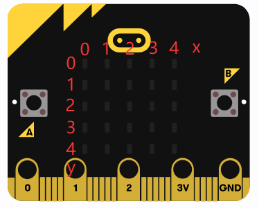
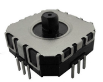
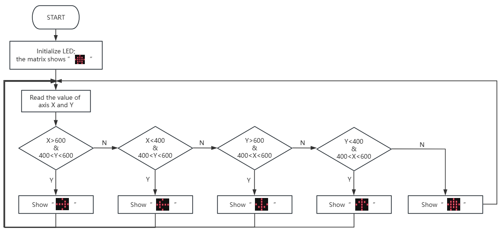

### 5.2.1 Direction Indicator

#### 5.2.1.1 Overview


When you toggle the joystick, the dot matrix displays arrows in the corresponding direction in real time: left, right, up, down, giving you a clear direction reference.


#### 5.2.1.2 Component Knowledge


**Micro:bit dot matrix:**



The LED dot matrix of the micro:bit board consists of a total of 25 light-emitting diodes, a group of 5, corresponding to axis X and Y, forming a 5×5 matrix. Each one is placed at the intersection of the row(X) and the column (Y). We can control one or some of them by setting the coordinate points.

**Joystick:**

| |   |
| :--: | :--: |
|       Real product       |     Schematic diagram     |

The internal core structure of this joystick is composed of two adjustable resistors (potentiometers) with a resistance value of 10KΩ each.

It detect directions (and amplitude) of the push through the ADC analog pin of the microcontroller to output the analog electrical signals of the corresponding dimension. During actual signal reading, when the analog values of the joystick X and Y axes are detected within the range of 450~600, it can be determined that the joystick is in a neutral(stationary) state without active toggling.


#### 5.2.1.3 Required Parts

| |   ||
| :--: | :--: | :--: |
| **micro:bit V2 board** (self-provided) ×1 | **micro:bit Smart Gamepad** (assembled) ×1 | **AAA battery** (self-provided) ×4 |

#### 5.2.1.4 Code Flow




#### 5.2.1.5 Test Code

**Complete code:**

```Python
# import related libraries
from microbit import *

display.show(Image.HOUSE)

while True:
    #Read the toggle state of the joystick
    x = pin2.read_analog()
    y = pin1.read_analog()
    #Determine the direction in which the joystick is toggled
    if x > 600 and (400 < y < 600):
        display.show(Image.ARROW_E)
    elif x < 400 and (400 < y < 600):
        display.show(Image.ARROW_W)
    elif y > 600 and (400 < x < 600):
        display.show(Image.ARROW_S)
    elif y < 400 and (400 < x < 600):
        display.show(Image.ARROW_N)
    else:
        display.show(Image.HOUSE)
```


**Brief explanation:**

① Import the library and display the initial image.

First import `microbit` library, which is a necessary core library of Micro:bit on MicroPython. It provides full access to the Micro:bit hardware (including LED displays and pins). Upon import, a house icon(`Image.HOUSE`) shows on the matrix as the initial state / standby screen.

```python
# import related libraries
from microbit import *

display.show(Image.HOUSE)
```
② Loop: Read the analog value of the joystick.

The program enters an infinite loop (`while True`). At the start of the loop, it reads the analog input values from `pin2` and `pin1`, typically the joystick's X-axis (left-right) and the Y-axis (up-down).

`read_analog()` returns an integer value within 0~1023, representing the joystick's position along that axis. It is usually close to 511–512 when the joystick is centered.

```python
while True:
    #Read the toggle state of the joystick
    x = pin2.read_analog()
    y = pin1.read_analog()
```
③ Determine the direction of the joystick and display the corresponding arrow.

Here it determines the joystick's movement direction based on the analog `x` and `y`. We set thresholds (400 and 600) to determine whether the joystick is toggled.

*   [ `x` > 600 , 400 <  `y` < 600 ] : (at central Y-axis) the joystick is at right and display the east-facing arrow (`Image.ARROW_E`).
*   [ `x` < 400 , 400 <  `y` < 600 ] : the joystick is at left and display the west-facing arrow (`Image.ARROW_W`).
*   [ `y` >  600 , 400 < `x` < 600 ] : the joystick is push down and display the south-facing arrow (`Image.ARROW_S`).
*   [ `y` < 400 ,400 < `x` < 600 ] : the joystick is push up and display the north-facing arrow (`Image.ARROW_N`).

```python
    #Determine the direction in which the joystick is toggled
    if x > 600 and (400 < y < 600):
        display.show(Image.ARROW_E)
    elif x < 400 and (400 < y < 600):
        display.show(Image.ARROW_W)
    elif y > 600 and (400 < x < 600):
        display.show(Image.ARROW_S)
    elif y < 400 and (400 < x < 600):
        display.show(Image.ARROW_N)
```
④ The house pattern is displayed when the joystick is centered.

If none of the above conditions are met—that is, the joystick does not move significantly in any direction (which typically indicates it is in the center position)—the Micro:bit will again show the "house" (`Image.HOUSE`), which means the joystick is stationary.

```python
    else:
        display.show(Image.HOUSE)
```

#### 5.2.1.6 Test Result


After burning the code, insert the micro:bit board into the slot of the gamepad (**batteries installed**), and toggle the switch on it to “ON”. 

When you push the joystick of the gamepad, you can see the corresponding arrows on the matrix. If you bring it back to the center, there will be a house icon on the matrix.


<span style="color: rgb(0, 209, 0);">**Tip:** If there is no response on the board, please press the reset button on the back of the micro:bit board.</span>


