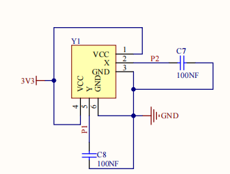
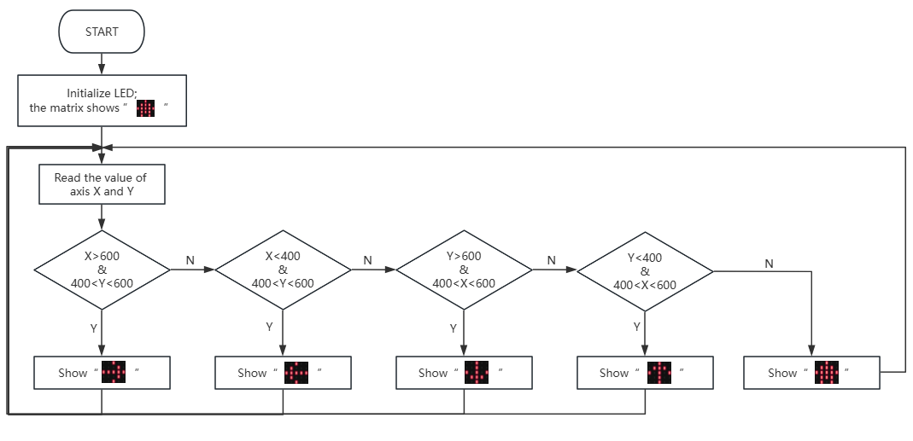

### 5.2.1 Richtingaanwijzer

#### 5.2.1.1 Overzicht


Wanneer u de joystick beweegt, toont de puntmatrix in realtime pijlen in de overeenkomstige richting: links, rechts, omhoog, omlaag, wat u een duidelijke richtingsreferentie geeft.


#### 5.2.1.2 Componentenkennis


**Micro:bit puntmatrix:**


De LED-puntmatrix van het micro:bit-bord bestaat uit in totaal 25 lichtgevende diodes, een groep van 5, corresponderend met as X en Y, die een 5×5 matrix vormen. Elk is geplaatst op het snijpunt van de rij (X) en de kolom (Y). We kunnen een of enkele ervan besturen door de coördinaatpunten in te stellen.

**Joystick:**

| |   |
| :--: | :--: |
|       Werkelijk product       |     Schematisch diagram     |

De interne kernstructuur van deze joystick is samengesteld uit twee instelbare weerstanden (potentiometers) met elk een weerstandswaarde van 10KΩ.

Het detecteert richtingen (en amplitude) van de druk via de ADC analoge pin van de microcontroller om de analoge elektrische signalen van de corresponderende dimensie uit te voeren. Tijdens het daadwerkelijke uitlezen van het signaal, wanneer de analoge waarden van de X- en Y-assen van de joystick worden gedetecteerd binnen het bereik van 450~600, kan worden vastgesteld dat de joystick zich in een neutrale (stationaire) toestand bevindt zonder actieve beweging.


#### 5.2.1.3 Benodigde onderdelen

| |   ||
| :--: | :--: | :--: |
| **micro:bit V2 board** (zelf mee te nemen) ×1 | **micro:bit Smart Gamepad** (gemonteerd) ×1 | **AAA batterij** (zelf mee te nemen) ×4 |

#### 5.2.1.4 Codestroom




#### 5.2.1.5 Testcode

**Volledige code:**

```Python
# import related libraries
from microbit import *

display.show(Image.HOUSE)

while True:
    #Read the toggle state of the joystick
    x = pin2.read_analog()
    y = pin1.read_analog()
    #Determine the direction in which the joystick is toggled
    if x > 600 and (400 < y < 600):
        display.show(Image.ARROW_E)
    elif x < 400 and (400 < y < 600):
        display.show(Image.ARROW_W)
    elif y > 600 and (400 < x < 600):
        display.show(Image.ARROW_S)
    elif y < 400 and (400 < x < 600):
        display.show(Image.ARROW_N)
    else:
        display.show(Image.HOUSE)
```


**Korte uitleg:**

① Importeer de bibliotheek en toon de initiële afbeelding.

Importeer eerst de `microbit`-bibliotheek, een noodzakelijke kernbibliotheek van Micro:bit op MicroPython. Het biedt volledige toegang tot de Micro:bit-hardware (inclusief LED-displays en pinnen). Na import wordt een huispictogram (`Image.HOUSE`) op de matrix getoond als de initiële status / stand-byscherm.

```python
# import related libraries
from microbit import *

display.show(Image.HOUSE)
```
② Lus: Lees de analoge waarde van de joystick.

Het programma gaat een oneindige lus in (`while True`). Aan het begin van de lus leest het de analoge invoerwaarden van `pin2` en `pin1`, typisch de X-as (links-rechts) en de Y-as (omhoog-omlaag) van de joystick.

`read_analog()` retourneert een geheel getal tussen 0 en 1023, dat de positie van de joystick langs die as vertegenwoordigt. Het ligt meestal dicht bij 511-512 wanneer de joystick gecentreerd is.

```python
while True:
    #Read the toggle state of the joystick
    x = pin2.read_analog()
    y = pin1.read_analog()
```
③ Bepaal de richting van de joystick en toon de overeenkomstige pijl.

Hier wordt de bewegingsrichting van de joystick bepaald op basis van de analoge `x` en `y`. We stellen drempels (400 en 600) in om te bepalen of de joystick wordt bewogen.

*   [ `x` > 600 , 400 <  `y` < 600 ] : (op centrale Y-as) de joystick is naar rechts en toont de pijl naar het oosten (`Image.ARROW_E`).
*   [ `x` < 400 , 400 <  `y` < 600 ] : de joystick is naar links en toont de pijl naar het westen (`Image.ARROW_W`).
*   [ `y` >  600 , 400 < `x` < 600 ] : de joystick wordt naar beneden geduwd en toont de pijl naar het zuiden (`Image.ARROW_S`).
*   [ `y` < 400 ,400 < `x` < 600 ] : de joystick wordt naar boven geduwd en toont de pijl naar het noorden (`Image.ARROW_N`).

```python
    #Determine the direction in which the joystick is toggled
    if x > 600 and (400 < y < 600):
        display.show(Image.ARROW_E)
    elif x < 400 and (400 < y < 600):
        display.show(Image.ARROW_W)
    elif y > 600 and (400 < x < 600):
        display.show(Image.ARROW_S)
    elif y < 400 and (400 < x < 600):
        display.show(Image.ARROW_N)
```
④ Het huispatroon wordt weergegeven wanneer de joystick gecentreerd is.

Als geen van de bovenstaande voorwaarden is voldaan – dat wil zeggen, de joystick beweegt niet significant in welke richting dan ook (wat typisch aangeeft dat deze in de middenpositie is) – zal de Micro:bit opnieuw het "huis" (`Image.HOUSE`) tonen, wat betekent dat de joystick stilstaat.

```python
    else:
        display.show(Image.HOUSE)
```

#### 5.2.1.6 Testresultaat


Na het branden van de code, plaatst u het micro:bit-bord in de sleuf van de gamepad (**batterijen geïnstalleerd**) en zet u de schakelaar op “ON”. 

Wanneer u de joystick van de gamepad beweegt, ziet u de overeenkomstige pijlen op de matrix. Als u deze terugbrengt naar het midden, verschijnt er een huispictogram op de matrix.


<span style="color: rgb(0, 209, 0);">**Tip:** Als er geen reactie is op het bord, drukt u op de resetknop aan de achterkant van het micro:bit-bord.</span>


