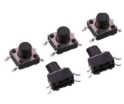
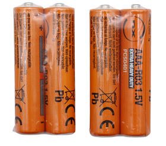

### 5.2.2 Colorful Lights

#### 5.2.2.1 Overview


RGB LEDs are a type of LED light source that creates images by mixing light from the three primary colors: red, green, and blue, whose intersection produces various hues. Common methods include direct mixing of the primary colors, using a blue LED combined with yellow phosphor, or employing an ultraviolet LED together with RGB phosphor. Compared to LEDs that emit white light directly, RGB LEDs offer a wider range of color mixing possibilities because the three primary colors can be controlled independently.

In this project, each button corresponds to a different mode of the RGB LEDs. When the button C is pressed, the lights flash alternately in the order of "red, green, blue, yellow, and purple"; Press D to switch to breathing lights; Press E for water flowing lights; Press F for marquee lights.

Colorful light strings for festival decorations, Christmas tree lights, RGB strips for daily ambiance, LED decorative lights in amusement parks and shopping malls... They are all common examples of multi-mode lights in our daily lives.


#### 5.2.2.2 Component Knowledge


**SK6812 RGB LED**

| | |
| :--: | :--: |
|       Real product        |     Schematic diagram     |

The SK6812 is an external-controlled LED light source that integrates control and lighting circuits. Its main part is 5x5mm surface-illuminated LED beads, each functioning as an independent pixel that incorporates multiple core circuits: a smart digital interface data latch circuit, signal shaping and amplification drive circuit, power regulation circuit, built-in constant-current circuit, and high-precision RC oscillator. 

Its communication employs a single-polarity zero-return code protocol. Upon power-on reset, each pixel receives data from the controller via the DIN port. The first 24 bits of data are extracted by the initial pixel and stored in the internal data latch, while the remaining ones are shaped and amplified internally before being transmitted through the DOUT port to subsequent pixels. With each pixel processed, the transmitted signal size decreases by 24 bits.

On the gamepad, there are four SK6812 RGB lights. These all support 256-level brightness adjustment across their red, green, and blue channels, enabling 256×256×256 color combinations. Due to this, it delivers diverse lighting effects such as alternating flashes, breathing gradients, and scrolling animations, providing more intuitive and vivid interactions.

**Button**

| | |
| :--: | :--: |
|       Real product        |     Schematic diagram     |

The button, first emerged in Japan, was referred to as a sensitive switch. During operation, press the switch to apply force to close the circuit. Upon release of the pressure, the switch opens. Its internal metal spring leaf changes its state of being connected/disconnected in response to applied force.

There are four buttons, each independently connected to a pin on the micro:bit board. When one button is pressed, the circuit generates a corresponding low-level signal, enabling the micro:bit to respond rapidly to commands and significantly enhancing interaction convenience and accuracy.


#### 5.2.2.3 Required Parts

| |   | |
| :--: | :--: | :--: |
| **micro:bit V2 board** (self-provided) ×1 | **micro:bit Smart Gamepad** (assembled) ×1 | **AAA battery** (self-provided) ×4 |


#### 5.2.2.4 Code Flow


#### 5.2.2.5 Test Code

⚠️ **Note that the delay time of the MODE\*_DELAY in the codes can be modified according to your needs.**

**Complete code:**

```python
# import related libraries
from microbit import *
import neopixel, random, utime

# ==================== Configuration & Initialization ====================
BRIGHTNESS = 0.3        # Global brightness factor (0.0 to 0.9)
NP_NUM = 4              # Number of LEDs in the strip
strip = neopixel.NeoPixel(pin8, NP_NUM)

# Button Pins: Mapping JoyBit buttons to Pins
# C_KEY: Left, D_KEY: Right, E_KEY: Up, F_KEY: Down
KEYS = [pin15, pin16, pin13, pin14] 
for p in KEYS: 
    p.set_pull(p.PULL_UP)

# Global State Variables
mode = 0                # Current active mode (0-4)
last_btn_time = 0       # Global timestamp for button debouncing
# Shared state dictionary to handle indices and timing across modes
mode_data = {"idx": 0, "last_t": 0, "val": 0} 

# ==================== Utility Functions ====================
def get_rgb(h, s=99, l=15):
    """ Converts HSL to RGB and applies global brightness scaling """
    h %= 360
    s, l = s/100.0, l/100.0
    c = (1 - abs(2 * l - 1)) * s
    x = c * (1 - abs((h / 60) % 2 - 1))
    m = l - c / 2
    # Determine RGB sector based on Hue
    res = [(c,x,0), (x,c,0), (0,c,x), (0,x,c), (x,0,c), (c,0,x)][int(h/60)]
    return tuple(int((i + m) * 255 * BRIGHTNESS) for i in res)

def update_mode(new_mode):
    """ Resets mode states and clears the strip when switching modes """
    global mode
    mode = new_mode
    mode_data["idx"], mode_data["val"] = 0, 0
    mode_data["last_t"] = utime.ticks_ms()
    strip.fill((0, 0, 0))
    strip.show()

# ==================== Mode Behavior Definitions ====================
def run_m1(): # Mode 1: Solid Color Cycling
    colors = [(255,0,0), (0,255,0), (0,0,255), (255,255,0), (128,0,128)]
    rgb = tuple(int(i * BRIGHTNESS) for i in colors[mode_data["idx"]])
    strip.fill(rgb)
    mode_data["idx"] = (mode_data["idx"] + 1) % len(colors)

def run_m2(): # Mode 2: Smooth Rainbow Gradient (HSL)
    mode_data["val"] = (mode_data["val"] + 1) % 360
    strip.fill(get_rgb(mode_data["val"]))

def run_m3(): # Mode 3: Pixel Shifting with Random Colors
    # Shift existing pixels to the right
    for i in range(NP_NUM - 1, 0, -1): 
        strip[i] = strip[i-1]
    # Inject a new random color at the start
    strip[0] = get_rgb(random.randint(0, 360))

def run_m4(): # Mode 4: Chasing Single Pixel
    strip.fill((0,0,0)) # Clear all
    strip[mode_data["idx"]] = get_rgb(random.randint(0, 360), l=18)
    mode_data["idx"] = (mode_data["idx"] + 1) % NP_NUM

# Mode Map: Mode ID -> (Function to execute, delay in milliseconds)
MODES = {
    1: (run_m1, 500), 2: (run_m2, 5), 
    3: (run_m3, 200), 4: (run_m4, 200)
}

# ==================== Main Loop (Non-Blocking) ====================
while True:
    curr_t = utime.ticks_ms()
    
    # 1. Scan Buttons (Non-blocking debounce)
    for i, pin in enumerate(KEYS):
        if pin.read_digital() == 0 and utime.ticks_diff(curr_t, last_btn_time) > 200:
            last_btn_time = curr_t
            update_mode(i + 1) # i+1 maps 0-3 to modes 1-4
            break 

    # 2. Execute Mode Logic based on Timer
    if mode in MODES:
        func, delay = MODES[mode]
        if utime.ticks_diff(curr_t, mode_data["last_t"]) > delay:
            mode_data["last_t"] = curr_t
            func()
            strip.show()
    elif mode == 0:
        # Standby: Keep strip off and save CPU cycles
        strip.fill((0,0,0))
        strip.show()
        utime.sleep_ms(20)

```
**Brief explanation:**

① Import libraries, configure constants, initialize NeoPixel strips, and buttons pins.

It first imports the core library `microbit` required for MicroPython, `neopixel` to control NeoPixel LED lights, `random` for generating random numbers, and `utime` for time-related operations (such as obtaining the current timestamp and delaying time).

Then, several key configuration constants are defined: `BRIGHTNESS` controls the global brightness of the LED (0.0~0.9), `NP_NUM` specifies the number of LEDs on the NeoPixel strip (in this case, 4), and `strip` object is initialized, connected to `pin8` and contains `NP_NUM` LEDs.

`KEYS` list specifies the Micro:bit pins corresponding to the four buttons connected to the JoyBit expansion board. By applying pull-up resistors(`p.PULL_UP`)to these pins in a loop, the pins maintain a high level when the buttons are not pressed and a low level when pressed (for easy detection).

Finally, the following global state variables are defined: `mode` tracks the currently active lighting mode (0 for standby; 1–4 are different lighting effects), `last_btn_time` stores the timestamp for button anti-jitter, and `mode_data` is a dictionary that holds state information shared or maintained across modes (e.g., index, last update time, value).

```python
# import related libraries
from microbit import *
import neopixel, random, utime

# ==================== Configuration & Initialization ====================
BRIGHTNESS = 0.3        # Global brightness factor (0.0 to 0.9)
NP_NUM = 4              # Number of LEDs in the strip
strip = neopixel.NeoPixel(pin8, NP_NUM)

# Button Pins: Mapping JoyBit buttons to Pins
# C_KEY: Left, D_KEY: Right, E_KEY: Up, F_KEY: Down
KEYS = [pin15, pin16, pin13, pin14] 
for p in KEYS: 
    p.set_pull(p.PULL_UP)

# Global State Variables
mode = 0                # Current active mode (0-4)
last_btn_time = 0       # Global timestamp for button debouncing
# Shared state dictionary to handle indices and timing across modes
mode_data = {"idx": 0, "last_t": 0, "val": 0} 
```

② Tool function: Convert HSL colors to RGB and switches among different color modes.

This part defines two helper functions:

*   `get_rgb(h, s, l)` : convert colors. It accepts HSL (Hue, Saturation, Lightness) values and converts them to RGB format. It also applies a global brightness factor `BRIGHTNESS`, ensuring all colors are adjusted according to the brightness limit. This function makes it very convenient to generate lighting effects in various colors.
*   `update_mode(new_mode)` : enable secure switching between lighting modes. Call it to switch to a new mode, and it will update the global `mode` variable, reset the `idx` and `val` in `mode_data` dictionary to 0, and set `last_t` to the current time so the new mode can start timing from scratch. Additionally, it clears the NeoPixel light strip to ensure no residual old lighting effects remain during the mode switch.

```python
# ==================== Utility Functions ====================
def get_rgb(h, s=99, l=15):
    """ Converts HSL to RGB and applies global brightness scaling """
    h %= 360
    s, l = s/100.0, l/100.0
    c = (1 - abs(2 * l - 1)) * s
    x = c * (1 - abs((h / 60) % 2 - 1))
    m = l - c / 2
    # Determine RGB sector based on Hue
    res = [(c,x,0), (x,c,0), (0,c,x), (0,x,c), (x,0,c), (c,0,x)][int(h/60)]
    return tuple(int((i + m) * 255 * BRIGHTNESS) for i in res)

def update_mode(new_mode):
    """ Resets mode states and clears the strip when switching modes """
    global mode
    mode = new_mode
    mode_data["idx"], mode_data["val"] = 0, 0
    mode_data["last_t"] = utime.ticks_ms()
    strip.fill((0, 0, 0))
    strip.show()
```

③ Light pattern behavior definition and pattern mapping.

There are four different lighting mode functions, each of which implements a unique lighting effect:

*   `run_m1()` (Mode 1: Solid Color Cycling): The strip regularly displays a preset set of solid colors (red, green, blue, yellow, purple), switching one color at a time.
*   `run_m2()` (Mode 2: Smooth Rainbow Gradient): The strip displays a smooth rainbow gradient by constantly changing hues(`mode_data["val"]`).
*   `run_m3()` (Mode 3: Pixel Shifting with Random Colors): The pixels on the strip will move to the right, and the leftmost pixel will be filled with a new random color, like flowing.
*   `run_m4()` (Mode 4: Chasing Single Pixel): Only one pixel on the strip lights up and moves around the light strip, with a random color each time it is lit.

Finally, the `MODES` dictionary maps each mode ID (1–4) to its corresponding execution function and updates each delay time (in milliseconds), so the main loop will be convenient to call an appropriate function based on the current mode and control its update frequency.

```python
# ==================== Mode Behavior Definitions ====================
def run_m1(): # Mode 1: Solid Color Cycling
    colors = [(255,0,0), (0,255,0), (0,0,255), (255,255,0), (128,0,128)]
    rgb = tuple(int(i * BRIGHTNESS) for i in colors[mode_data["idx"]])
    strip.fill(rgb)
    mode_data["idx"] = (mode_data["idx"] + 1) % len(colors)

def run_m2(): # Mode 2: Smooth Rainbow Gradient (HSL)
    mode_data["val"] = (mode_data["val"] + 1) % 360
    strip.fill(get_rgb(mode_data["val"]))

def run_m3(): # Mode 3: Pixel Shifting with Random Colors
    # Shift existing pixels to the right
    for i in range(NP_NUM - 1, 0, -1): 
        strip[i] = strip[i-1]
    # Inject a new random color at the start
    strip[0] = get_rgb(random.randint(0, 360))

def run_m4(): # Mode 4: Chasing Single Pixel
    strip.fill((0,0,0)) # Clear all
    strip[mode_data["idx"]] = get_rgb(random.randint(0, 360), l=18)
    mode_data["idx"] = (mode_data["idx"] + 1) % NP_NUM

# Mode Map: Mode ID -> (Function to execute, delay in milliseconds)
MODES = {
    1: (run_m1, 500), 2: (run_m2, 5), 
    3: (run_m3, 200), 4: (run_m4, 200)
}
```

④ Main loop: button scanning, mode execution, and standby processing.
1.  Button scanning: It scans each button pin in the `KEYS` list to detect whether a button is pressed (pin reading is `0`). To prevent multiple triggers caused by button jitter, a software anti-jitter mechanism is employed: a new button press is only detected if more than 200 milliseconds have passed since the previous operation. Upon detecting a valid press, it calls the `update_mode()` for a corresponding lighting mode (the mode ID is obtained by adding 1 to the button index `i`) and updates `last_btn_time`.
2.  Mode execution: If the current `mode` is listed in the `MODES` dictionary (i.e., not a standby mode), it retrieves the corresponding execution function and update delay. It then checks whether the specified delay period has elapsed since the last update of that mode. If so, it updates `mode_data["last_t"]`, calls the mode's `func()` to update the color data, and sends the updates to the light strip via `strip.show()`.
3.  Standby processing: If `mode` = `0` (standby), it clears the light strip (`strip.fill((0,0,0))`), displays an off state, with a brief delay via `utime.sleep_ms(20)` to conserve CPU resources.

```python
# ==================== Main Loop (Non-Blocking) ====================
while True:
    curr_t = utime.ticks_ms()
    
    # 1. Scan Buttons (Non-blocking debounce)
    for i, pin in enumerate(KEYS):
        if pin.read_digital() == 0 and utime.ticks_diff(curr_t, last_btn_time) > 200:
            last_btn_time = curr_t
            update_mode(i + 1) # i+1 maps 0-3 to modes 1-4
            break 

    # 2. Execute Mode Logic based on Timer
    if mode in MODES:
        func, delay = MODES[mode]
        if utime.ticks_diff(curr_t, mode_data["last_t"]) > delay:
            mode_data["last_t"] = curr_t
            func()
            strip.show()
    elif mode == 0:
        # Standby: Keep strip off and save CPU cycles
        strip.fill((0,0,0))
        strip.show()
        utime.sleep_ms(20)
```

#### 5.2.2.6 Test Result


After burning the code, insert the micro:bit board into the slot of the gamepad (**batteries installed**), and toggle the switch on it to “ON”. 

Press **C**: the lights alternates among **red-green-blue-yellow-purple** in sequence. 

Press **D**: the color hue of the lights will increase, and eventually the gradient colors will smoothly change. 

Press **E**: the lights generate a random color starting from the 0th pixel, and shift the color one pixel sequentially, so you can see a water flowing light.

Press **F**: each pixel lights up in random colors in sequence.


<span style="color: rgb(0, 209, 0);">**Tip:** If there is no response on the board, please press the reset button on the back of the micro:bit board.</span>


