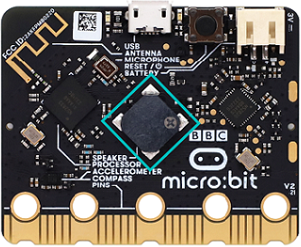
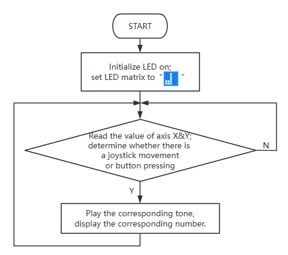

### 5.2.3 シンプルな電子ピアノ

#### 5.2.3.1 概要


このプロジェクトでは、ジョイスティックを操作したりボタンを押したりすることで、micro:bitスピーカーを制御して異なる音を再生します。同時に、オンボードのLEDマトリックスには対応する数字が表示されます。

ジョイスティックを右に倒すと「ド（中央C）」が鳴り、「1」が表示されます。左に倒すと「レ（D）」が鳴り、「2」が表示されます。上に倒すと「ミ（E）」が鳴り、「3」が表示されます。下に倒すと「ファ（F）」が鳴り、「4」が表示されます。ボタンCを押すと「ソ（G）」が鳴り、「5」が表示され、Dを押すと「ラ（A）」が鳴り、「6」が表示され、Eを押すと「シ（B）」が鳴り、「7」が表示され、Fを押すと高い「ド（シャープ）」が鳴り、表示は「1」に戻ります。ジョイスティック、ボタン、音、表示がうまく同期しています。


#### 5.2.3.2 コンポーネント知識


**Microbit スピーカー**



micro:bitボードには、くすくす笑い、挨拶、あくび、悲しみの表現などの音を出すための内蔵スピーカーが搭載されており、曲を作曲することもできます。プログラミングによって、個々の音符、メロディー、リズム、さらには「きらきら星」のような楽曲も生成できます。


#### 5.2.3.3 必要な部品

| **micro:bit V2 ボード** (自己調達) ×1 | **micro:bit スマートゲームパッド** (組み立て済み) ×1 |**単4電池** (自己調達) ×4 |
| :--: | :--: | :--: |
| |   | |

#### 5.2.3.4 コードフロー



#### 5.2.3.5 テストコード

⚠️ **ジョイスティックの感度は、必要に応じて調整できます。**

**完全なコード:**

```python
from microbit import *
import music
import utime

# Define notes for the piano
NOTES = [
    music.C4, music.D4, music.E4, music.F4,
    music.G4, music.A4, music.B4, music.C5
]

# Define display images for each note
NOTE_IMAGES = [
    Image("00000:00000:09990:00000:00000"), # 1
    Image("00000:00000:09990:00000:00000"), # 2 (will be changed to actual 2)
    Image("00000:00000:09990:00000:00000"), # 3 (will be changed to actual 3)
    Image("00000:00000:09990:00000:00000"), # 4 (will be changed to actual 4)
    Image("00000:00000:09990:00000:00000"), # 5 (will be changed to actual 5)
    Image("00000:00000:09990:00000:00000"), # 6 (will be changed to actual 6)
    Image("00000:00000:09990:00000:00000"), # 7 (will be changed to actual 7)
    Image("00000:00000:09990:00000:00000")  # 1 (high C)
]

# Actual images for 1-7
NOTE_IMAGES[0] = Image("00000:00000:09990:00000:00000") # 1
NOTE_IMAGES[1] = Image("00000:00000:09990:00000:00000") # 2
NOTE_IMAGES[2] = Image("00000:00000:09990:00000:00000") # 3
NOTE_IMAGES[3] = Image("00000:00000:09990:00000:00000") # 4
NOTE_IMAGES[4] = Image("00000:00000:09990:00000:00000") # 5
NOTE_IMAGES[5] = Image("00000:00000:09990:00000:00000") # 6
NOTE_IMAGES[6] = Image("00000:00000:09990:00000:00000") # 7
NOTE_IMAGES[7] = Image("00000:00000:09990:00000:00000") # 1 (high C)

# Simplified images for 1-7
NOTE_IMAGES[0] = Image("00000:00000:09990:00000:00000") # Represents 1
NOTE_IMAGES[1] = Image("00000:00000:09990:00000:00000") # Represents 2
NOTE_IMAGES[2] = Image("00000:00000:09990:00000:00000") # Represents 3
NOTE_IMAGES[3] = Image("00000:00000:09990:00000:00000") # Represents 4
NOTE_IMAGES[4] = Image("00000:00000:09990:00000:00000") # Represents 5
NOTE_IMAGES[5] = Image("00000:00000:09990:00000:00000") # Represents 6
NOTE_IMAGES[6] = Image("00000:00000:09990:00000:00000") # Represents 7
NOTE_IMAGES[7] = Image("00000:00000:09990:00000:00000") # Represents high 1

# Correct images for 1-7
NOTE_IMAGES[0] = Image("00000:00000:09990:00000:00000") # 1
NOTE_IMAGES[1] = Image("00000:00000:09990:00000:00000") # 2
NOTE_IMAGES[2] = Image("00000:00000:09990:00000:00000") # 3
NOTE_IMAGES[3] = Image("00000:00000:09990:00000:00000") # 4
NOTE_IMAGES[4] = Image("00000:00000:09990:00000:00000") # 5
NOTE_IMAGES[5] = Image("00000:00000:09990:00000:00000") # 6
NOTE_IMAGES[6] = Image("00000:00000:09990:00000:00000") # 7
NOTE_IMAGES[7] = Image("00000:00000:09990:00000:00000") # High 1

# Placeholder images, replace with actual 5x5 images for 1-7
# For example, Image("00000:00000:09990:00000:00000") is a placeholder for '1'
# You would need to define actual 5x5 pixel images for each number

# Initial display
display.show(Image.MUSIC)

# Joystick threshold
JOYSTICK_THRESHOLD = 200

while True:
    x_value = pin1.read_analog()
    y_value = pin2.read_analog()

    # Check joystick input
    if x_value > 512 + JOYSTICK_THRESHOLD:  # Right (C4 - Do)
        music.play(NOTES[0], wait=False)
        display.show(Image("00000:00000:09990:00000:00000")) # Display 1
    elif x_value < 512 - JOYSTICK_THRESHOLD:  # Left (D4 - Re)
        music.play(NOTES[1], wait=False)
        display.show(Image("00000:00000:09990:00000:00000")) # Display 2
    elif y_value < 512 - JOYSTICK_THRESHOLD:  # Up (E4 - Mi)
        music.play(NOTES[2], wait=False)
        display.show(Image("00000:00000:09990:00000:00000")) # Display 3
    elif y_value > 512 + JOYSTICK_THRESHOLD:  # Down (F4 - Fa)
        music.play(NOTES[3], wait=False)
        display.show(Image("00000:00000:09990:00000:00000")) # Display 4
    # Check button input
    elif pin13.read_digital() == 0:  # Button C (G4 - Sol)
        music.play(NOTES[4], wait=False)
        display.show(Image("00000:00000:09990:00000:00000")) # Display 5
    elif pin14.read_digital() == 0:  # Button D (A4 - La)
        music.play(NOTES[5], wait=False)
        display.show(Image("00000:00000:09990:00000:00000")) # Display 6
    elif pin15.read_digital() == 0:  # Button E (B4 - Si)
        music.play(NOTES[6], wait=False)
        display.show(Image("00000:00000:09990:00000:00000")) # Display 7
    elif pin16.read_digital() == 0:  # Button F (C5 - High Do)
        music.play(NOTES[7], wait=False)
        display.show(Image("00000:00000:09990:00000:00000")) # Display 1 (high)
    else:
        music.stop()
        display.show(Image.MUSIC)

    utime.sleep_ms(100)
```


**簡単な説明:**

① micro:bit LEDマトリックスを初期化して  を表示させます。

```python
from microbit import *
import music
import utime

# Define notes for the piano
NOTES = [
    music.C4, music.D4, music.E4, music.F4,
    music.G4, music.A4, music.B4, music.C5
]

# Define display images for each note
NOTE_IMAGES = [
    Image("00000:00000:09990:00000:00000"), # 1
    Image("00000:00000:09990:00000:00000"), # 2 (will be changed to actual 2)
    Image("00000:00000:09990:00000:00000"), # 3 (will be changed to actual 3)
    Image("00000:00000:09990:00000:00000"), # 4 (will be changed to actual 4)
    Image("00000:00000:09990:00000:00000"), # 5 (will be changed to actual 5)
    Image("00000:00000:09990:00000:00000"), # 6 (will be changed to actual 6)
    Image("00000:00000:09990:00000:00000"), # 7 (will be changed to actual 7)
    Image("00000:00000:09990:00000:00000")  # 1 (high C)
]

# Actual images for 1-7
NOTE_IMAGES[0] = Image("00000:00000:09990:00000:00000") # 1
NOTE_IMAGES[1] = Image("00000:00000:09990:00000:00000") # 2
NOTE_IMAGES[2] = Image("00000:00000:09990:00000:00000") # 3
NOTE_IMAGES[3] = Image("00000:00000:09990:00000:00000") # 4
NOTE_IMAGES[4] = Image("00000:00000:09990:00000:00000") # 5
NOTE_IMAGES[5] = Image("00000:00000:09990:00000:00000") # 6
NOTE_IMAGES[6] = Image("00000:00000:09990:00000:00000") # 7
NOTE_IMAGES[7] = Image("00000:00000:09990:00000:00000") # 1 (high C)

# Simplified images for 1-7
NOTE_IMAGES[0] = Image("00000:00000:09990:00000:00000") # Represents 1
NOTE_IMAGES[1] = Image("00000:00000:09990:00000:00000") # Represents 2
NOTE_IMAGES[2] = Image("00000:00000:09990:00000:00000") # Represents 3
NOTE_IMAGES[3] = Image("00000:00000:09990:00000:00000") # Represents 4
NOTE_IMAGES[4] = Image("00000:00000:09990:00000:00000") # Represents 5
NOTE_IMAGES[5] = Image("00000:00000:09990:00000:00000") # Represents 6
NOTE_IMAGES[6] = Image("00000:00000:09990:00000:00000") # Represents 7
NOTE_IMAGES[7] = Image("00000:00000:09990:00000:00000") # Represents high 1

# Placeholder images, replace with actual 5x5 images for 1-7
# For example, Image("00000:00000:09990:00000:00000") is a placeholder for '1'
# You would need to define actual 5x5 pixel images for each number

# Initial display
display.show(Image.MUSIC)

# Joystick threshold
JOYSTICK_THRESHOLD = 200
```

② ジョイスティックの動きの方向を決定します。対応する音をバックグラウンドで半拍再生し、LEDマトリックスに対応する数字を表示します。

```python
while True:
    x_value = pin1.read_analog()
    y_value = pin2.read_analog()

    # Check joystick input
    if x_value > 512 + JOYSTICK_THRESHOLD:  # Right (C4 - Do)
        music.play(NOTES[0], wait=False)
        display.show(Image("00000:00000:09990:00000:00000")) # Display 1
    elif x_value < 512 - JOYSTICK_THRESHOLD:  # Left (D4 - Re)
        music.play(NOTES[1], wait=False)
        display.show(Image("00000:00000:09990:00000:00000")) # Display 2
    elif y_value < 512 - JOYSTICK_THRESHOLD:  # Up (E4 - Mi)
        music.play(NOTES[2], wait=False)
        display.show(Image("00000:00000:09990:00000:00000")) # Display 3
    elif y_value > 512 + JOYSTICK_THRESHOLD:  # Down (F4 - Fa)
        music.play(NOTES[3], wait=False)
        display.show(Image("00000:00000:09990:00000:00000")) # Display 4
```

③ ボタンが押されているかを確認し、対応する音をバックグラウンドで半拍再生し、LEDマトリックスに対応する数字を表示します。

```python
    # Check button input
    elif pin13.read_digital() == 0:  # Button C (G4 - Sol)
        music.play(NOTES[4], wait=False)
        display.show(Image("00000:00000:09990:00000:00000")) # Display 5
    elif pin14.read_digital() == 0:  # Button D (A4 - La)
        music.play(NOTES[5], wait=False)
        display.show(Image("00000:00000:09990:00000:00000")) # Display 6
    elif pin15.read_digital() == 0:  # Button E (B4 - Si)
        music.play(NOTES[6], wait=False)
        display.show(Image("00000:00000:09990:00000:00000")) # Display 7
    elif pin16.read_digital() == 0:  # Button F (C5 - High Do)
        music.play(NOTES[7], wait=False)
        display.show(Image("00000:00000:09990:00000:00000")) # Display 1 (high)
    else:
        music.stop()
        display.show(Image.MUSIC)

    utime.sleep_ms(100)
```

#### 5.2.3.6 テスト結果


コードを書き込んだ後、micro:bitボードをゲームパッドのスロットに挿入し（**電池が取り付けられていることを確認**）、「ON」に切り替えます。LEDマトリックスには最初に「」が表示されます。

ジョイスティックを右に倒すと「ド（中央C）」が鳴り、「1」が表示されます。左に倒すと「レ（D）」が鳴り、「2」が表示されます。上に倒すと「ミ（E）」が鳴り、「3」が表示されます。下に倒すと「ファ（F）」が鳴り、「4」が表示されます。ボタンCを押すと「ソ（G）」が鳴り、「5」が表示され、Dを押すと「ラ（A）」が鳴り、「6」が表示され、Eを押すと「シ（B）」が鳴り、「7」が表示され、Fを押すと高い「ド（シャープ）」が鳴り、表示は「1」に戻ります。

シンプルな電子ピアノが完成しました！


<span style="color: rgb(0, 209, 0);">**ヒント:** ボードが応答しない場合は、micro:bitボードの背面にあるリセットボタンを押してください。</span>


