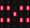

### 5.2.4 Music Player

#### 5.2.4.1 Overview


Herein we build a music player that generates sound via the built-in buzzer on the micro:bit board (does not play vocal music). It features a library of 20 short tracks and supports both sequential and random playback. 

In sequential mode, pressing C(Previous song) or E(Next song) button switches tracks according to a preset sequence until reaching the end of the list; while in random mode, each press selects a track randomly from the 20 sounds with the color lights flashing, and when one song is finishes it stops immediately. 

Meanwhile, the micro:bit LED matrix displays the current playback mode in real time.


#### 5.2.4.2 Required Parts

| |   | |
| :--: | :--: | :--: |
| **micro:bit V2 board** (self-provided) ×1 | **micro:bit Smart Gamepad** (assembled) ×1 | **AAA battery** (self-provided) ×4 |

#### 5.2.4.3 Code Flow


#### 5.2.4.4 Test Code

**Complete code:**

```python
# import related libraries
from microbit import *
import music, neopixel, random

# --- Configuration & Data ---
vol = 50
mode = 0  # 0: Manual, 1: Random
idx = 0
last_idx = -1
hue = 0
strip = neopixel.NeoPixel(pin8, 4)
melodies = ["DADADADUM", "ENTERTAINER", "PRELUDE", "ODE", "NYAN", "RINGTONE", "FUNK", "BLUES", 
            "BIRTHDAY", "WEDDING", "FUNERAL", "PUNCHLINE", "BADDY", "CHASE", "BA_DING", 
            "WAWAWAWAA", "JUMP_UP", "JUMP_DOWN", "POWER_UP", "POWER_DOWN"]

# Pin Initialization (P13-P16)
btns = [pin13, pin14, pin15, pin16]
for p in btns: p.set_pull(p.PULL_UP)
set_volume(vol)

def get_rgb(h):
    """ Simplified HSL to RGB logic """
    h %= 360
    pos = h // 60
    f = (h % 60) / 60.0
    v = 76 # 255 * 0.3 (Brightness coefficient)
    up, down = int(v * f), int(v * (1 - f))
    res = [(v, up, 0), (down, v, 0), (0, v, up), (0, down, v), (up, 0, v), (v, 0, down)]
    return res[pos]

# State tracking (for debouncing)
last_states = [1] * 4
last_press_t = 0

while True:
    curr_t = running_time()
    
    # 1. Volume Control (Buttons A/B)
    if button_a.was_pressed(): vol = min(250, vol + 10); set_volume(vol)
    if button_b.was_pressed(): vol = max(20, vol - 10); set_volume(vol)

    # 2. Joystick/Button Input Detection (with debouncing)
    for i, p in enumerate(btns):
        v = p.read_digital()
        if v == 0 and last_states[i] == 1 and (curr_t - last_press_t > 50):
            last_press_t = curr_t
            if i == 3: mode = 0; sleep(500)     # P16: Manual Mode
            elif i == 1: mode = 1; sleep(500)   # P14: Random Mode
            elif i == 2: # P15: Next track / Random track
                idx = random.randint(0, 19) if mode else (idx + 1) % 20
            elif i == 0: # P13: Previous track / Random track
                idx = random.randint(0, 19) if mode else (idx - 1) % 20
        last_states[i] = v

    # 3. Music Playback Logic
    if idx != last_idx:
        music.stop()
        try:
            music.play(getattr(music, melodies[idx]), wait=False)
            last_idx = idx
        except: pass

    # 4. Lighting & Display Updates
    hue = (hue + 1) % 360
    strip.fill(get_rgb(hue))
    strip.show()
    
    # Show Mode Icon: "X" for Random, Arrow for Manual
    display.show(Image("00000:99099:00900:99099:00000") if mode else Image.ARROW_E)
    
    sleep(10)

```


**Brief explanation:**

① Import libraries, configure constants and initialization.

It first imports `microbit` library to access Micro:bit's core functions, `music` for playing built-in music, `neopixel` for controlling the NeoPixel LED strip, and `random` for generating random numbers.

It then defines a series of global variables and constants: `vol` sets the initial volume to 50; `mode` controls the music playback mode (0 for manual selection, 1 for random playback); `idx` stores the current music index; tracks the previous playback index to avoid duplicate plays; `hue` controls the color of the NeoPixel strip; `strip` initializes a NeoPixel strip connected to `pin8` of four LEDs; and `melodies` lists all MicroPython `music` titles.

Next, the `btns` list defines the four external button pins from `pin13` to `pin16`, assigning internal pull-up resistors(`p.PULL_UP`) to them in a loop—resulting in high-level pins when buttons are released and low-level pins when pressed.

`set_volume (vol)` sets the volume to its default value.

```python
# import related libraries
from microbit import *
import music, neopixel, random

# --- Configuration & Data ---
vol = 50
mode = 0  # 0: Manual, 1: Random
idx = 0
last_idx = -1
hue = 0
strip = neopixel.NeoPixel(pin8, 4)
melodies = ["DADADADUM", "ENTERTAINER", "PRELUDE", "ODE", "NYAN", "RINGTONE", "FUNK", "BLUES", 
            "BIRTHDAY", "WEDDING", "FUNERAL", "PUNCHLINE", "BADDY", "CHASE", "BA_DING", 
            "WAWAWAWAA", "JUMP_UP", "JUMP_DOWN", "POWER_UP", "POWER_DOWN"]

# Pin Initialization (P13-P16)
btns = [pin13, pin14, pin15, pin16]
for p in btns: p.set_pull(p.PULL_UP)
set_volume(vol)
```

② Color conversion function and stabilization variable.

`get_rgb(h)` is a simplified HSL (Hue, Saturation, Lightness) to RGB color conversion function. It accepts a hue value `h` (0–359) and converts it into an RGB triplet. The brightness `v` is fixed at 76 (approximately 255 × 0.3, corresponding to the `BRIGHTNESS` coefficient). This function facilitates the generation of rainbow colors based on the hue value.

`last_states` list stores the previous states of the four buttons, initially all set to 1 (high level for not pressed). `last_press_t` records the time of the last button press. Together, these variables implement software anti-jitter to prevent multiple detections of a single button press.

```python
def get_rgb(h):
    """ Simplified HSL to RGB logic """
    h %= 360
    pos = h // 60
    f = (h % 60) / 60.0
    v = 76 # 255 * 0.3 (Brightness coefficient)
    up, down = int(v * f), int(v * (1 - f))
    res = [(v, up, 0), (down, v, 0), (0, v, up), (0, down, v), (up, 0, v), (v, 0, down)]
    return res[pos]

# State tracking (for debouncing)
last_states = [1] * 4
last_press_t = 0
```

③ Main loop: Volume control.

There is an infinite loop (`while True`) that retrieves the current runtime `curr_t`. Then, it handles the A and B buttons on the Micro:bit board:

*   If `button_a` is pressed (`button_a.was_pressed()`), the volume `vol` + 10, but not exceeding 250. `set_volume(vol)` is followed to update the system volume.
*   If `button_b` is pressed (`button_b.was_pressed()`), `vol` - 10, but remains no less than 20. `set_volume(vol)` is followed to update the system volume.

`was_pressed()` returns `True` only once when the button transitions from an unpressed to a pressed state, providing inherent anti-jitter.

```python
while True:
    curr_t = running_time()
    
    # 1. Volume Control (Buttons A/B)
    if button_a.was_pressed(): vol = min(250, vol + 10); set_volume(vol)
    if button_b.was_pressed(): vol = max(20, vol - 10); set_volume(vol)
```

④ Main loop: button input detection and mode switching.

It iterates through the four external buttons(`pin13` to `pin16`) in `btns` list, detecting their pressed states. The button is only responded when it is from high(unpressed) to low(pressed) and it has been more than 50 milliseconds since the last valid key press.

*   If `pin16` is pressed(`i == 3`), `mode` = 0(manual mode) and pause for 500 ms.
*   If `pin14` is pressed(`i == 1`), `mode` = 1(random mode) and pause for 500 ms.
*   If `pin15` is pressed(`i == 2`), update the music index `idx` according to the current pattern: one music is randomly selected in random mode; the next music is played in manual mode.
*   If `pin13` is pressed(`i == 0`), update the music index `idx` according to the current pattern: one music is randomly selected in random mode; the next music is played in manual mode.

At the end of each loop, `last_states[i] = v` updates the current status of button in preparation for the next stabilization check.

```python
    # 2. Joystick/Button Input Detection (with debouncing)
    for i, p in enumerate(btns):
        v = p.read_digital()
        if v == 0 and last_states[i] == 1 and (curr_t - last_press_t > 50):
            last_press_t = curr_t
            if i == 3: mode = 0; sleep(500)     # P16: Manual Mode
            elif i == 1: mode = 1; sleep(500)   # P14: Random Mode
            elif i == 2: # P15: Next track / Random track
                idx = random.randint(0, 19) if mode else (idx + 1) % 20
            elif i == 0: # P13: Previous track / Random track
                idx = random.randint(0, 19) if mode else (idx - 1) % 20
        last_states[i] = v
```

⑤ Main loop: music playback logic.

It controls the playback of the music by checking if the current music index `idx` is different from the last one `last_idx`. If they are, the music needs to be switched:

1.  `music.stop()` stops the music that is currently playing.
2.  `music.play(getattr(music, melodies[idx]), wait=False)` tries to play a new music. `getattr(music, melodies[idx])` dynamically obtains the music data of the corresponding name in `music`, and `wait=False` ensures that the music playback does not block the main loop.
3.  If the playback is successful, update `last_idx = idx`.
4.  `try...except` captures potential errors; for example, there might be invalid music titles in the `melodies` list.

```python
    # 3. Music Playback Logic
    if idx != last_idx:
        music.stop()
        try:
            music.play(getattr(music, melodies[idx]), wait=False)
            last_idx = idx
        except: pass
```

⑥ Main loop: Light and display updates.

Here is an update on the color of the NeoPixel strip and the display of the Micro:bit LED matrix:

1.  `hue = (hue + 1) % 360` continuously increases `hue` to make it cycle among 0 to 359  for a rainbow gradient light.
2.  `strip.fill(get_rgb(hue))` adopts `get_rgb` to generate a color based on the current `hue` and fill the entire NeoPixel strip with this color.
3.  `strip.show()` sends the updated color to the NeoPixel strip for display.
4.  `display.show(...)` displays display depending on the current `mode`. `mode` = 1(random): show a custom “X”; `mode` = 0(manual), show an arrow pointing to the right (`Image.ARROW_E`).

Then, `sleep(10)` introduces a short delay for suitable execution speed, lower CPU load, and smoother effect.

```python
    # 4. Lighting & Display Updates
    hue = (hue + 1) % 360
    strip.fill(get_rgb(hue))
    strip.show()
    
    # Show Mode Icon: "X" for Random, Arrow for Manual
    display.show(Image("00000:99099:00900:99099:00000") if mode else Image.ARROW_E)
    
    sleep(10)
```
#### 5.2.4.5 Test Result


After burning the code, insert the micro:bit board into the slot of the gamepad (**batteries installed**), and toggle the switch on it to “ON”. 

After powering on, it is in sequential mode by default, and will play the song at N.O. “0”. As it is finishes, you can press C for the last song or E for the next one. 

Press F to switch to random mode. And you can press D to back to sequential one. In F mode, a random track of these 20 will be played if you press C/E. After finishing, it stops. 

The RGB lights are always breathing from the moment of powering on. Meanwhile, the micro:bit LED matrix shows “” in sequential mode and “”in random mode. 

For volume, press A to turn up and B to turn down.


<span style="color: rgb(0, 209, 0);">**Tip:** If there is no response on the board, please press the reset button on the back of the micro:bit board.</span>


