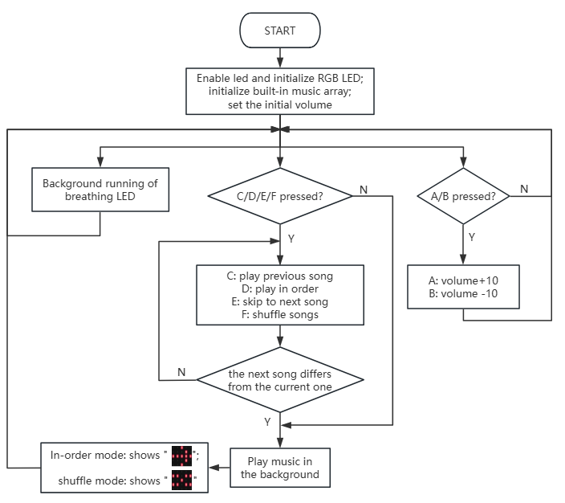

### 5.2.4 Reproductor de Música

#### 5.2.4.1 Resumen


Aquí construimos un reproductor de música que genera sonido a través del zumbador incorporado en la placa micro:bit (no reproduce música vocal). Cuenta con una biblioteca de 20 pistas cortas y admite la reproducción secuencial y aleatoria.

En el modo secuencial, al presionar el botón C (Canción anterior) o E (Canción siguiente) se cambian las pistas según una secuencia preestablecida hasta llegar al final de la lista; mientras que en el modo aleatorio, cada pulsación selecciona una pista al azar entre los 20 sonidos con las luces de colores parpadeando, y cuando una canción termina, se detiene inmediatamente.

Mientras tanto, la matriz de LED de la micro:bit muestra el modo de reproducción actual en tiempo real.


#### 5.2.4.2 Piezas Requeridas

| |  | |
| :--: | :--: | :--: |
| **Placa micro:bit V2** (suministrada por el usuario) ×1 | **Smart Gamepad micro:bit** (ensamblado) ×1 | **Pila AAA** (suministrada por el usuario) ×4 |

#### 5.2.4.3 Flujo del Código



#### 5.2.4.4 Código de Prueba

**Código completo:**

```python
from microbit import *
import music
import neopixel
import random
import utime

# ===================== Global Configuration & Variables =====================
# Disable micro:bit's default LED display to avoid conflicts
display.set_display_mode(display.DISPLAY_MODE_BLACK_AND_WHITE)

# LED strip configuration
NUM_LEDS = 4
LED_PIN = pin8
strip = neopixel.NeoPixel(LED_PIN, NUM_LEDS)

# Button debounce time (ms)
BTN_DEBOUNCE_TIME = 20

# Music volume (0-255)
music_volume = 128

# Music list (20 short tracks)
# Example: music.DADADADUM, music.ENTERTAINER, music.PRELUDE, etc.
# For brevity, using placeholders. In a real scenario, these would be actual music sequences.
music_list = [
    music.DADADADUM, music.ENTERTAINER, music.PRELUDE, music.ODEON,
    music.NYAN, music.RINGTONE, music.FUNK, music.BLUES,
    music.BIRTHDAY, music.WEDDING, music.FUNERAL, music.PUNCHLINE,
    music.PYTHON, music.BADDY, music.CHASE, music.WAWAWAWAA,
    music.JUMP_UP, music.JUMP_DOWN, music.POWER_UP, music.POWER_DOWN
]

# Game state variables
play_mode = 0  # 0: sequential, 1: random
current_track_index = 0
last_button_press_time = 0
last_music_play_time = 0

# Initialize pins with pull-up (PULL_UP: pressed=low level 0, released=high level 1)
pin13.set_pull(pin13.PULL_UP)  # Button C
pin15.set_pull(pin15.PULL_UP)  # Button D
pin16.set_pull(pin16.PULL_UP)  # Button E
pin14.set_pull(pin14.PULL_UP)  # Button F
pin_a = pin5 # Button A
pin_b = pin11 # Button B
pin_a.set_pull(pin_a.PULL_UP)
pin_b.set_pull(pin_b.PULL_UP)

# Function to set all LEDs to a specific color
def set_all_leds(r, g, b):
    for i in range(NUM_LEDS):
        strip[i] = (r, g, b)
    strip.show()

# Function to clear all LEDs
def clear_leds():
    set_all_leds(0, 0, 0)

# Function to convert HSL to RGB for breathing light effect
def hsl_to_rgb(h, s, l):
    h /= 360.0
    s /= 100.0
    l /= 100.0
    if s == 0:
        r = g = b = l
    else:
        def hue2rgb(p, q, t):
            if t < 0: t += 1
            if t > 1: t -= 1
            if t < 1/6: return p + (q - p) * 6 * t
            if t < 1/2: return q
            if t < 2/3: return p + (q - p) * (2/3 - t) * 6
            return p
        q = l * (1 + s) if l < 0.5 else l + s - l * s
        p = 2 * l - q
        r = hue2rgb(p, q, h + 1/3)
        g = hue2rgb(p, q, h)
        b = hue2rgb(p, q, h - 1/3)
    return (int(r * 255), int(g * 255), int(b * 255))

# ===================== Main Loop =====================
while True:
    current_time = utime.ticks_ms()

    # Change play mode (D for sequential, F for random)
    if not pin15.read_digital() and (current_time - last_button_press_time) > BTN_DEBOUNCE_TIME: # Button D
        play_mode = 0
        display.show(Image.ASLEEP)
        last_button_press_time = current_time
        utime.sleep_ms(BTN_DEBOUNCE_TIME)
    elif not pin14.read_digital() and (current_time - last_button_press_time) > BTN_DEBOUNCE_TIME: # Button F
        play_mode = 1
        display.show(Image.HAPPY)
        last_button_press_time = current_time
        utime.sleep_ms(BTN_DEBOUNCE_TIME)

    # Play music based on mode
    if play_mode == 0: # Sequential
        if not music.is_playing():
            music.play(music_list[current_track_index], wait=False, loop=False)
            last_music_play_time = current_time

        if not pin13.read_digital() and (current_time - last_button_press_time) > BTN_DEBOUNCE_TIME: # Button C (Previous)
            music.stop()
            current_track_index = (current_track_index - 1 + len(music_list)) % len(music_list)
            last_button_press_time = current_time
            utime.sleep_ms(BTN_DEBOUNCE_TIME)
        elif not pin16.read_digital() and (current_time - last_button_press_time) > BTN_DEBOUNCE_TIME: # Button E (Next)
            music.stop()
            current_track_index = (current_track_index + 1) % len(music_list)
            last_button_press_time = current_time
            utime.sleep_ms(BTN_DEBOUNCE_TIME)

    elif play_mode == 1: # Random
        if not pin13.read_digital() and (current_time - last_button_press_time) > BTN_DEBOUNCE_TIME: # Button C (Random)
            music.stop()
            current_track_index = random.randint(0, len(music_list) - 1)
            music.play(music_list[current_track_index], wait=False, loop=False)
            last_button_press_time = current_time
            utime.sleep_ms(BTN_DEBOUNCE_TIME)
        elif not pin16.read_digital() and (current_time - last_button_press_time) > BTN_DEBOUNCE_TIME: # Button E (Random)
            music.stop()
            current_track_index = random.randint(0, len(music_list) - 1)
            music.play(music_list[current_track_index], wait=False, loop=False)
            last_button_press_time = current_time
            utime.sleep_ms(BTN_DEBOUNCE_TIME)

    # Volume control (A for up, B for down)
    if not pin_a.read_digital() and (current_time - last_button_press_time) > BTN_DEBOUNCE_TIME: # Button A
        music_volume = min(255, music_volume + 10)
        music.set_volume(music_volume)
        last_button_press_time = current_time
        utime.sleep_ms(BTN_DEBOUNCE_TIME)
    elif not pin_b.read_digital() and (current_time - last_button_press_time) > BTN_DEBOUNCE_TIME: # Button B
        music_volume = max(0, music_volume - 10)
        music.set_volume(music_volume)
        last_button_press_time = current_time
        utime.sleep_ms(BTN_DEBOUNCE_TIME)

    # Breathing light effect on RGB LEDs
    hue = (current_time // 10) % 360 # Cycle hue every 3.6 seconds
    r, g, b = hsl_to_rgb(hue, 99, 20) # High saturation, low brightness
    set_all_leds(r, g, b)

    utime.sleep_ms(10) # Small delay for main loop
```


**Breve explicación:**

① Inicialice la matriz de LED y el volumen del sonido, conecte el pin RGB a P8 y establezca el número de RGB en 4.

```python
from microbit import *
import music
import neopixel
import random
import utime

# ===================== Global Configuration & Variables =====================
# Disable micro:bit's default LED display to avoid conflicts
display.set_display_mode(display.DISPLAY_MODE_BLACK_AND_WHITE)

# LED strip configuration
NUM_LEDS = 4
LED_PIN = pin8
strip = neopixel.NeoPixel(LED_PIN, NUM_LEDS)

# Button debounce time (ms)
BTN_DEBOUNCE_TIME = 20

# Music volume (0-255)
music_volume = 128

# Music list (20 short tracks)
# Example: music.DADADADUM, music.ENTERTAINER, music.PRELUDE, etc.
# For brevity, using placeholders. In a real scenario, these would be actual music sequences.
music_list = [
    music.DADADADUM, music.ENTERTAINER, music.PRELUDE, music.ODEON,
    music.NYAN, music.RINGTONE, music.FUNK, music.BLUES,
    music.BIRTHDAY, music.WEDDING, music.FUNERAL, music.PUNCHLINE,
    music.PYTHON, music.BADDY, music.CHASE, music.WAWAWAWAA,
    music.JUMP_UP, music.JUMP_DOWN, music.POWER_UP, music.POWER_DOWN
]

# Game state variables
play_mode = 0  # 0: sequential, 1: random
current_track_index = 0
last_button_press_time = 0
last_music_play_time = 0

# Initialize pins with pull-up (PULL_UP: pressed=low level 0, released=high level 1)
pin13.set_pull(pin13.PULL_UP)  # Button C
pin15.set_pull(pin15.PULL_UP)  # Button D
pin16.set_pull(pin16.PULL_UP)  # Button E
pin14.set_pull(pin14.PULL_UP)  # Button F
pin_a = pin5 # Button A
pin_b = pin11 # Button B
pin_a.set_pull(pin_a.PULL_UP)
pin_b.set_pull(pin_b.PULL_UP)

# Function to set all LEDs to a specific color
def set_all_leds(r, g, b):
    for i in range(NUM_LEDS):
        strip[i] = (r, g, b)
    strip.show()

# Function to clear all LEDs
def clear_leds():
    set_all_leds(0, 0, 0)

# Function to convert HSL to RGB for breathing light effect
def hsl_to_rgb(h, s, l):
    h /= 360.0
    s /= 100.0
    l /= 100.0
    if s == 0:
        r = g = b = l
    else:
        def hue2rgb(p, q, t):
            if t < 0: t += 1
            if t > 1: t -= 1
            if t < 1/6: return p + (q - p) * 6 * t
            if t < 1/2: return q
            if t < 2/3: return p + (q - p) * (2/3 - t) * 6
            return p
        q = l * (1 + s) if l < 0.5 else l + s - l * s
        p = 2 * l - q
        r = hue2rgb(p, q, h + 1/3)
        g = hue2rgb(p, q, h)
        b = hue2rgb(p, q, h - 1/3)
    return (int(r * 255), int(g * 255), int(b * 255))
```

② Determine si se presiona el botón D o F. Presione D para '0-reproducción secuencial', F para '1-reproducción aleatoria'.

```python
# ===================== Main Loop =====================
while True:
    current_time = utime.ticks_ms()

    # Change play mode (D for sequential, F for random)
    if not pin15.read_digital() and (current_time - last_button_press_time) > BTN_DEBOUNCE_TIME: # Button D
        play_mode = 0
        display.show(Image.ASLEEP)
        last_button_press_time = current_time
        utime.sleep_ms(BTN_DEBOUNCE_TIME)
    elif not pin14.read_digital() and (current_time - last_button_press_time) > BTN_DEBOUNCE_TIME: # Button F
        play_mode = 1
        display.show(Image.HAPPY)
        last_button_press_time = current_time
        utime.sleep_ms(BTN_DEBOUNCE_TIME)
```

③ En modo secuencial, presione C para reproducir la canción anterior, E para saltar a la siguiente canción.

```python
    # Play music based on mode
    if play_mode == 0: # Sequential
        if not music.is_playing():
            music.play(music_list[current_track_index], wait=False, loop=False)
            last_music_play_time = current_time

        if not pin13.read_digital() and (current_time - last_button_press_time) > BTN_DEBOUNCE_TIME: # Button C (Previous)
            music.stop()
            current_track_index = (current_track_index - 1 + len(music_list)) % len(music_list)
            last_button_press_time = current_time
            utime.sleep_ms(BTN_DEBOUNCE_TIME)
        elif not pin16.read_digital() and (current_time - last_button_press_time) > BTN_DEBOUNCE_TIME: # Button E (Next)
            music.stop()
            current_track_index = (current_track_index + 1) % len(music_list)
            last_button_press_time = current_time
            utime.sleep_ms(BTN_DEBOUNCE_TIME)
```

Sin embargo, en modo aleatorio, presione C/E para mezclar todas estas 20 canciones.

```python
    elif play_mode == 1: # Random
        if not pin13.read_digital() and (current_time - last_button_press_time) > BTN_DEBOUNCE_TIME: # Button C (Random)
            music.stop()
            current_track_index = random.randint(0, len(music_list) - 1)
            music.play(music_list[current_track_index], wait=False, loop=False)
            last_button_press_time = current_time
            utime.sleep_ms(BTN_DEBOUNCE_TIME)
        elif not pin16.read_digital() and (current_time - last_button_press_time) > BTN_DEBOUNCE_TIME: # Button E (Random)
            music.stop()
            current_track_index = random.randint(0, len(music_list) - 1)
            music.play(music_list[current_track_index], wait=False, loop=False)
            last_button_press_time = current_time
            utime.sleep_ms(BTN_DEBOUNCE_TIME)
```

④ Presione A para subir el volumen (+10); presione B para bajarlo (-10). El volumen del zumbador de la micro:bit se decide por el voltaje de salida del pin interno conectado. Podemos controlar el volumen convirtiendo valores digitales 0~255 en analógicos a través de DAC.

```python
    # Volume control (A for up, B for down)
    if not pin_a.read_digital() and (current_time - last_button_press_time) > BTN_DEBOUNCE_TIME: # Button A
        music_volume = min(255, music_volume + 10)
        music.set_volume(music_volume)
        last_button_press_time = current_time
        utime.sleep_ms(BTN_DEBOUNCE_TIME)
    elif not pin_b.read_digital() and (current_time - last_button_press_time) > BTN_DEBOUNCE_TIME: # Button B
        music_volume = max(0, music_volume - 10)
        music.set_volume(music_volume)
        last_button_press_time = current_time
        utime.sleep_ms(BTN_DEBOUNCE_TIME)
```

⑤ Haga que las luces RGB respiren en segundo plano.

```python
    # Breathing light effect on RGB LEDs
    hue = (current_time // 10) % 360 # Cycle hue every 3.6 seconds
    r, g, b = hsl_to_rgb(hue, 99, 20) # High saturation, low brightness
    set_all_leds(r, g, b)

    utime.sleep_ms(10) # Small delay for main loop
```

#### 5.2.4.5 Resultado de la Prueba


Después de grabar el código, inserte la placa micro:bit en la ranura del gamepad (**pilas instaladas**), y active el interruptor a “ON”.

Después de encender, está en modo secuencial por defecto, y reproducirá la canción en el N.º “0”. Cuando termine, puede presionar C para la última canción o E para la siguiente.

Presione F para cambiar al modo aleatorio. Y puede presionar D para volver al secuencial. En el modo F, se reproducirá una pista aleatoria de estas 20 si presiona C/E. Después de terminar, se detiene.

Las luces RGB siempre están respirando desde el momento de encender. Mientras tanto, la matriz de LED de la micro:bit muestra “” en modo secuencial y “” en modo aleatorio.

Para el volumen, presione A para subir y B para bajar.


<span style="color: rgb(0, 209, 0);">**Consejo:** Si no hay respuesta en la placa, presione el botón de reinicio en la parte posterior de la placa micro:bit.</span>


