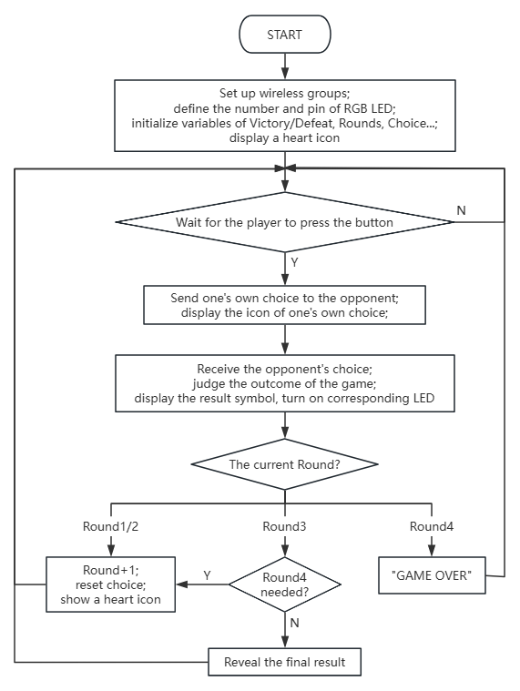

### 5.2.6 じゃんけん

#### 5.2.6.1 概要


ここでは、micro:bitの無線通信を使ってじゃんけんをしましょう。プレイヤーはボタンで手（グー、チョキ、パー）を選択し、デバイス間でデータを交換します。ゲームは3回勝負で、3回すべて引き分けまたは勝ち負け引き分けの場合、4回戦が行われます。

各結果はmicro:bitマトリックスに表示され（Wは勝ち、Lは負け、=は引き分け）、P8ピンのRGBライトで示されます（緑は勝ち、赤は負け、黄は引き分け）。1ラウンドが終了すると、両方のデバイスはすべてのデータとライトをリセットし、次の試合に備えます。

ゲームプレイは、無線インタラクションと複数ラウンドの対戦をシームレスに統合しています。


#### 5.2.6.2 コンポーネント知識


**Microbit 無線通信**


micro:bitボードは、**2.4GHz無線**と**低電力Bluetooth (BLE)**という2つの便利な無線通信機能を統合しています。ただし、これらを同時に使用することはできません。

前者はペアリングが不要で、干渉を最小限に抑えるために最大255個の独立したパケットをサポートし、通信範囲は10〜30メートルで、デジタルデータと文字列の高速伝送を可能にします。後者は主にスマートフォン、タブレット、その他のスマートデバイスとのペアリングに使用され、センサーデータアップロードやモバイルアプリのリモートコントロールなどのIoTアプリケーションに利用されます。

これらはmicro:bitの創造的な開発の可能性を広げます。

#### 5.2.6.3 必要な部品

| |   | |
| :--: | :--: | :--: |
| **micro:bit V2 ボード** (自己調達) ×2 | **micro:bit スマートゲームパッド** (組み立て済み) ×2 | **単4電池** (自己調達) ×8 |

#### 5.2.6.4 コードフロー



#### 5.2.6.5 テストコード

**完全なコード:**

```python
from microbit import *
import neopixel
import radio
import utime

# Global Variables
round_num = 1
my_choice = 0
opponent_choice = 0
wins = 0
loses = 0
draws = 0
game_results = []
strip = None

# Pin configurations for buttons
pin13.set_pull(pin13.PULL_UP) # Button C (Scissors)
pin15.set_pull(pin15.PULL_UP) # Button E (Rock)
pin16.set_pull(pin16.PULL_UP) # Button F (Paper)

# Initialize LED strip (4 LEDs, connected to pin P8)
strip = neopixel.NeoPixel(pin8, 4)

# Reset game state
def reset_game():
    global my_choice, opponent_choice, round_num, wins, loses, draws, game_results
    my_choice = 0
opponent_choice = 0
    round_num = 1
    wins = 0
    loses = 0
    draws = 0
    game_results = []
    reset_lights()
    display.show(Image.HEART)

# Receive opponent\\'s choice via radio
def on_received_message(received_msg):
    global opponent_choice
    if opponent_choice == 0:
        # Convert string to integer if needed
        if isinstance(received_msg, str) and received_msg in [\'1\', \'2\', \'3\']:
            opponent_choice = int(received_msg)
        # Use directly if it\\'s an integer
        elif isinstance(received_msg, int) and received_msg in [1, 2, 3]:
            opponent_choice = received_msg

# Turn off all LEDs
def reset_lights():
    for i in range(4):
        strip[i] = (0, 0, 0)  # Off
    strip.show()

# Check if a 4th round is needed
def need_fourth_round():
    # Case 1: All 3 draws -> need 4th round, return 2
    if wins == 0 and loses == 0 and draws == 3:
        return 2
    # Case 2: 1 win, 1 loss, 1 draw -> need 4th round, return 1
    if wins == 1 and loses == 1 and draws == 1:
        return 1
    # No 4th round needed
    return 0

# Show round result on LED strip
def show_round_result(current_round, result):
    if current_round <= 4:
        if result == 1:
            # Win: Green
            strip[current_round - 1] = (0, 255, 0)
        elif result == 0:
            # Draw: Yellow
            strip[current_round - 1] = (255, 255, 0)
        else:
            # Lose: Red
            strip[current_round - 1] = (255, 0, 0)
        strip.show()

# Game initialization
radio.on()
radio.config(group=1)
reset_lights()
display.show(Image.HEART)

# Main game loop
while True:
    # Process result when both players have chosen
    if my_choice != 0 and opponent_choice != 0:
        result_symbol = "="
        round_result = 0 # 0=draw, 1=win, -1=lose

        # Determine round outcome
        if my_choice == opponent_choice:
            result_symbol = "="
            round_result = 0
            draws += 1
        elif (my_choice == 1 and opponent_choice == 3) or \
             (my_choice == 2 and opponent_choice == 1) or \
             (my_choice == 3 and opponent_choice == 2):
            result_symbol = "W"
            round_result = 1
            wins += 1
        else:
            result_symbol = "L"
            round_result = -1
            loses += 1

        # Save round result
        game_results.append(round_result)

        # Display result symbol
        display.show(result_symbol)

        # Update LED strip
        show_round_result(round_num, round_result)

        utime.sleep_ms(3000)

        # Check if game continues
        if round_num == 3:
            # After 3 rounds, check for 4th round
            fourth_round_needed = need_fourth_round()
            if fourth_round_needed:
                # Go to 4th round
                round_num = 4
                if fourth_round_needed == 2:
                    display.scroll("FINAL")
                utime.sleep_ms(1000)
                display.show(Image.HEART)
                my_choice = 0
                opponent_choice = 0
            else:
                # End game
                if wins > loses:
                    display.scroll("WINNER")
                elif loses > wins:
                    display.scroll("LOSER")
                else:
                    display.scroll("TIE")
                utime.sleep_ms(3000)
                reset_game()
        elif round_num == 4:
            # 4th round finished, game over
            display.scroll("GAME OVER")
            utime.sleep_ms(3000)
            reset_game()
        else:
            # Next round (1st or 2nd)
            round_num += 1
            display.show(Image.HEART)
            my_choice = 0
            opponent_choice = 0

    # Check button input
    if my_choice == 0:
        if pin13.read_digital() == 0: # Button C (Scissors)
            radio.send(\'1\')
            display.show(Image(\'99009:\'\'99090:\'\'00900:\'\'99090:\'\'99009\')) # Scissors image
            my_choice = 1
            utime.sleep_ms(200)
        elif pin15.read_digital() == 0: # Button E (Rock)
            radio.send(\'2\')
            display.show(Image.SQUARE_SMALL) # Rock image
            my_choice = 2
            utime.sleep_ms(200)
        elif pin16.read_digital() == 0: # Button F (Paper)
            radio.send(\'3\')
            display.show(Image.SQUARE) # Paper image
            my_choice = 3
            utime.sleep_ms(200)

    # Receive radio data
    received = radio.receive()
    if received is not None:
        on_received_message(received)

    utime.sleep_ms(100)
```


**簡単な説明:**

① 無線を初期化し、グループを「1」に設定します。ラウンド数、ステータス、対戦相手、プレイヤーのじゃんけんの結果を設定します。4つのRGBライトをP8ピンに接続し、表示を更新し、マトリックスに  を表示させます。

```python
from microbit import *
import neopixel
import radio
import utime

# Global Variables
round_num = 1
my_choice = 0
opponent_choice = 0
wins = 0
loses = 0
draws = 0
game_results = []
strip = None

# Pin configurations for buttons
pin13.set_pull(pin13.PULL_UP) # Button C (Scissors)
pin15.set_pull(pin15.PULL_UP) # Button E (Rock)
pin16.set_pull(pin16.PULL_UP) # Button F (Paper)

# Initialize LED strip (4 LEDs, connected to pin P8)
strip = neopixel.NeoPixel(pin8, 4)

# Reset game state
def reset_game():
    global my_choice, opponent_choice, round_num, wins, loses, draws, game_results
    my_choice = 0
opponent_choice = 0
    round_num = 1
    wins = 0
    loses = 0
    draws = 0
    game_results = []
    reset_lights()
    display.show(Image.HEART)

# Receive opponent\\'s choice via radio
def on_received_message(received_msg):
    global opponent_choice
    if opponent_choice == 0:
        # Convert string to integer if needed
        if isinstance(received_msg, str) and received_msg in [\'1\', \'2\', \'3\']:
            opponent_choice = int(received_msg)
        # Use directly if it\\'s an integer
        elif isinstance(received_msg, int) and received_msg in [1, 2, 3]:
            opponent_choice = received_msg

# Turn off all LEDs
def reset_lights():
    for i in range(4):
        strip[i] = (0, 0, 0)  # Off
    strip.show()

# Check if a 4th round is needed
def need_fourth_round():
    # Case 1: All 3 draws -> need 4th round, return 2
    if wins == 0 and loses == 0 and draws == 3:
        return 2
    # Case 2: 1 win, 1 loss, 1 draw -> need 4th round, return 1
    if wins == 1 and loses == 1 and draws == 1:
        return 1
    # No 4th round needed
    return 0

# Show round result on LED strip
def show_round_result(current_round, result):
    if current_round <= 4:
        if result == 1:
            # Win: Green
            strip[current_round - 1] = (0, 255, 0)
        elif result == 0:
            # Draw: Yellow
            strip[current_round - 1] = (255, 255, 0)
        else:
            # Lose: Red
            strip[current_round - 1] = (255, 0, 0)
        strip.show()

# Game initialization
radio.on()
radio.config(group=1)
reset_lights()
display.show(Image.HEART)
```

② 現在のラウンドの結果を決定します。自分の選択が相手の選択と一致する場合（**チョキ/グー/パーはそれぞれ1/2/3**）、引き分けです。そうでない場合は、勝者を選択し（チョキはパーに勝ち、パーはグーに勝ち、グーはチョキに勝つ）、ラウンド値を+1して結果を保存します。

```python
# Main game loop
while True:
    # Process result when both players have chosen
    if my_choice != 0 and opponent_choice != 0:
        result_symbol = "="
        round_result = 0 # 0=draw, 1=win, -1=lose

        # Determine round outcome
        if my_choice == opponent_choice:
            result_symbol = "="
            round_result = 0
            draws += 1
        elif (my_choice == 1 and opponent_choice == 3) or \
             (my_choice == 2 and opponent_choice == 1) or \
             (my_choice == 3 and opponent_choice == 2):
            result_symbol = "W"
            round_result = 1
            wins += 1
        else:
            result_symbol = "L"
            round_result = -1
            loses += 1

        # Save round result
        game_results.append(round_result)

        # Display result symbol
        display.show(result_symbol)

        # Update LED strip
        show_round_result(round_num, round_result)

        utime.sleep_ms(3000)
```

③ 結果を配列に保存し、対応する文字列を表示します。これが3回目のゲームの場合、4回目のゲームが必要かどうかを判断します（すべて引き分けまたは勝ち負け引き分けの場合）。必要な場合は「FINAL」と表示し、1秒待ってからじゃんけんの選択をクリアします。

```python
        # Check if game continues
        if round_num == 3:
            # After 3 rounds, check for 4th round
            fourth_round_needed = need_fourth_round()
            if fourth_round_needed:
                # Go to 4th round
                round_num = 4
                if fourth_round_needed == 2:
                    display.scroll("FINAL")
                utime.sleep_ms(1000)
                display.show(Image.HEART)
                my_choice = 0
                opponent_choice = 0
            else:
                # End game
                if wins > loses:
                    display.scroll("WINNER")
                elif loses > wins:
                    display.scroll("LOSER")
                else:
                    display.scroll("TIE")
                utime.sleep_ms(3000)
                reset_game()
        elif round_num == 4:
            # 4th round finished, game over
            display.scroll("GAME OVER")
            utime.sleep_ms(3000)
            reset_game()
        else:
            # Next round (1st or 2nd)
            round_num += 1
            display.show(Image.HEART)
            my_choice = 0
            opponent_choice = 0
```

そうでない場合は、勝利の場合は「WINNER」、敗北の場合は「LOSER」、引き分けの場合は「TIE」と表示します。3秒の遅延の後、`reset_game()`関数を呼び出してすべてのゲーム変数をクリアします。

試合が4ゲームで構成されている場合、「GAME OVER」と表示され、3秒の遅延の後、`reset_game()`関数を再度呼び出してすべてのゲーム変数をリセットします。

ゲームが終了していない場合は、 を表示し、両方の選択をクリアします。

④ Cを押すと、ボードはチョキとして「1」を送信し、マトリックスは  を表示します。Eを押すと、ボードはグーとして「2」を送信し、 を表示します。Fを押すと、ボードはパーとして「3」を送信し、マトリックスは  を表示します。

```python
    # Check button input
    if my_choice == 0:
        if pin13.read_digital() == 0: # Button C (Scissors)
            radio.send(\'1\')
            display.show(Image(\'99009:\'\'99090:\'\'00900:\'\'99090:\'\'99009\')) # Scissors image
            my_choice = 1
            utime.sleep_ms(200)
        elif pin15.read_digital() == 0: # Button E (Rock)
            radio.send(\'2\')
            display.show(Image.SQUARE_SMALL) # Rock image
            my_choice = 2
            utime.sleep_ms(200)
        elif pin16.read_digital() == 0: # Button F (Paper)
            radio.send(\'3\')
            display.show(Image.SQUARE) # Paper image
            my_choice = 3
            utime.sleep_ms(200)
```

⑤ 無線データ（相手の選択）を受信します。

```python
    # Receive radio data
    received = radio.receive()
    if received is not None:
        on_received_message(received)

    utime.sleep_ms(100)
```

⑥ 4回戦が必要かどうかを判断します。3回すべて引き分けまたは勝ち負け引き分けの場合、4回戦が必要です。そうでない場合は不要です。

```python
def need_fourth_round():
    # Case 1: All 3 draws -> need 4th round, return 2
    if wins == 0 and loses == 0 and draws == 3:
        return 2
    # Case 2: 1 win, 1 loss, 1 draw -> need 4th round, return 1
    if wins == 1 and loses == 1 and draws == 1:
        return 1
    # No 4th round needed
    return 0
```

⑦ RGBライトは、結果に応じて対応する色を表示します。緑は勝ち、赤は負け、黄は引き分けです。

```python
def show_round_result(current_round, result):
    if current_round <= 4:
        if result == 1:
            # Win: Green
            strip[current_round - 1] = (0, 255, 0)
        elif result == 0:
            # Draw: Yellow
            strip[current_round - 1] = (255, 255, 0)
        else:
            # Lose: Red
            strip[current_round - 1] = (255, 0, 0)
        strip.show()
```

⑧ ゲームが終了したら、4つのRGBライトの表示をクリアします。

```python
def reset_lights():
    for i in range(4):
        strip[i] = (0, 0, 0)  # Off
    strip.show()
```

⑨ ゲームの状態をリセットし、すべてのゲーム変数の値をクリアし、RGBライトをリセットし、 を表示します。

```python
def reset_game():
    global my_choice, opponent_choice, round_num, wins, loses, draws, game_results
    my_choice = 0
opponent_choice = 0
    round_num = 1
    wins = 0
    loses = 0
    draws = 0
    game_results = []
    reset_lights()
    display.show(Image.HEART)
```

#### 5.2.6.6 テスト結果


コードを書き込んだ後、micro:bitボードをゲームパッドのスロットに挿入し（**電池が取り付けられていることを確認**）、「ON」に切り替えます。

マトリックスには最初に  が表示されます。プレイヤーはボタンを押して手（Eはグー、Dはパー、Cはチョキ）を選択し、2つのデバイス間で試合データを交換します。現在のラウンドの結果を決定します。勝ちは「W」と緑色のRGBライトで示され、引き分けは「=」と黄色のライトで示され、負けは「L」と赤色のライトで示されます（最初のRGBライトは最初のラウンド後に点灯し、以降も同様です）。ゲームが終了していない場合は、次のラウンドに進みます。

ゲームは3回勝負を採用しています。3回すべて引き分けまたは勝ち負け引き分けの場合、4回戦が行われます。

3ラウンド後に勝者がいる場合、勝利の場合は「WINNER」、敗北の場合は「LOSER」と表示されます。結果が表示された後、「GAME OVER」が表示され、ゲームがリセットされます。4回戦が未決定の場合もゲームオーバーになります。


<span style="color: rgb(0, 209, 0);">**ヒント:** 次のラウンドに進む前にハートアイコンが表示されるのを待ちます。ボードが応答しない場合は、micro:bitボードの背面にあるリセットボタンを押してください。</span>


