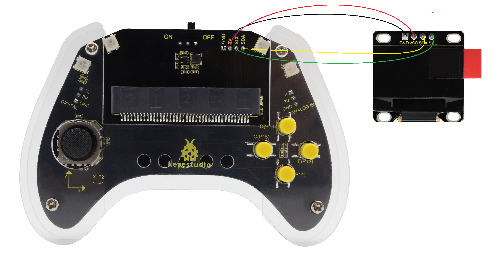
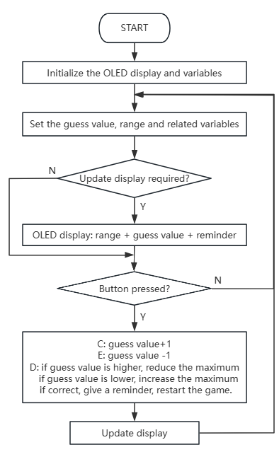

### 5.2.7 Guess Number

#### 5.2.7.1 Overview


In this project, we play a game of guessing number by a Micro:bit board, a gamepad control board, and an OLED display. When the correct number is guessed, the OLED displays "Great!!!"; if the guess is too high or too low, it shows "To High!"/"To Low!" respectively, along with the corresponding range of possible numbers.


#### 5.2.7.2 Required Parts

| |   | |
| :--: | :--: | :--: |
| **micro:bit V2 board** (self-provided) ×1 | **micro:bit Smart Gamepad** (assembled) ×1 | **AAA battery** (self-provided) ×4 |
||||
|    **OLED display** (self-provided)×1     |   **F-F DuPont wire**(self-provided) x4    ||

#### 5.2.7.3 Wiring Diagram



**After wiring up as shown above, insert the micro:bit into the slot on the gamepad control board.**

| OLED display | micro:bit gamepad control board | micro:bit board pin |
| :----------: | :-----------------------------: | :-----------------: |
|     GND      |               GND               |         GND         |
|     VCC      |               3V                |         3V          |
|     SDA      |               SDA               |         P20         |
|     SCL      |               SCL               |         P19         |

#### 5.2.7.4 Code Flow



#### 5.2.7.5 Test Code

⚠️ **Note that here OLED is used, so we need to import its library.**


**Complete code:**

```python
# Import required libraries
from microbit import *
from oled_ssd1306 import *
from random import *

# Initialize OLED and pins
initialize()
clear_oled()

# Game core variables (defined outside loop to avoid resetting)
mode = 0          # 0: Game init, 1: Game running
min_num = 1       # Minimum guess number
max_num = 100     # Maximum guess number
current_guess = 50# Current guess value
target_num = 0    # Random target number
state = 0         # 0: Initial, 1: Too high, 2: Too low, 3: Correct
update_display = True  # Display update flag

# Enable pull-up resistors for buttons (active low)
pin13.set_pull(pin13.PULL_UP)
pin15.set_pull(pin15.PULL_UP)
pin16.set_pull(pin16.PULL_UP)

while True:
    # 1. Game initialization: generate random number and reset state
    if mode == 0:
        min_num = 1
        max_num = 100
        current_guess = 50
        target_num = randint(min_num, max_num)  # Generate target number
        state = 0
        mode = 1  # Switch to running mode
        update_display = True

    # 2. Game running logic
    if mode == 1:
        # Check buttons (independent detection to avoid blocking)
        if pin15.read_digital() == 0:  # Pin15 pressed: increase number
            current_guess += 1
            if current_guess > max_num:
                current_guess = max_num
            update_display = True
            sleep(50)  # Debounce delay

        elif pin13.read_digital() == 0:  # Pin13 pressed: decrease number
            current_guess -= 1
            if current_guess < min_num:
                current_guess = min_num
            update_display = True
            sleep(50)  # Debounce delay

        elif pin16.read_digital() == 0:  # Pin16 pressed: confirm guess
            if current_guess > target_num:
                state = 1
                max_num = current_guess  # Narrow range: max = current
            elif current_guess < target_num:
                state = 2
                min_num = current_guess  # Narrow range: min = current
            else:
                state = 3  # Correct guess
                mode = 0   # Reset game
            update_display = True
            sleep(50)  # Debounce delay

        # 3. Update OLED display (only when needed)
        if update_display:
            clear_oled()  # Clear screen
            # Display number range
            add_text(0, 0, "num:" + str(min_num) + "~" + str(max_num))
            # Display current guess
            add_text(0, 2, str(current_guess))
            # Display status message
            if state == 1:
                add_text(0, 4, "TO High")
            elif state == 2:
                add_text(0, 4, "TO Low")
            elif state == 3:
                add_text(0, 4, "Great!!!")

            # Reset update flag
            update_display = False

    # 4. Delay after correct guess to show message
    if state == 3:
        sleep(1000)
        state = 0
```


**Brief explanation:**

① Import libraries, initialize OLED, define global variables, and configure button pins.

Three libraries are required: `microbit`(for accessing Micro:bit hardware), `oled_ssd1306`(for controlling the connected OLED display), `random`(for generating random numbers in the game).

`initialize()` and `clear_oled()` initializes and clears the OLED. 

A series of global variables are defined to manage game state parameters, including game mode (`mode`), number range (`min_num`, `max_num`), the current guess value (`current_guess`), the target number (`target_num`), game feedback (`state`) and a flag controlling display updates (`update_display`).

`pin13`, `pin15` and `pin16` are configured in pull-up mode—maintaining high when button is not pressed and low when pressed. 

```python
# Import required libraries
from microbit import *
from oled_ssd1306 import *
from random import *

# Initialize OLED and pins
initialize()
clear_oled()

# Game core variables (defined outside loop to avoid resetting)
mode = 0          # 0: Game init, 1: Game running
min_num = 1       # Minimum guess number
max_num = 100     # Maximum guess number
current_guess = 50# Current guess value
target_num = 0    # Random target number
state = 0         # 0: Initial, 1: Too high, 2: Too low, 3: Correct
update_display = True  # Display update flag

# Enable pull-up resistors for buttons (active low)
pin13.set_pull(pin13.PULL_UP)
pin15.set_pull(pin15.PULL_UP)
pin16.set_pull(pin16.PULL_UP)
```
② Game initialization logic in the main loop.

It is the first logical block of the program's main loop, specifically responsible for game initialization or restart. 

`mode` = `0` : the game requires initialization. In this case, it resets the guess range to 1–100 and sets the current guess value to 50. It uses `randint(min_num, max_num)` to randomly generate an integer within 1 to 100 as the target number (`target_num`)

Then,  `state` = `0` (initial state) and `mode` = `1` (running). And set `update_display` to `True` to ensure the OLED updates the latest game information immediately during running.

```python
while True:
    # 1. Game initialization: generate random number and reset state
    if mode == 0:
        min_num = 1
        max_num = 100
        current_guess = 50
        target_num = randint(min_num, max_num)  # Generate target number
        state = 0
        mode = 1  # Switch to running mode
        update_display = True
```
③ Handle button inputs and decision-making based on guess.

When the game is in operation (`mode == 1`), it manages player interactions and game logic. It independently detects inputs from three external buttons:

*   **`pin15` is pressed**: (low level detected); `current_guess` + 1. To prevent the value from exceeding the range, it checks and limits `current_guess` < or = `max_num`.
*   **`pin13` is pressed**: `current_guess` - 1. It also checks  `current_guess` no greater than `min_num`。
*   **`pin16` is pressed**: If `pin16` is pressed，表示The player submitted the guess value. It will be compared with `target_num`:
    *   `current_guess` > `target_num` : `state` = `1` (too high) and set range maximum `max_num` to  `current_guess`.
    *   `current_guess` < `target_num `: `state` = `2` (too low) and set the minimum `min_num` to `current_guess`.
    *   `current_guess` = `target_num` : `state` = `3` (Great) and set `mode` to `0` to prepare for next round.

After each button press, `update_display` is set to `True` to update OLED, with a delay of 50ms for anti-jitter. 

```python
    # 2. Game running logic
    if mode == 1:
        # Check buttons (independent detection to avoid blocking)
        if pin15.read_digital() == 0:  # Pin15 pressed: increase number
            current_guess += 1
            if current_guess > max_num:
                current_guess = max_num
            update_display = True
            sleep(50)  # Debounce delay

        elif pin13.read_digital() == 0:  # Pin13 pressed: decrease number
            current_guess -= 1
            if current_guess < min_num:
                current_guess = min_num
            update_display = True
            sleep(50)  # Debounce delay

        elif pin16.read_digital() == 0:  # Pin16 pressed: confirm guess
            if current_guess > target_num:
                state = 1
                max_num = current_guess  # Narrow range: max = current
            elif current_guess < target_num:
                state = 2
                min_num = current_guess  # Narrow range: min = current
            else:
                state = 3  # Correct guess
                mode = 0   # Reset game
            update_display = True
            sleep(50)  # Debounce delay
```
④ OLED update logic.

It displays the game's current status and information on the OLED. It executes only when `update_display` = `True` to avoid unnecessary refreshes. 

Each execution first calls `clear_oled()` to clear the display. The current guess range (e.g., "num:1~100") appears on the first line. The player's current guess (`current_guess`) is displayed on the third line. 

Based on `state`,  the corresponding feedback message ("TO High,"  "TO Low," or "Great!!!") appears on the fifth line. 

After completing all displays, `update_display` is reset to `False` to ready to update the next game state change.

```python
        # 3. Update OLED display (only when needed)
        if update_display:
            clear_oled()  # Clear screen
            # Display number range
            add_text(0, 0, "num:" + str(min_num) + "~" + str(max_num))
            # Display current guess
            add_text(0, 2, str(current_guess))
            # Display status message
            if state == 1:
                add_text(0, 4, "TO High")
            elif state == 2:
                add_text(0, 4, "TO Low")
            elif state == 3:
                add_text(0, 4, "Great!!!")

            # Reset update flag
            update_display = False
```
⑤ Handle delays after correct guesses.

It only executes when the player correctly guesses the target number (`state == 3`). Then, it pauses 1000ms(1s) for players to check the “Great!!!”.

Then, `state` is reset to `0`. Since `mode` has already been reset to `0`, upon correct guess, the game will restart from the initialization.

```python
    # 4. Delay after correct guess to show message
    if state == 3:
        sleep(1000)
        state = 0
```

#### 5.2.7.6 Test Result


After burning the code, insert the micro:bit board into the slot of the gamepad (**batteries installed**), and toggle the switch on it to “ON”. 

After uploading the code, the OLED initialize and shows the value range of “num: 1 ~ 100” and initial guess of 50. You can press C to temp+1(max of 100) or  E to temp-1(min of 1) to change your guess value on the OLED. 

Press D to submit your value, and temp will be compared with the random target value. If temp>value, show “To High!” and assign temp to max2; if temp<value, show “To Low!” and assign it to min2. If you are too lucky that temp=value, you will see “Great!!!” for 1s. 

After that, the game will be reset and a new target value will be set. Let's play another round!


⚠️ **The building block in Test Result are not included in this product kit.**

<span style="color: rgb(0, 209, 0);">**Tip:** If there is no response on the board, please press the reset button on the back of the micro:bit board.</span>


