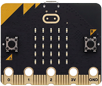
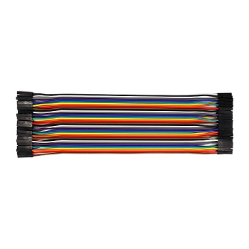
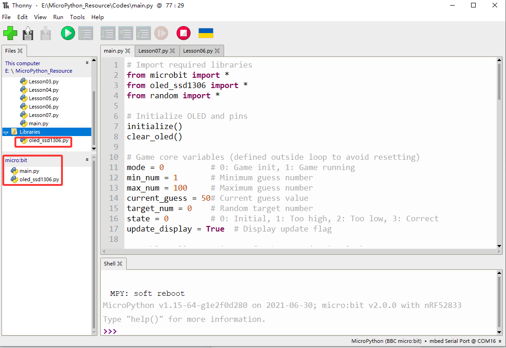

### 5.2.7 Zahlenraten

#### 5.2.7.1 Übersicht


In diesem Projekt spielen wir ein Zahlenratespiel mit einem Micro:bit-Board, einem Gamepad-Steuerplatine und einem OLED-Display. Wenn die richtige Zahl erraten wird, zeigt das OLED „Great!!!“ an; wenn die Schätzung zu hoch oder zu niedrig ist, zeigt es „To High!“/„To Low!“ an, zusammen mit dem entsprechenden Bereich der möglichen Zahlen.


#### 5.2.7.2 Benötigte Teile

| |  | |
| :--: | :--: | :--: |
| **micro:bit V2 Board** (selbst mitgebracht) ×1 | **micro:bit Smart Gamepad** (montiert) ×1 | **AAA Batterie** (selbst mitgebracht) ×4 |
||||
| **OLED Display** (selbst mitgebracht)×1 | **F-F DuPont Kabel** (selbst mitgebracht) x4 ||

#### 5.2.7.3 Schaltplan


**Nachdem Sie die Verkabelung wie oben gezeigt vorgenommen haben, stecken Sie den micro:bit in den Steckplatz auf der Gamepad-Steuerplatine.**

| OLED Display | micro:bit Gamepad-Steuerplatine | micro:bit Board-Pin |
| :----------: | :-----------------------------: | :-----------------: |
| GND | GND | GND |
| VCC | 3V | 3V |
| SDA | SDA | P20 |
| SCL | SCL | P19 |

#### 5.2.7.4 Codeablauf


#### 5.2.7.5 Testcode

⚠️ **Beachten Sie, dass hier OLED verwendet wird, daher müssen wir seine Bibliothek importieren.**



**Vollständiger Code:**

```python
# Import required libraries
from microbit import *
from oled_ssd1306 import *
from random import *

# Initialize OLED and pins
initialize()
clear_oled()

# Game core variables (defined outside loop to avoid resetting)
mode = 0          # 0: Game init, 1: Game running
min_num = 1       # Minimum guess number
max_num = 100     # Maximum guess number
current_guess = 50# Current guess value
target_num = 0    # Random target number
state = 0         # 0: Initial, 1: Too high, 2: Too low, 3: Correct
update_display = True  # Display update flag

# Enable pull-up resistors for buttons (active low)
pin13.set_pull(pin13.PULL_UP)
pin15.set_pull(pin15.PULL_UP)
pin16.set_pull(pin16.PULL_UP)

while True:
    # 1. Game initialization: generate random number and reset state
    if mode == 0:
        min_num = 1
        max_num = 100
        current_guess = 50
        target_num = randint(min_num, max_num)  # Generate target number
        state = 0
        mode = 1  # Switch to running mode
        update_display = True

    # 2. Game running logic
    if mode == 1:
        # Check buttons (independent detection to avoid blocking)
        if pin15.read_digital() == 0:  # Pin15 pressed: increase number
            current_guess += 1
            if current_guess > max_num:
                current_guess = max_num
            update_display = True
            sleep(50)  # Debounce delay

        elif pin13.read_digital() == 0:  # Pin13 pressed: decrease number
            current_guess -= 1
            if current_guess < min_num:
                current_guess = min_num
            update_display = True
            sleep(50)  # Debounce delay

        elif pin16.read_digital() == 0:  # Pin16 pressed: confirm guess
            if current_guess > target_num:
                state = 1
                max_num = current_guess  # Narrow range: max = current
            elif current_guess < target_num:
                state = 2
                min_num = current_guess  # Narrow range: min = current
            else:
                state = 3  # Correct guess
                mode = 0   # Reset game
            update_display = True
            sleep(50)  # Debounce delay

        # 3. Update OLED display (only when needed)
        if update_display:
            clear_oled()  # Clear screen
            # Display number range
            add_text(0, 0, "num:" + str(min_num) + "~" + str(max_num))
            # Display current guess
            add_text(0, 2, str(current_guess))
            # Display status message
            if state == 1:
                add_text(0, 4, "TO High")
            elif state == 2:
                add_text(0, 4, "TO Low")
            elif state == 3:
                add_text(0, 4, "Great!!!")

            # Reset update flag
            update_display = False

    # 4. Delay after correct guess to show message
    if state == 3:
        sleep(1000)
        state = 0
```


**Kurze Erklärung:**

① Bibliotheken importieren, OLED initialisieren, globale Variablen definieren und Tasten-Pins konfigurieren.

Drei Bibliotheken sind erforderlich: `microbit` (für den Zugriff auf die Micro:bit-Hardware), `oled_ssd1306` (zur Steuerung des angeschlossenen OLED-Displays), `random` (zum Generieren von Zufallszahlen im Spiel).

`initialize()` und `clear_oled()` initialisieren und löschen das OLED.

Eine Reihe globaler Variablen wird definiert, um die Spielzustandsparameter zu verwalten, einschließlich Spielmodus (`mode`), Zahlenbereich (`min_num`, `max_num`), des aktuellen Schätzwerts (`current_guess`), der Zielzahl (`target_num`), des Spiel-Feedbacks (`state`) und eines Flags, das die Anzeigeaktualisierungen steuert (`update_display`).

`pin13`, `pin15` und `pin16` werden im Pull-up-Modus konfiguriert – sie bleiben hoch, wenn die Taste nicht gedrückt wird, und niedrig, wenn sie gedrückt wird.

```python
# Import required libraries
from microbit import *
from oled_ssd1306 import *
from random import *

# Initialize OLED and pins
initialize()
clear_oled()

# Game core variables (defined outside loop to avoid resetting)
mode = 0          # 0: Game init, 1: Game running
min_num = 1       # Minimum guess number
max_num = 100     # Maximum guess number
current_guess = 50# Current guess value
target_num = 0    # Random target number
state = 0         # 0: Initial, 1: Too high, 2: Too low, 3: Correct
update_display = True  # Display update flag

# Enable pull-up resistors for buttons (active low)
pin13.set_pull(pin13.PULL_UP)
pin15.set_pull(pin15.PULL_UP)
pin16.set_pull(pin16.PULL_UP)
```
② Spiellogik-Initialisierung in der Hauptschleife.

Dies ist der erste logische Block der Hauptschleife des Programms, der speziell für die Spielinitialisierung oder den Neustart verantwortlich ist.

`mode` = `0` : Das Spiel erfordert eine Initialisierung. In diesem Fall setzt es den Schätzbereich auf 1–100 zurück und setzt den aktuellen Schätzwert auf 50. Es verwendet `randint(min_num, max_num)`, um zufällig eine Ganzzahl zwischen 1 und 100 als Zielzahl (`target_num`) zu generieren.

Dann wird `state` = `0` (Anfangszustand) und `mode` = `1` (läuft) gesetzt. Und `update_display` wird auf `True` gesetzt, um sicherzustellen, dass das OLED die neuesten Spielinformationen während des Betriebs sofort aktualisiert.

```python
while True:
    # 1. Game initialization: generate random number and reset state
    if mode == 0:
        min_num = 1
        max_num = 100
        current_guess = 50
        target_num = randint(min_num, max_num)  # Generate target number
        state = 0
        mode = 1  # Switch to running mode
        update_display = True
```
③ Tasten-Eingaben und Entscheidungsfindung basierend auf der Schätzung verarbeiten.

Wenn das Spiel läuft (`mode == 1`), verwaltet es die Spielerinteraktionen und die Spiellogik. Es erkennt unabhängig die Eingaben von drei externen Tasten:

*   **`pin15` wird gedrückt**: (niedriger Pegel erkannt); `current_guess` + 1. Um zu verhindern, dass der Wert den Bereich überschreitet, überprüft und begrenzt es `current_guess` < oder = `max_num`.
*   **`pin13` wird gedrückt**: `current_guess` - 1. Es überprüft auch, ob `current_guess` nicht größer als `min_num` ist.
*   **`pin16` wird gedrückt**: Wenn `pin16` gedrückt wird, bedeutet dies, dass der Spieler den Schätzwert übermittelt hat. Er wird mit `target_num` verglichen:
    *   `current_guess` > `target_num` : `state` = `1` (zu hoch) und setzt das Bereichsmaximum `max_num` auf `current_guess`.
    *   `current_guess` < `target_num `: `state` = `2` (zu niedrig) und setzt das Minimum `min_num` auf `current_guess`.
    *   `current_guess` = `target_num` : `state` = `3` (Großartig) und setzt `mode` auf `0`, um sich auf die nächste Runde vorzubereiten.

Nach jedem Tastendruck wird `update_display` auf `True` gesetzt, um das OLED zu aktualisieren, mit einer Verzögerung von 50 ms zur Entprellung.

```python
    # 2. Game running logic
    if mode == 1:
        # Check buttons (independent detection to avoid blocking)
        if pin15.read_digital() == 0:  # Pin15 pressed: increase number
            current_guess += 1
            if current_guess > max_num:
                current_guess = max_num
            update_display = True
            sleep(50)  # Debounce delay

        elif pin13.read_digital() == 0:  # Pin13 pressed: decrease number
            current_guess -= 1
            if current_guess < min_num:
                current_guess = min_num
            update_display = True
            sleep(50)  # Debounce delay

        elif pin16.read_digital() == 0:  # Pin16 pressed: confirm guess
            if current_guess > target_num:
                state = 1
                max_num = current_guess  # Narrow range: max = current
            elif current_guess < target_num:
                state = 2
                min_num = current_guess  # Narrow range: min = current
            else:
                state = 3  # Correct guess
                mode = 0   # Reset game
            update_display = True
            sleep(50)  # Debounce delay
```
④ OLED-Aktualisierungslogik.

Es zeigt den aktuellen Status und die Informationen des Spiels auf dem OLED an. Es wird nur ausgeführt, wenn `update_display` = `True` ist, um unnötige Aktualisierungen zu vermeiden.

Jede Ausführung ruft zuerst `clear_oled()` auf, um die Anzeige zu löschen. Der aktuelle Schätzbereich (z. B. „num:1~100“) erscheint in der ersten Zeile. Die aktuelle Schätzung des Spielers (`current_guess`) wird in der dritten Zeile angezeigt.

Basierend auf `state` erscheint die entsprechende Feedback-Nachricht („TO High“, „TO Low“ oder „Great!!!“) in der fünften Zeile.

Nach Abschluss aller Anzeigen wird `update_display` auf `False` zurückgesetzt, um bereit zu sein, die nächste Spielzustandsänderung zu aktualisieren.

```python
        # 3. Update OLED display (only when needed)
        if update_display:
            clear_oled()  # Clear screen
            # Display number range
            add_text(0, 0, "num:" + str(min_num) + "~" + str(max_num))
            # Display current guess
            add_text(0, 2, str(current_guess))
            # Display status message
            if state == 1:
                add_text(0, 4, "TO High")
            elif state == 2:
                add_text(0, 4, "TO Low")
            elif state == 3:
                add_text(0, 4, "Great!!!")

            # Reset update flag
            update_display = False
```
⑤ Verzögerungen nach richtigen Schätzungen behandeln.

Es wird nur ausgeführt, wenn der Spieler die Zielzahl richtig errät (`state == 3`). Dann pausiert es 1000 ms (1 s), damit die Spieler das „Great!!!“ überprüfen können.

Dann wird `state` auf `0` zurückgesetzt. Da `mode` bereits auf `0` zurückgesetzt wurde, wird das Spiel nach einer richtigen Schätzung von der Initialisierung an neu gestartet.

```python
    # 4. Delay after correct guess to show message
    if state == 3:
        sleep(1000)
        state = 0
```

#### 5.2.7.6 Testergebnis


Nach dem Brennen des Codes stecken Sie das micro:bit-Board in den Steckplatz des Gamepads (**Batterien eingelegt**) und schalten Sie den Schalter auf „ON“.

Nach dem Hochladen des Codes initialisiert sich das OLED und zeigt den Wertebereich von „num: 1 ~ 100“ und die anfängliche Schätzung von 50 an. Sie können C drücken, um temp+1 (max. 100) oder E, um temp-1 (min. 1) zu ändern, um Ihren Schätzwert auf dem OLED zu ändern.

Drücken Sie D, um Ihren Wert zu übermitteln, und temp wird mit dem zufälligen Zielwert verglichen. Wenn temp>Wert, wird „To High!“ angezeigt und temp wird max_num zugewiesen; wenn temp<Wert, wird „To Low!“ angezeigt und es wird min_num zugewiesen. Wenn Sie zu viel Glück haben, dass temp=Wert ist, sehen Sie „Great!!!“ für 1 Sekunde.

Danach wird das Spiel zurückgesetzt und ein neuer Zielwert festgelegt. Lassen Sie uns eine weitere Runde spielen!


⚠️ **Die Bausteine im Testergebnis sind nicht in diesem Produktkit enthalten.**

<span style="color: rgb(0, 209, 0);">**Tipp:** Wenn das Board nicht reagiert, drücken Sie bitte die Reset-Taste auf der Rückseite des micro:bit-Boards.</span>


