## 5.1 Thonny Development Environment

**Before programming, you need to do some important preparations.**

### 5.1.1 Install Thonny

Thonny is a free and open source software platform with small size, simple interface, simple operation and rich functions. It is a Python IDE suitable for beginners. In this tutorial, we use this IDE to develop a ESP32. Thonny supports multiple operating systems including Windows, Mac OS, Linux.

**1. Download Thonny**

(1)  Enter the website: [https://thonny.org](https://thonny.org) to download the latest version of Thonny. Other versions may not be compatible with microbit functions.
(2)  Thonny open-source code library: [https://github.com/thonny/thonny](https://github.com/thonny/thonny).

Please download the one of your operation system.

| OS | Download |
| :-- | :-- |
| MAC OS： | https://github.com/thonny/thonny/releases/download/v4.1.7/thonny-4.1.7.pkg|
| Windows： | https://github.com/thonny/thonny/releases/download/v4.1.7/thonny-4.1.7.exe|

| OS | Method          | Command |
| :-- |---------|--------------|
| Linux | Binary bundle | `bash <(wget -O - https://thonny.org/installer-for-linux)` |
|       | With pip | `pip3 install thonny` |
|       | Distro packages | Debian/Ubuntu：`sudo apt install thonny` Fedora：`sudo dnf install thonny` |

**2. Windows System**

A.The downloaded Thonny icon is as follows:

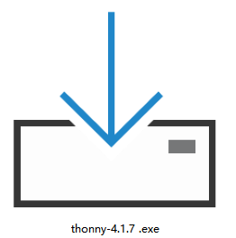

B.Double-click “thonny-4.1.7.exe” and select install mode. Here we choose “Install for all users”.

C.You can also keep selecting “Next” to finish install.

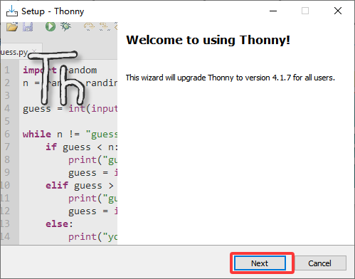

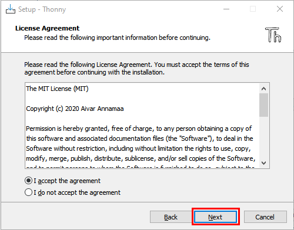

D.If you want to change the route of installing Thonny, just click “Browse...” to select a new route. If you not, just keep clicking “Next”.

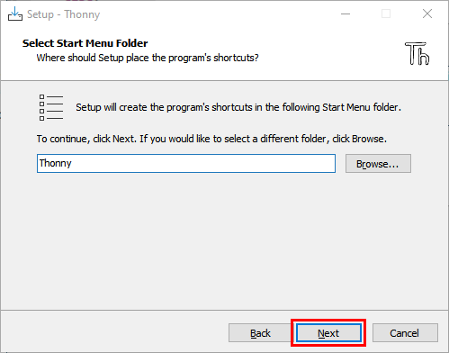

E.Tick “Create desktop icon”, you will view Thonny on your desktop.

F.“Install”.

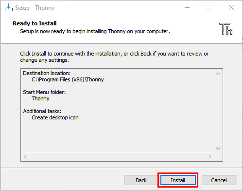

G.Wait for a while but don’t click “Cancel”.

H.When you see the success interface, click “Finish”.

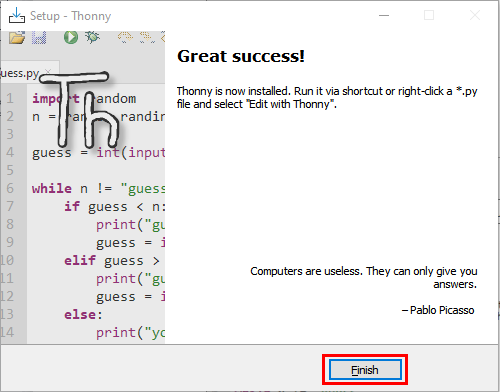

I.You can see the icon on your desktop if you tick “Create desktop icon”:

                    

### 5.1.2 Thonny Basic Settings

A.Double-click Thonny, choose lanuage and initial settings and click “Let’s go!”.

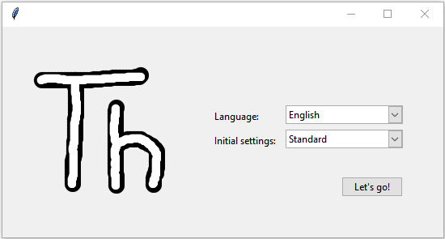

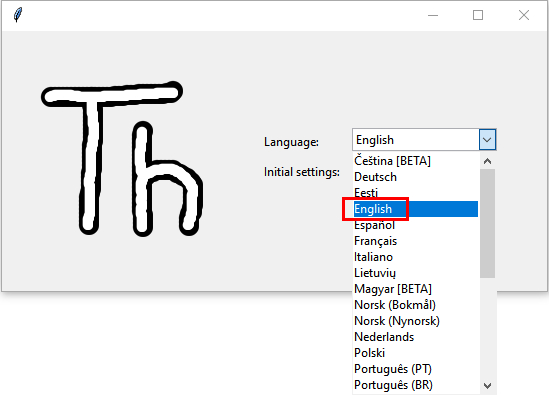

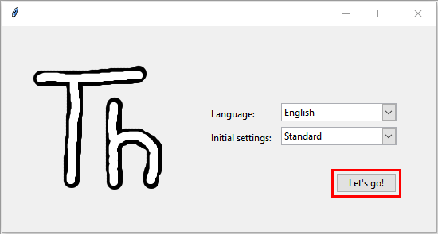

B.Click “**View**”→“**File**” and “**Shell**”.

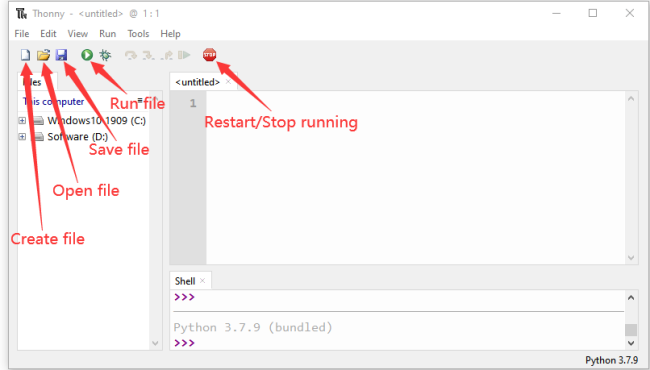

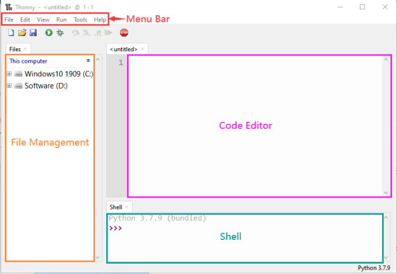

### 5.1.3 Burn Micropython Firmware(Important)

To run a Python program on the Micro:bit board, we need to burn the firmware to it first.

**Burn the Micropython firmware:**

Connect the Micro:bit to your PC with a USB cable.

Make sure the driver has been installed successfully and the COM port can be identified correctly. Open “**Device Manager**” and expand “**Ports**”.

The COM port number may vary from computers.

Open Thonny, click “**run**” and “**Configure interpreter...**”

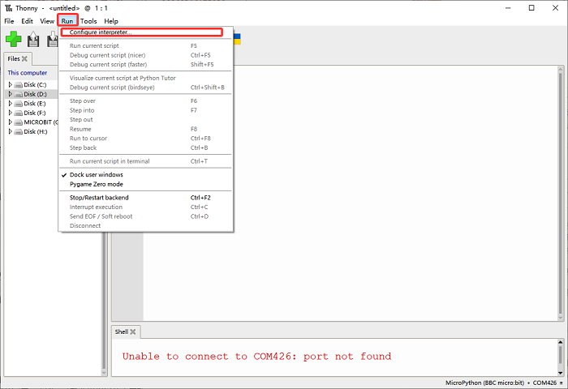

Select “Micropython (BBC micro:bit)” and “mbeb Serial Port @ COM16” in its interpreter, and click “Install or update firmware”.

And you will see the followings. Set “Target volume” to “MICROBIT”, “MicroPython family” to “nRF52”, “variant” to “BBC micro:bit v2 (original simplifiled API)”, “version” to “2.1.2”, and then “Install”. 

If the firmware fails to install, press the reset button on the Micro:bit, and click “Install”.

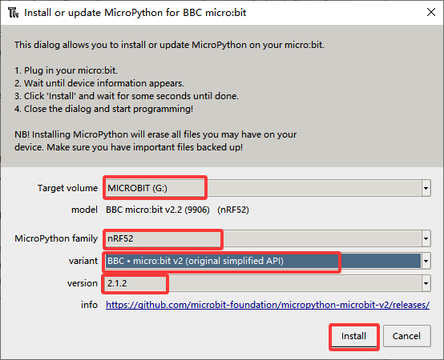

After that, click “Close” and “OK”.

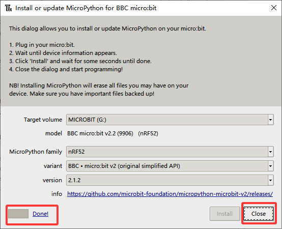

Turn off all windows and turn to the main page and click “STOP” icon:

### 5.1.4 Upload Code

**Run the test code(online)**

The Micro:bit runs the code online when it needs to be connect to the computer. Users can program and debug programs withThonny.

Open Thonny and click "**Open**".

When a new window pops up, open ".\MicroPython_Resource\Codes\Heart beat", select “heartbeat&ZeroWidthSpace;.py”, and click “Run current script” (if error reports, click   first and then “Run current script”), and you can see there is a heart is beating on the Micro:bit.

Note: When running it online, if you press the reset button, the code will not be executed again. If you want it to run after resetting it, please refer to the offline running instructions below.

**Run the test code(offline)**

After resetting Micro:bit, run the main.py file under the root directory first. 

Therefore, the file name we upload to the Micro:bit must be changed to main.py if we want it runs the code after reset. Then, upload the file, press the reset button, and the code still be executed.

Here we take heartbeat.py as an example. Select **heartbeat&ZeroWidthSpace;.py** to "**rename**" it to main.py, and click "**OK**". Now you can choose to “**Upload to micro:bit**”.

Press the Reset button and you can see the heart is beating on the Micro:bit.

If you want to run other code (not libraries), you need first to change its name to main&ZeroWidthSpace;.py before uloading. 

As for libraries, right-click to directly “Upload to micro:bit” (Sometime the uploading may fail due to too large size of the library. So you need to simplify it or delete the unused ones).

### 5.1.5 Other Common Operations

**Delete file under Micro:bit**

In “micro:bit”, select “main&ZeroWidthSpace;.py” to “Delete”, and it will be removed.

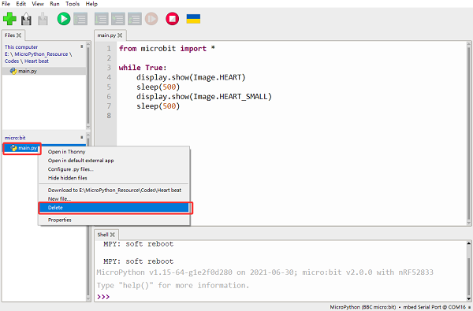

The same procedure applies when deleting other files.
