## 5.1 Thonny Ontwikkelomgeving

**Voordat u begint met programmeren, zijn er enkele belangrijke voorbereidingen nodig.**

### 5.1.1 Thonny installeren

Thonny is een gratis en open-source softwareplatform met een klein formaat, eenvoudige interface, gemakkelijke bediening en rijke functionaliteit. Het is een Python IDE die geschikt is voor beginners. In deze tutorial gebruiken we deze IDE om een ESP32 te ontwikkelen. Thonny ondersteunt meerdere besturingssystemen, waaronder Windows, Mac OS en Linux.

**1. Thonny downloaden**

(1) Ga naar de website: [https://thonny.org](https://thonny.org) om de nieuwste versie van Thonny te downloaden. Andere versies zijn mogelijk niet compatibel met microbit-functies.
(2) Thonny open-source codebibliotheek: [https://github.com/thonny/thonny](https://github.com/thonny/thonny).

Download de versie die geschikt is voor uw besturingssysteem.

| OS | Download |
| :-- | :-- |
| MAC OS： | https://github.com/thonny/thonny/releases/download/v4.1.7/thonny-4.1.7.pkg|
| Windows： | https://github.com/thonny/thonny/releases/download/v4.1.7/thonny-4.1.7.exe|

| OS | Methode          | Commando |
| :-- |---------|--------------|
| Linux | Binair pakket | `bash <(wget -O - https://thonny.org/installer-for-linux)` |
|       | Met pip | `pip3 install thonny` |
|       | Distro pakketten | Debian/Ubuntu：`sudo apt install thonny` Fedora：`sudo dnf install thonny` |

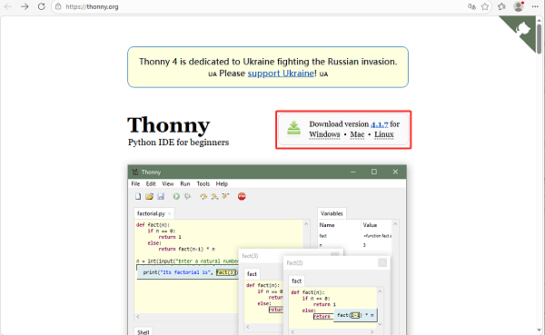

**2. Windows Systeem**

A. Het gedownloade Thonny-pictogram ziet er als volgt uit:

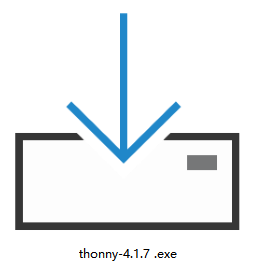

B. Dubbelklik op “thonny-4.1.7.exe” en selecteer de installatiemodus. Hier kiezen we voor “Install for all users”.

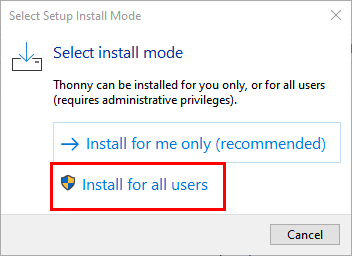

C. U kunt ook blijven klikken op “Next” om de installatie te voltooien.

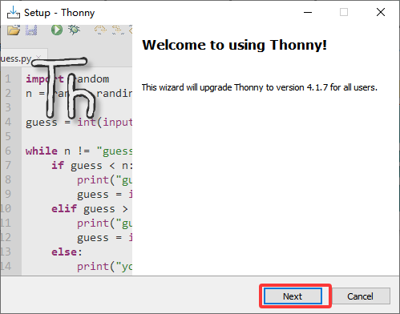

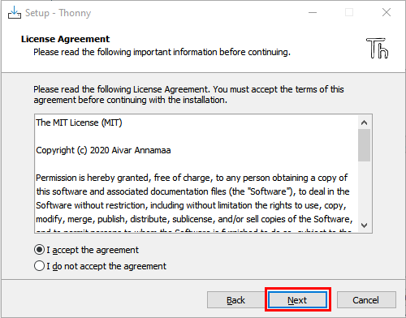

D. Als u de installatielocatie van Thonny wilt wijzigen, klikt u op “Browse...” om een nieuwe locatie te selecteren. Zo niet, dan blijft u gewoon op “Next” klikken.

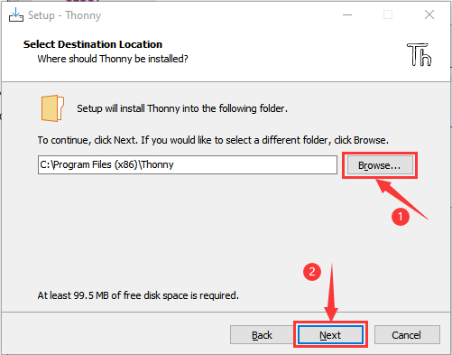

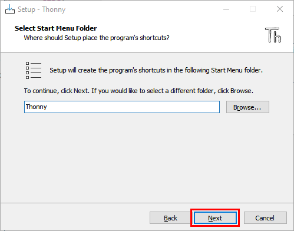

E. Vink “Create desktop icon” aan, dan ziet u Thonny op uw bureaublad.

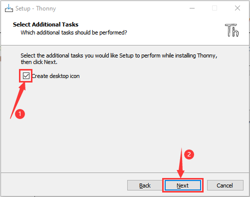

F. “Installeren”.

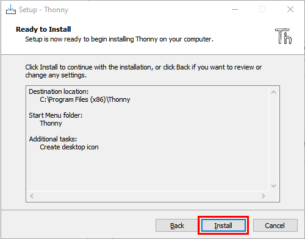

G. Wacht even, maar klik niet op “Cancel”.

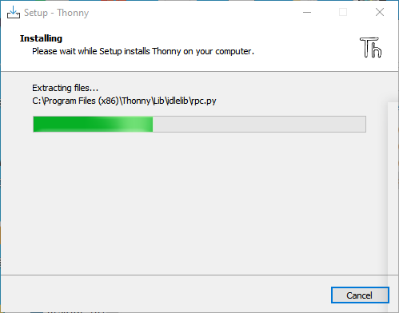

H. Wanneer u het succesvolle installatiescherm ziet, klikt u op “Finish”.

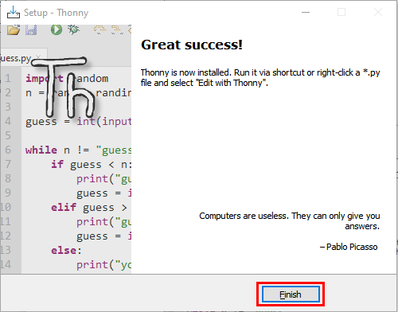

I. U ziet het pictogram op uw bureaublad als u “Create desktop icon” hebt aangevinkt:

                    

### 5.1.2 Thonny Basisinstellingen

A. Dubbelklik op Thonny, kies de taal en de initiële instellingen en klik op “Let’s go!”.

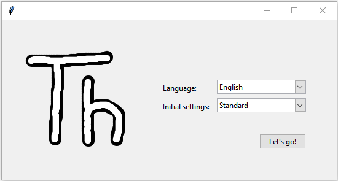

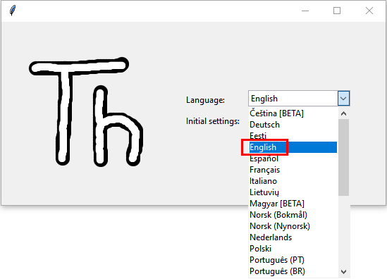

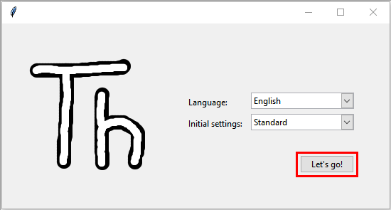

B. Klik op “**View**”→“**File**” en “**Shell**”.

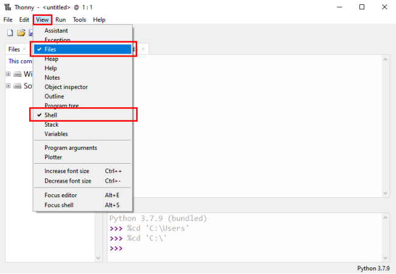

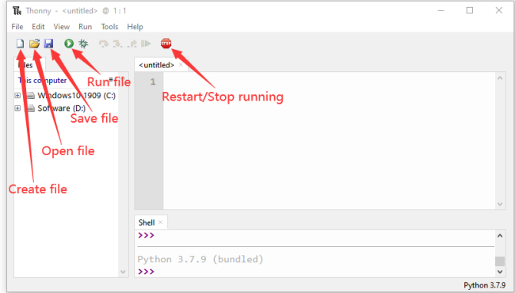

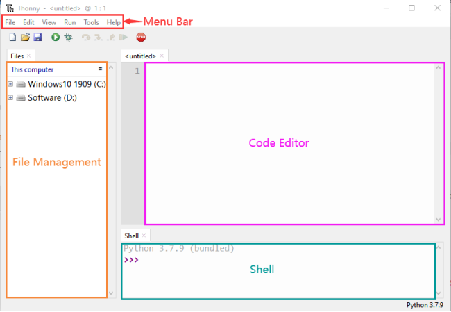

### 5.1.3 MicroPython Firmware branden (Belangrijk)

Om een Python-programma op het Micro:bit-bord uit te voeren, moeten we eerst de firmware erop branden.

**De MicroPython firmware branden:**

Verbind de Micro:bit met uw pc met een USB-kabel.

Zorg ervoor dat het stuurprogramma succesvol is geïnstalleerd en dat de COM-poort correct kan worden geïdentificeerd. Open “**Apparaatbeheer**” en vouw “**Poorten**” uit.

Het COM-poortnummer kan per computer verschillen.

Open Thonny, klik op “**run**” en “**Configure interpreter...**”

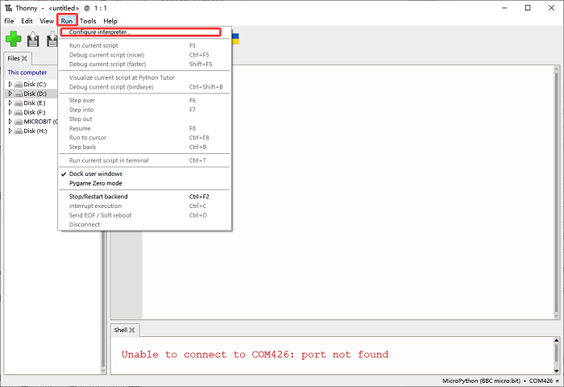

Selecteer “Micropython (BBC micro:bit)” en “mbeb Serial Port @ COM16” in de interpreter, en klik op “Install or update firmware”.

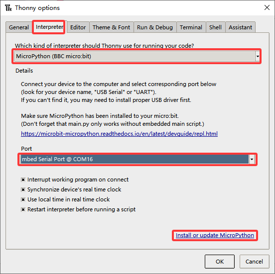

En u ziet het volgende. Stel “Target volume” in op “MICROBIT”, “MicroPython family” op “nRF52”, “variant” op “BBC micro:bit v2 (original simplifiled API)”, “version” op “2.1.2”, en vervolgens “Install”. 

Als de firmware niet kan worden geïnstalleerd, drukt u op de resetknop op de Micro:bit en klikt u op “Install”.

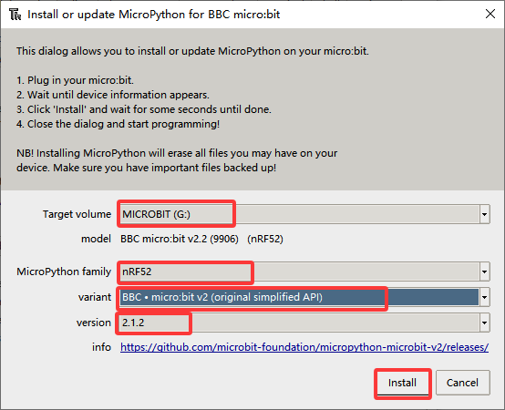

Klik daarna op “Close” en “OK”.

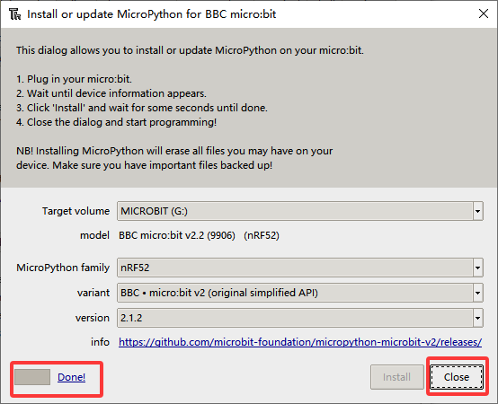

Sluit alle vensters en ga naar de hoofdpagina en klik op het “STOP”-pictogram:

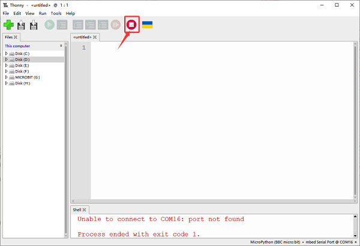

### 5.1.4 Code uploaden

**De testcode uitvoeren (online)**

De Micro:bit voert de code online uit wanneer deze met de computer moet worden verbonden. Gebruikers kunnen programma's programmeren en debuggen met Thonny.

Open Thonny en klik op "**Open**".

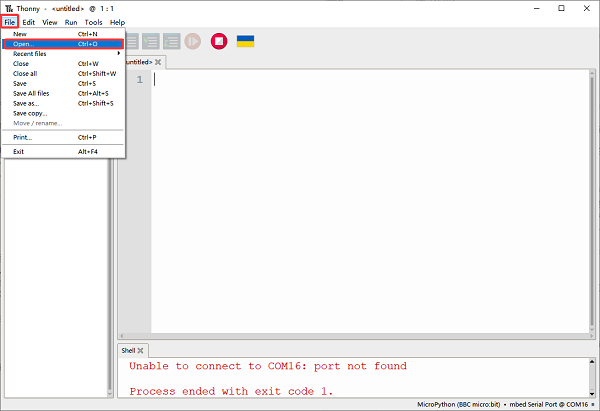

Wanneer een nieuw venster verschijnt, opent u ".\MicroPython_Resource\Codes\Heart beat", selecteert u “heartbeat&ZeroWidthSpace;.py”, en klikt u op “Run current script” (als er een foutmelding verschijnt, klikt u eerst op  en vervolgens op “Run current script”), en u ziet een kloppend hart op de Micro:bit.

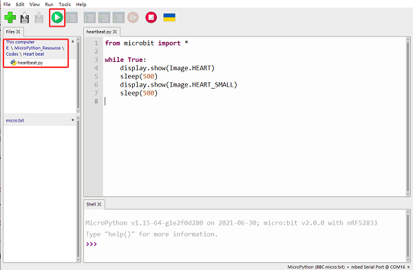

Opmerking: Wanneer u het online uitvoert, wordt de code niet opnieuw uitgevoerd als u op de resetknop drukt. Als u wilt dat het na het resetten wordt uitgevoerd, raadpleegt u de onderstaande instructies voor offline uitvoeren.

**De testcode uitvoeren (offline)**

Na het resetten van de Micro:bit, voert u eerst het bestand main.py uit in de hoofdmap. 

Daarom moet de bestandsnaam die we uploaden naar de Micro:bit worden gewijzigd in main.py als we willen dat deze de code na het resetten uitvoert. Upload vervolgens het bestand, druk op de resetknop en de code wordt nog steeds uitgevoerd.

Hier nemen we heartbeat.py als voorbeeld. Selecteer **heartbeat&ZeroWidthSpace;.py** om het te "**hernoemen**" naar main.py, en klik op "**OK**". Nu kunt u kiezen om te “**Upload to micro:bit**”.

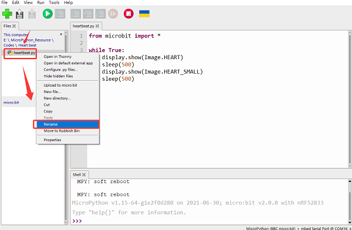

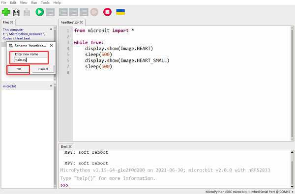

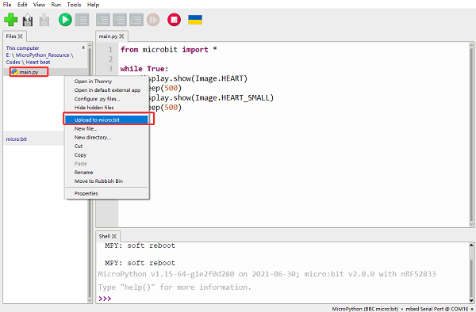

Druk op de Reset-knop en u ziet het hart kloppen op de Micro:bit.

Als u andere code (geen bibliotheken) wilt uitvoeren, moet u eerst de naam wijzigen in main&ZeroWidthSpace;.py voordat u uploadt. 

Wat betreft bibliotheken, klik met de rechtermuisknop om direct “Upload to micro:bit” (Soms kan het uploaden mislukken vanwege een te grote bibliotheek. U moet deze dan vereenvoudigen of ongebruikte bibliotheken verwijderen).

### 5.1.5 Andere veelvoorkomende bewerkingen

**Bestand verwijderen onder Micro:bit**

In “micro:bit” selecteert u “main&ZeroWidthSpace;.py” om te “Delete”, en het wordt verwijderd.

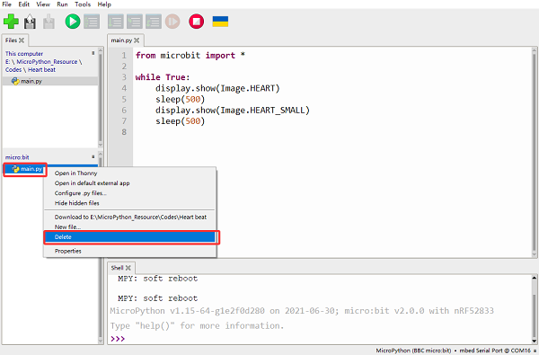

Dezelfde procedure is van toepassing bij het verwijderen van andere bestanden.
