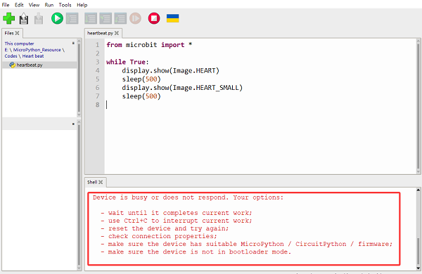

## Troubleshooting

1\. After uploading the code, the micro:bit 5x5 matrix shows a crying face, and it will display error messages in a scrolling manner.

2\. If the uploaded code has characters added or deleted by mistake, you can check it according to the prompts in the shell.

3\. If the uploaded code contains third-party library files, first check whether the corresponding libraries have been uploaded to the micro:bit board. For how to import library, please refer to “**5.1.4 Upload Code**”. 

4\. After uploading the code, no data is printed. You need to click ""first, and then press the reset button on the back of the Micro:bit board, after which the data prints normally.

5\.  The micropython firmware will be lost after burning the Makecode code, and the shell will prints the error messages:

At this moment, you need to burn the firmware again, referring to **5.2.3 Burn Micropython Firmware (Important)**.

