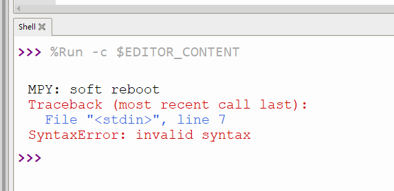
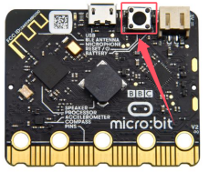
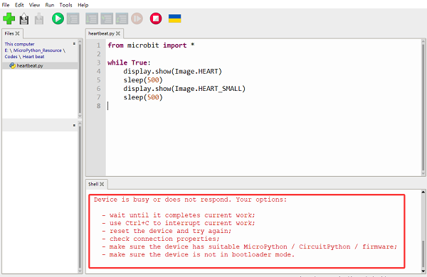

## トラブルシューティング

1. コードをアップロードした後、micro:bitの5x5マトリックスに泣き顔が表示され、エラーメッセージがスクロール表示されます。

2. アップロードしたコードに誤って文字が追加または削除された場合、シェル内のプロンプトに従って確認できます。

3. アップロードしたコードにサードパーティのライブラリファイルが含まれている場合、まず対応するライブラリがmicro:bitボードにアップロードされているかを確認してください。ライブラリのインポート方法については、「**5.1.4 Upload Code**」を参照してください。

4. コードをアップロードした後、データがプリントされません。「」を最初にクリックし、次にMicro:bitボードの背面にあるリセットボタンを押すと、データが正常にプリントされます。

5. Makecodeコードを書き込んだ後、MicroPythonファームウェアが失われ、シェルにエラーメッセージが表示されます。

このとき、「**5.2.3 Burn Micropython Firmware (Important)**」を参照して、ファームウェアを再度書き込む必要があります。