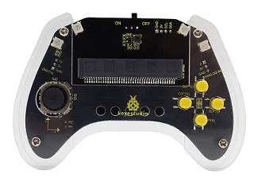
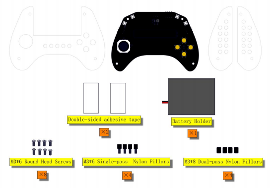
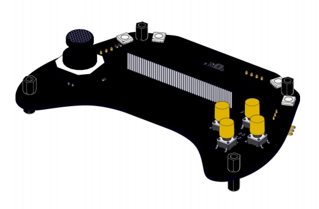
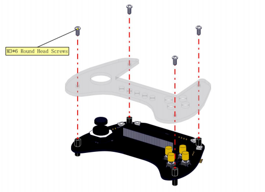
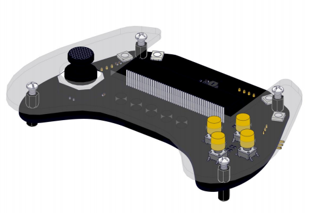
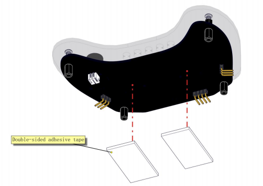
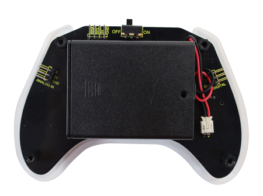
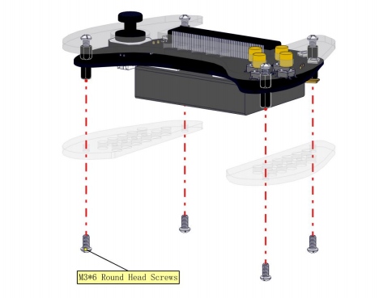

# 3. Gamepad Assembly

## 3.1 Installation
Parts required:

Install these nylon pillars on the control board.

Like this:

And then mount the top acrylic board to the control board with four M3*6 screws.

Like this:

Turn the board upside down, and stick the 3M double-sided adhesive tape in the yellow box of the back of the control board.

Like this:

Toggle the switch on the battery holder to "ON". The side with the switch should be facing the adhesive tape when attaching (**Pay attention to the direction and position of the battery box. Please align it accurately with the yellow line; or the following acrylic boards may get blocked**).

And then connect the cable of the battery holder to the control board. Like this:

Now mount the two bottom acrylic boards to the gamepad with four M3*6 screws.

Congratulations! Installation completed!

