# 3. ゲームパッドの組み立て

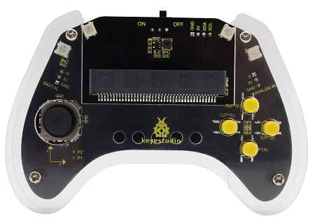

## 3.1 インストール
必要な部品:

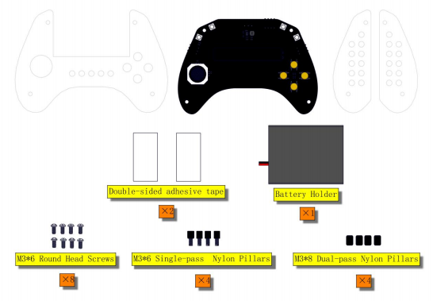

これらのナイロンピラーを制御ボードに取り付けます。

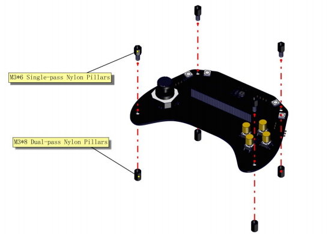

このように:

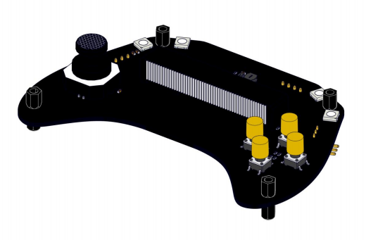

次に、4本のM3*6ネジで上部アクリルボードを制御ボードに取り付けます。

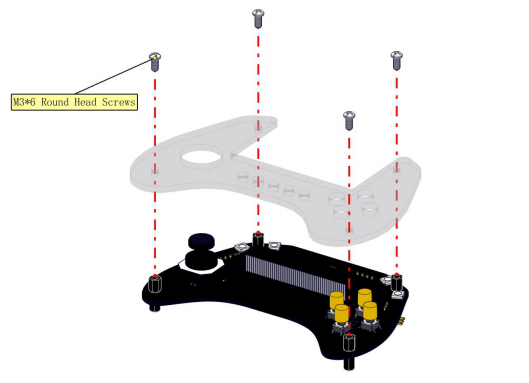

このように:

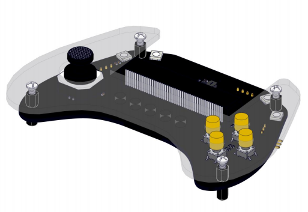

ボードを裏返し、制御ボードの裏側の黄色いボックスに3M両面テープを貼り付けます。

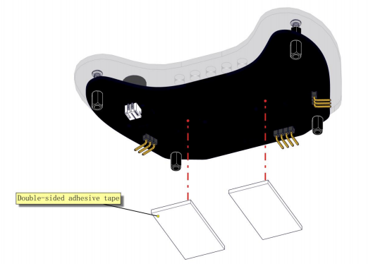

このように:

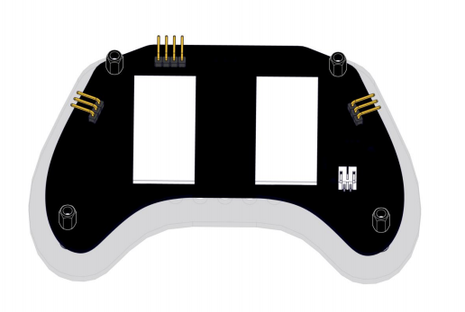

バッテリーホルダーのスイッチを「ON」に切り替えます。スイッチのある側が接着テープに面するように取り付けます（**バッテリーボックスの方向と位置に注意してください。黄色の線に正確に合わせないと、次のアクリルボードがブロックされる可能性があります**）。

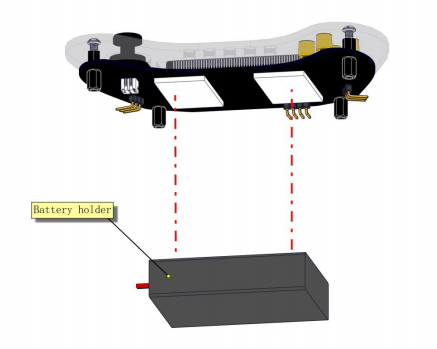

次に、バッテリーホルダーのケーブルを制御ボードに接続します。このように:

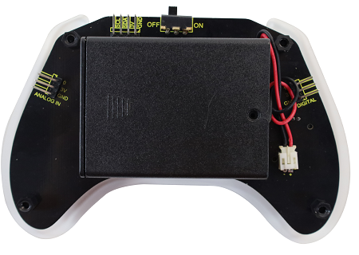

これで、2つの下部アクリルボードを4本のM3*6ネジでゲームパッドに取り付けます。

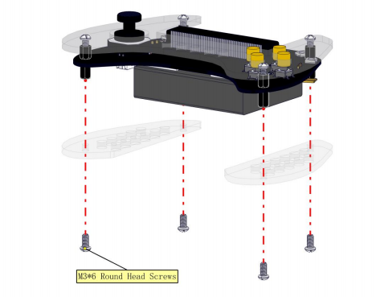

おめでとうございます！インストールが完了しました！

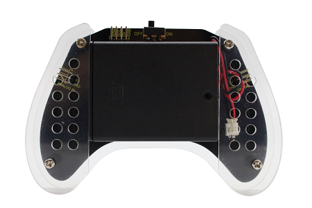

