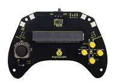
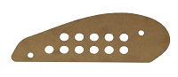
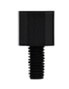
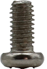
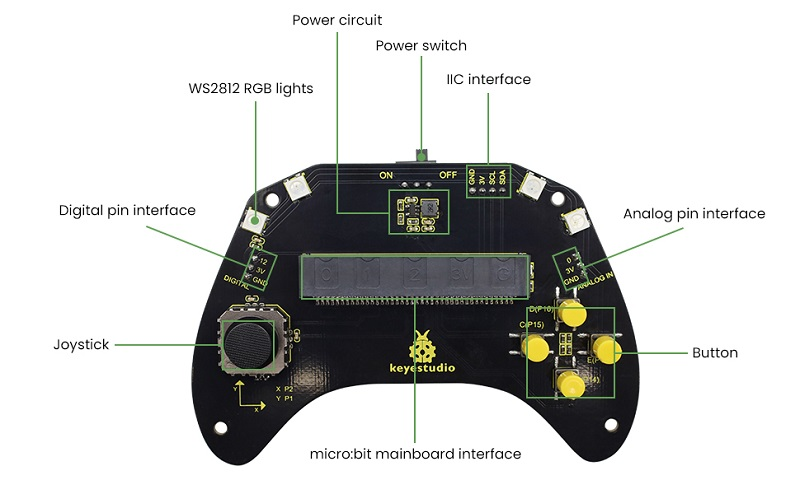
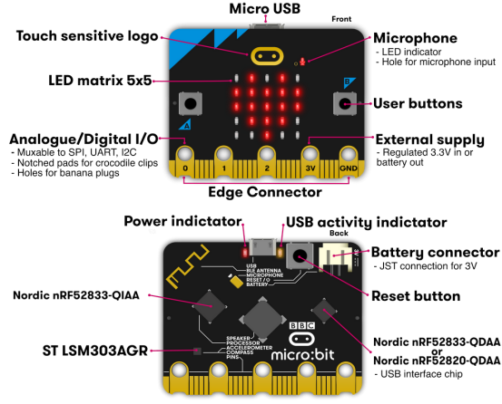

# 2. Product Introduction

## 2.1 Product Safety

1. Small parts are included in this product kit. Please keep it out of the reach of children.

2. Please follow the instructions strictly to avoid damaging the product. And pay attention to electrical safety.

## 2.2 Product Introduction

Based on the Micro:bit board, this smart gamepad kit integrates various electronic components, which enables users to build many interesting DIY projects, like small cars and robots control, and provides them with an intuitive and vivid learning experience. 

This kit not only allows students and beginners to appreciate the joy of innovation in experiments, but also cultivates their logical thinking. At the same time, it fully demonstrates the practical value and educational significance of technological application.

## 2.3 Product List

If any missing parts are found, please contact our sales staff immediately.

| # | NAME | QTY | PIC |
| :--: | :--: | :--: | :--: |
| 1 | micro:bit gamepad control board | 1 | |
| 2 |gamepad top acrylic board| 1 | |
| 3 |gamepad bottom acrylic board| 2 ||
| 4 | battery holder | 1 | |
| 5 | 20mm*40mm double-sided adhesive tape | 2 | |
| 6 | M3*8mm dual--pass nylon pillar | 4 | |
| 7 | Phillips screwdriver | 1 | |
| 8 | M3*6+5mm single-pass nylon pillar | 4 | |
| 9 | M3*6mm round head screw | 8 | |

## 2.4 Product Parameters

- Operating voltage: DC 3.3V 
- Battery voltage: DC 6V 
- Maximum output current: ≤ 2A 
- Maximum dissipation power: ≤ 10W 
- Operating temperature: –10℃ to +65℃ 
- Product weight: 207.4g (±5%packaging included) 
- Packaging dimensions: 186mm × 90mm × 46mm (±1%)

## 2.5 Gamepad Control Board

### 2.5.1 Overview

In the education market, the micro:bit board is highly popular for its compact size and ease of use in programming and maker education. However, a single micro:bit control board often lacks convenient interaction methods in applications such as game control or small car and robot operation. Therefore, we designed this keyestudio gamepad control board for the micro:bit board. 

For full use of micro:bit IO ports, this control board integrates common game input modules of joystick and buttons, and can exchange data with the micro:bit board through a 3PIN interface (GND, VCC, Signal) or by direct connection.

Furthermore, since it expands some commonly used serial communication interfaces into pins spacing of 2.54mm, including I2C and analog/digital pins, it enables the micro:bit board to easily connect to external displays, wireless modules and other communication devices in games or robotics projects. 

If you mount 4 AAA batteries in the battery holder, they will supply power to both the entire gamepad and the micro:bit board.

⚠️ **Attention:**

The joystick, buttons or connected external modules on the control board may be not functioning properly if the battery power is too low.

### 2.5.2 Features

- Input voltage: Battery interface(DC 4~6V); micro USB interface(DC 5V)
- Output voltage: DC 3.3V
- Built-in power indicator
- Analog pin (P0)
- I2C communication pin
- Digital pin (P12)
- Dimensions: 166mm x 78.5mm x 18mm
- Weight: 35.4 g

### 2.5.3 Pin-out

## 2.6 About Micro:bit

### 2.6.1 What is Micro:bit?

Micro:bit is a microcomputer development board designed for programming education for teenagers launched by British Broadcasting Corporation (BBC).

Though it is just the size of a credit card, the micro:bit main board is equipped with loads of components, including a 5x5 LED dot matrix, 2 programmable buttons, an accelerometer, a compass, a thermometer, a touch-sensitive logo and a MEMS microphone, a Bluetooth module of low energy, and a buzzer and others. Thus, it also boasts multiple functions. The buzzer built in the other side of the board plays all kinds of sounds without any external equipment.

Moreover, this board has a sleeping mode to lower power consumption of batteries when users long-press the Reset & Power button on the back.

### 2.6.2 Micro:bit V2 Main Board Layout

### 2.6.3 Micro:bit V2 Pin-out

Micro:bit pin functions:

| Function           | Pin                                                          |
| ------------------ | ------------------------------------------------------------ |
| GPIO               | P0, P1, P2, P3, P4, P5, P6, P7, P8, P9, P10, P11, P12, P13, P14, P15, P16, P19, P20 |
| ADC/DAC            | P0, P1, P2, P3, P4, P10                                      |
| IIC                | P19 (SCL), P20 (SDA)                                         |
| SPI                | P13 (SCK), P14 (MISO), P15 (MOSI)                            |
| PWM(commonly-used) | P0, P1, P2, P3, P4, P10                                      |
| occupied           | P3(LED Col3), P4(LED Col1), P5(Button A), P6(LED Col4), P7(LED Col2), P10(LED Col5), P11(Button B) |

Visit the official website for more details:

- [https://tech.microbit.org/hardware/edgeconnector/](https://tech.microbit.org/hardware/edgeconnector/)

- [https://microbit.org/](https://microbit.org/)

- [https://microbit.org/get-started/features/overview/](https://microbit.org/get-started/features/overview/)

- [https://microbit.org/guide/hardware/pins/](https://microbit.org/guide/hardware/pins/)

- [https://microbit.org/projects/make-it-code-it/](https://microbit.org/projects/make-it-code-it/)

- [https://microbit.org/get-started/what-is-the-microbit/](https://microbit.org/get-started/what-is-the-microbit/)

### 2.6.4 Notes for the Application of Micro:bit V2 Board

1. It is recommended to cover it with a silicone protector to prevent short circuit for it has a lot of sophisticated electronic components.
2. Its IO port is very weak in driving since it can merely handle current less than 300mA. Therefore, do not connect it with devices operating in large current, such as servo MG995 and DC motor or it will get burnt. Furthermore, you must figure out the current requirements of the devices before you use them and it is generally recommended to use the board together with a Micro:bit shield.
3. It is recommended to power the main board via the USB interface or via the battery of 3V. The IO port of this board is 3V, so it does not support sensors of 5V. If you need to connect sensors of 5 V, a Micro: Bit expansion board is required.
4. When using pins(P3, P4, P6, P7 and P10) shared with the LED dot matrix, blocking them from the matrix or the LEDs may display randomly and the data about sensors connected maybe wrong.
5. **No use of pin P19 and P20 IO!** Pin 19 and 20 can not be used as IO ports though the Makecode shows they can. They can only be used as I2C communication.
6. The battery port of 3V cannot be connected with battery more than 3.3V or the main board will be damaged.
7. Forbid to operate it on metal products to avoid short circuit.

To put it simple, Micro:bit V2 main board is like a microcomputer which has made programming at our fingertips and enhanced digital innovation. 