# 2. Produkteinführung

## 2.1 Produktsicherheit

1. Kleine Teile sind in diesem Produktkit enthalten. Bitte bewahren Sie es außerhalb der Reichweite von Kindern auf.

2. Bitte befolgen Sie die Anweisungen genau, um Schäden am Produkt zu vermeiden. Und achten Sie auf elektrische Sicherheit.

## 2.2 Produkteinführung

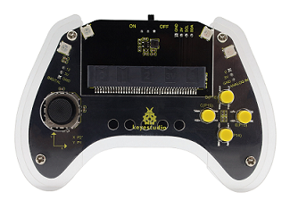

Basierend auf dem Micro:bit board integriert dieses Smart Gamepad Kit verschiedene elektronische Komponenten, die es Benutzern ermöglichen, viele interessante DIY-Projekte zu bauen, wie z.B. die Steuerung kleiner Autos und Roboter, und ihnen eine intuitive und lebendige Lernerfahrung bieten.

Dieses Kit ermöglicht es Schülern und Anfängern nicht nur, die Freude an Innovationen in Experimenten zu schätzen, sondern fördert auch ihr logisches Denken. Gleichzeitig demonstriert es den praktischen Wert und die pädagogische Bedeutung technologischer Anwendungen.

## 2.3 Produktliste

Sollten fehlende Teile festgestellt werden, kontaktieren Sie bitte umgehend unser Verkaufspersonal.

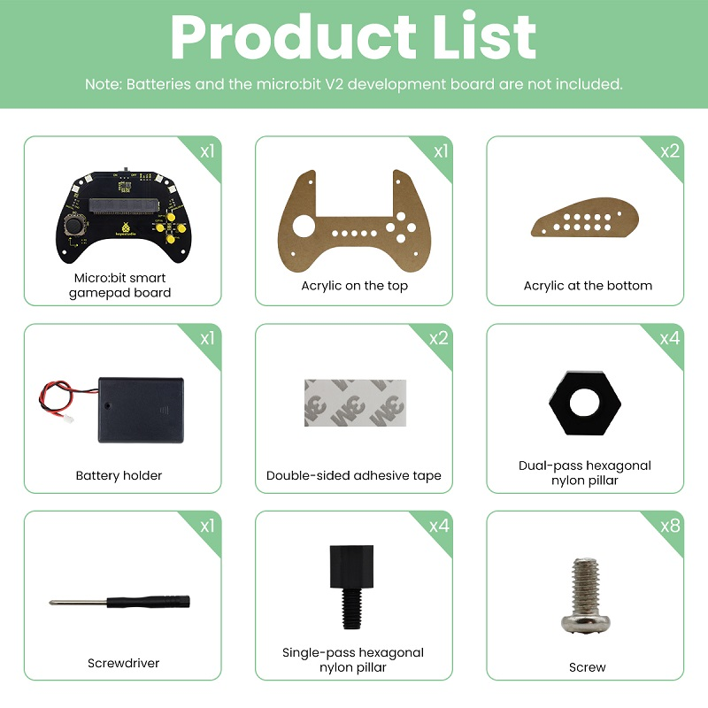

| # | NAME | QTY | PIC |
| :--: | :--: | :--: | :--: |
| 1 | micro:bit gamepad control board | 1 |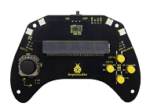 |
| 2 |gamepad top acrylic board| 1 | 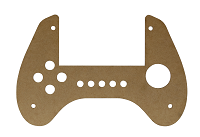|
| 3 |gamepad bottom acrylic board| 2 |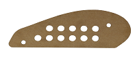|
| 4 | battery holder | 1 |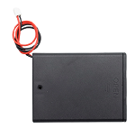 |
| 5 | 20mm*40mm double-sided adhesive tape | 2 |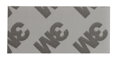 |
| 6 | M3*8mm dual-pass nylon pillar | 4 | 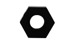|
| 7 | Phillips screwdriver | 1 |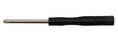 |
| 8 | M3*6+5mm single-pass nylon pillar | 4 |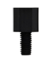 |
| 9 | M3*6mm round head screw | 8 | 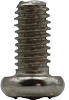|

## 2.4 Produktparameter

- Betriebsspannung: DC 3.3V
- Batteriespannung: DC 6V
- Maximaler Ausgangsstrom: ≤ 2A
- Maximale Verlustleistung: ≤ 10W
- Betriebstemperatur: –10℃ bis +65℃
- Produktgewicht: 207.4g (±5% Verpackung enthalten)
- Verpackungsmaße: 186mm × 90mm × 46mm (±1%)

## 2.5 Gamepad Control Board

### 2.5.1 Übersicht

Auf dem Bildungsmarkt ist das micro:bit board aufgrund seiner kompakten Größe und einfachen Handhabung in der Programmierung und Maker-Ausbildung sehr beliebt. Eine einzelne micro:bit Steuerplatine bietet jedoch oft keine bequemen Interaktionsmöglichkeiten in Anwendungen wie der Spielsteuerung oder dem Betrieb kleiner Autos und Roboter. Daher haben wir dieses keyestudio Gamepad Control Board für das micro:bit board entwickelt.

Zur vollständigen Nutzung der micro:bit IO-Ports integriert diese Steuerplatine gängige Spieleingabemodule wie Joystick und Tasten und kann Daten mit dem micro:bit board über eine 3PIN-Schnittstelle (GND, VCC, Signal) oder durch direkte Verbindung austauschen.

Darüber hinaus erweitert es einige häufig verwendete serielle Kommunikationsschnittstellen in Pins mit einem Abstand von 2.54mm, einschließlich I2C und analoger/digitaler Pins, wodurch das micro:bit board problemlos externe Displays, drahtlose Module und andere Kommunikationsgeräte in Spielen oder Robotikprojekten verbinden kann.

Wenn Sie 4 AAA Batterien in den Batteriehalter einlegen, versorgen diese sowohl das gesamte Gamepad als auch das micro:bit board mit Strom.

⚠️ **Achtung:**

Der Joystick, die Tasten oder angeschlossene externe Module auf der Steuerplatine funktionieren möglicherweise nicht richtig, wenn die Batterieleistung zu niedrig ist.

### 2.5.2 Funktionen

- Eingangsspannung: Batterieschnittstelle (DC 4~6V); micro USB Schnittstelle (DC 5V)
- Ausgangsspannung: DC 3.3V
- Eingebaute Leistungsanzeige
- Analog pin (P0)
- I2C communication pin
- Digital pin (P12)
- Abmessungen: 166mm x 78.5mm x 18mm
- Gewicht: 35.4 g

### 2.5.3 Pin-Belegung

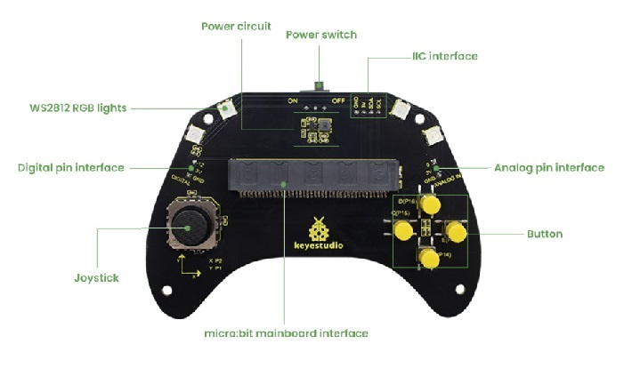

## 2.6 Über Micro:bit

### 2.6.1 Was ist Micro:bit?

Micro:bit ist eine Mikrocomputer-Entwicklungsplatine, die von der British Broadcasting Corporation (BBC) für die Programmierausbildung von Jugendlichen entwickelt wurde.

Obwohl es nur die Größe einer Kreditkarte hat, ist das micro:bit main board mit zahlreichen Komponenten ausgestattet, darunter eine 5x5 LED Punktmatrix, 2 programmierbare Tasten, ein Beschleunigungsmesser, ein Kompass, ein Thermometer, ein berührungsempfindliches Logo und ein MEMS Mikrofon, ein Bluetooth Modul mit geringem Energieverbrauch sowie ein Summer und andere. Somit verfügt es auch über mehrere Funktionen. Der auf der anderen Seite des boards eingebaute Summer spielt alle Arten von Geräuschen ohne externe Ausrüstung ab.

Darüber hinaus verfügt dieses board über einen Schlafmodus, um den Stromverbrauch der Batterien zu senken, wenn Benutzer die Reset & Power Taste auf der Rückseite lange drücken.

### 2.6.2 Micro:bit V2 Main Board Layout

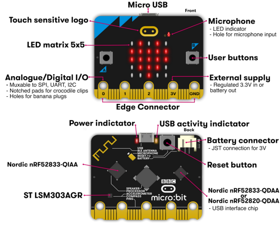

### 2.6.3 Micro:bit V2 Pin-Belegung

Micro:bit pin Funktionen:

| Funktion | Pin |
| ------------------ | ------------------------------------------------------------ |
| GPIO | P0, P1, P2, P3, P4, P5, P6, P7, P8, P9, P10, P11, P12, P13, P14, P15, P16, P19, P20 |
| ADC/DAC | P0, P1, P2, P3, P4, P10 |
| IIC | P19 (SCL), P20 (SDA) |
| SPI | P13 (SCK), P14 (MISO), P15 (MOSI) |
| PWM(commonly-used) | P0, P1, P2, P3, P4, P10 |
| occupied | P3(LED Col3), P4(LED Col1), P5(Button A), P6(LED Col4), P7(LED Col2), P10(LED Col5), P11(Button B) |

Besuchen Sie die offizielle Website für weitere Details:

- [https://tech.microbit.org/hardware/edgeconnector/](https://tech.microbit.org/hardware/edgeconnector/)

- [https://microbit.org/](https://microbit.org/)

- [https://microbit.org/get-started/features/overview/](https://microbit.org/get-started/features/overview/)

- [https://microbit.org/guide/hardware/pins/](https://microbit.org/guide/hardware/pins/)

- [https://microbit.org/projects/make-it-code-it/](https://microbit.org/projects/make-it-code-it/)

- [https://microbit.org/get-started/what-is-the-microbit/](https://microbit.org/get-started/what-is-the-microbit/)

### 2.6.4 Hinweise zur Anwendung des Micro:bit V2 Board

1. Es wird empfohlen, es mit einem Silikonschutz zu bedecken, um Kurzschlüsse zu vermeiden, da es viele hochentwickelte elektronische Komponenten enthält.
2. Sein IO-Port ist sehr schwach in der Ansteuerung, da er lediglich Ströme unter 300mA verarbeiten kann. Verbinden Sie es daher nicht mit Geräten, die mit großen Strömen arbeiten, wie z.B. Servo MG995 und DC motor, da es sonst durchbrennt. Darüber hinaus müssen Sie die Stromanforderungen der Geräte herausfinden, bevor Sie sie verwenden, und es wird generell empfohlen, das board zusammen mit einem Micro:bit shield zu verwenden.
3. Es wird empfohlen, das main board über die USB Schnittstelle oder über die Batterie von 3V mit Strom zu versorgen. Der IO-Port dieses boards ist 3V, daher unterstützt er keine Sensoren von 5V. Wenn Sie Sensoren von 5 V anschließen müssen, ist ein Micro: Bit Erweiterungsboard erforderlich.
4. Bei der Verwendung von Pins (P3, P4, P6, P7 und P10), die mit der LED Punktmatrix geteilt werden, kann das Blockieren dieser Pins von der Matrix dazu führen, dass die LEDs zufällig angezeigt werden und die Daten der angeschlossenen Sensoren falsch sind.
5. **Keine Verwendung von Pin P19 und P20 IO!** Pin 19 und 20 können nicht als IO-Ports verwendet werden, obwohl Makecode dies anzeigt. Sie können nur für die I2C communication verwendet werden.
6. Der Batterieanschluss von 3V darf nicht mit Batterien über 3.3V verbunden werden, da sonst das main board beschädigt wird.
7. Es ist verboten, es auf Metallprodukten zu betreiben, um Kurzschlüsse zu vermeiden.

Einfach ausgedrückt, ist das Micro:bit V2 main board wie ein Mikrocomputer, der das Programmieren zum Greifen nah gemacht und die digitale Innovation verbessert hat.
